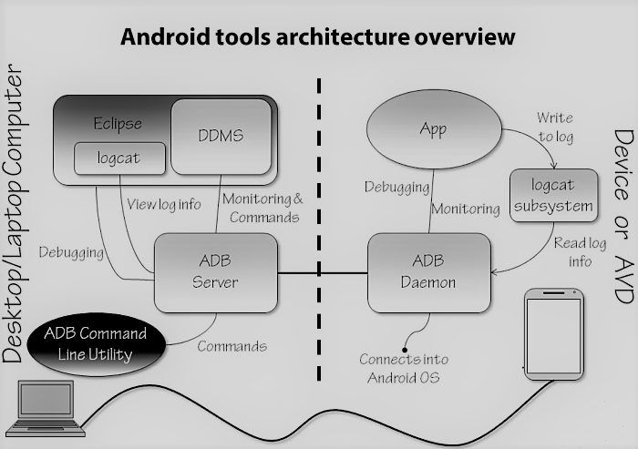
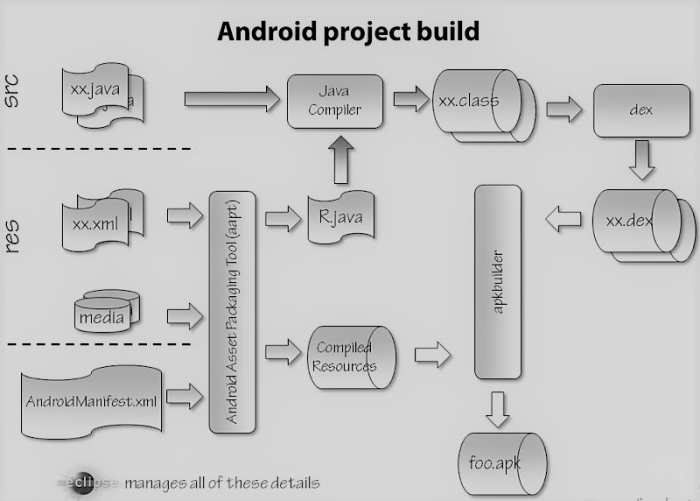

# Android Development

## Environment Setup
* Install the Java SDK. Refer to http://developer.android.com for the correct version.
* Install Android Development Kid (ADK) or Android Development Studio that includes:  
  IDE, Android SDK tools, Android Platform Tools, Android Virtual Devices (Emulator images)




### Enable Debugging using a real device

* Enable USB debugging on the android phone under Developer Options  
* Install USB drivers on your desktop - The USB driver enables dev tools to communicate with the device. Most Android Developer Phones use the Google USB driver. This can be installed through the **Android SDK Manager**. For other phones you must download the manufacturer drivers.
* Helpful debug setting is to keep the device awake. There is generally an option 'Stay awake' under Developer Options.


### Android Debug Bridge (ADB) cli

Navigate to the ADK installation. Generally located in `Library/Android/sdk/platform-tools/` for a Mac  

```sh
# list of the attached devices connected to the adb server
./adb devices -l

# If there's only one emulator running or only one device connected, the adb command is sent to that device by default. If multiple emulators are running and/or multiple devices are attached, you need to use:
# -d (target only connected device),
# -e (target the only open AVD) or 
# -s option
./adb [-d | -e | -s serial_number] command

# e.g. install with device serial number
./adb -s <serial_number> install helloworld.apk

# open a unix shell inside the connected device or the open AVD
./adb shell 
```

### Dalvik Debug Monitor Server (DDMS)

Android tool that provides a wide variety of debugging features. Debugging must be enabled for DDMS to access a process. On most AVDs, Android is debug-build, making all processes visible. Each application running on android gets its own copy of the Android/Dalvik virtual machine (VM). Android doesn't use the Standard Java Runtime, it uses the Dalvik Java Runtime that is optimised for mobile devices. DDMS provides process monitoring of  

* Memory  
* Threads  
* Network

### Project Build
Key project components are:

* Java source file
* Resource files
* AndroidManifest.xml

`R.java` is auto generated based on the resource files. It is used in Java source to identify resource contents. If there are compile issues, try

1. Compile project
2. Clean project
3. Check resource xml files are well formed

The generated `*.apk` file contains the fully constructed application package that gets deployed to a device or an emulator.



### Android Version and API Level

Platform is the Android OS version.
API is the minimum target SDK version. 

Current data about the relative number of devices running a given version of the Android platform can be found [here](http://developer.android.com/about/dashboards/index.html) This can assist in deciding the number of Android devices to target with your application. 

New API levels and SDK tools can be installed through the SDK manager.

### Android Layouts

Horizontal and vertical orientation can be used to align the views left to right and top to bottom respectively. Linear layout is simple but can be less performant if it contains multiple nested views. 


Relative layout allows you to adjust the **position** and **alignment** with respect to the *parent* or a *sibling*. Default position of a view is TOP LEFT when the horizontal and vertical position of a view is not specified.

#### Performance

* In general fewer views perform better, because android has few things to keep track of in terms of where they are and what's being clicked and touched.
* Fewer Measure Passes the better - Android goes through 3 phases: Measure, Layout, Draw to figure out how to put a given layout on the screen.
* Hierarchy Viewer is a tool that can be used to analyse and examine layouts. Used to look at structure and properties of views.

*Measure passes per layout*

Linear layout     1  2 (with weights)  
Relative layout  2  
Frame layout     1  
Table layout      2  3 (with shrinking and stretching)  

### Fragments

An android UI is a combination of activities and fragments. Fragments are sections in a UI contained in an activity that enable dividing the UI into logical units. Fragments can be created dynamically as well as defined statically at design time. Each activity has an instance of a FragmentManger that coordinates the interaction between the fragments and the activity. Interacting directly with the fragment views is possible from the activity but is discouraged as fragments are meant to be self contained units. Interaction within fragments of an activity is managed by the activity through the FragmentManger. Fragments were introduced fairly late in Android 3.0 (API 11) and shipped with support in Android 3.1 (API 12), they are supported in 99.9% of the devices.

**Swipe navigation** can be built using *ViewPagers* in an activity. *ViewPager* provides tab like swipeable pages. *ViewPager* is defined inside the activity xml.
```xml

<android.support.v4.view.ViewPager xmlns:android="http://schemas.android.com/apk/res/android"
        android:id="@+id/pager"
        android:layout_width="match_parent"
        android:layout_height="match_parent">

        <android.support.v4.view.PagerTitleStrip
            android:layout_width="match_parent"
            android:layout_height="wrap_content"
            android:layout_gravity="top"
            android:background="#33b5e5"
            android:paddingBottom="4dp"
            android:paddingTop="4dp"
            android:textColor="#fff" />

</android.support.v4.view.ViewPager>
```

*Fragments* can be used to provide structure to each page. Layout *fragment_item* below is a simple UI section with a single *TextView* for displaying the name of the item.
```java
public class ItemFragment extends Fragment {

  @Override
  public View onCreateView(LayoutInflater inflater, ViewGroup container, Bundle savedInstanceState) {
    View view = inflater.inflate(R.layout.fragment_item, container);

    TextView txtViewItemName = (TextView) view.findViewById(R.id.txtView_projectName);
    txtViewProjectName.setText(getArguments().getString("itemName"));
    return view;
  }
}
```

 The number of pages, the structure of each page and its data is wrapped in a *FragmentPagerAdapter* implementation.
```java
public class ItemPagerAdapter extends FragmentPagerAdapter {
  String[] mItems;

  public ItemPagerAdapter(FragmentManager fm, String[] items) {
    super(fm);
    mItems = items;
  }

  @Override
  public Fragment getItem(int position) {
    Bundle args = new Bundle();
    args.putString("itemName", mItems[position]);

    Fragment fragment =  new ItemFragment();
    fragment.setArguments(args);
    return fragment;
  }

  @Override
  public int getCount() {
    return mItems.length;
  }

  @Override
  public CharSequence getPageTitle(int position) {
    return mItems[position];
  }
}
```

The pages for the *ViewPager* can be linked to the activity like so
```java
@Override
protected void onCreate(Bundle savedInstanceState) {
    super.onCreate(savedInstanceState);
    setContentView(R.layout.activity_main);
    
    ViewPager viewPager = (ViewPager) findViewById(R.id.pager);
    viewPager.setAdapter(new ItemPagerAdapter(getFragmentManager(), this));
}
```