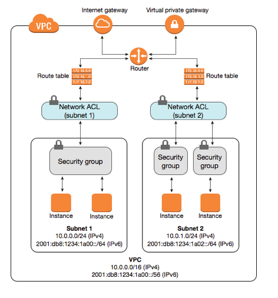

# AWS

Use the [AWS CLI](https://docs.aws.amazon.com/cli/latest/userguide/cli-chap-welcome.html) to interact with AWS services from your command line shell.

In order to configure the AWS CLI you will need an AWS account and your AWS credentials

```bash
$ aws configure
```

The configuration process stores your credentials in a file at `~/.aws/credentials` on MacOS and Linux, or `%UserProfile%\.aws\credentials` on Windows.

## Amazon Resource Names (ARNs)

* Uniquely identify AWS resources
* Required when you need to specify a resource unambiguously across all of AWS, such as in IAM policies, Amazon Relational Database Service (Amazon RDS) tags, and API calls
* Format: `arn:partition:service:region:account_id`
  * partition: aws|aws-cn (AWS China)
  * service: s3|ec2|rds
  * region: us-east-1|eu-central-1
  * account_id: 123456789012

## IAM

Identity and Access Management is used for

* managing users and their access to AWS resources, allowing administrators to define **who can do what** (authentication and authorization)
* issuing identities
  * IAM user - identity for humans using long term access credentials e.g. username and password or long term credentials for programmatic access
  * AWS services - identity for non-human resources e.g. EC2 instane, Lambda, SageMaker, Glue crawler, ECS task etc
  * IAM principal - is an identity in IAM, can be an IAM user or an AWS service, something that can make API calls to other AWS services
  * IAM role - is an identity that you can create in your account that has specific permissions. An IAM role is similar to an IAM user, in that it is an AWS identity with permission policies that determine what the identity can and cannot do in AWS. Instead of being uniquely associated with one person, a [role can be assumed](https://docs.aws.amazon.com/IAM/latest/UserGuide/id_credentials_temp_request.html) by anyone who needs it. Also, a role does not have standard long-term credentials such as a password or access keys associated with it. Instead, when you assume a role, it provides you with temporary security credentials for your role session.
* monitoring and auditing access to specific resources by enabling AWS Cloud Trail
* federate idenity into AWS by integrating with corporate identity providers like Microsoft Active Directory

|Users (Who)            |Groups (Who)       |Roles (Who)    | Policies (What) |
|:---------------------:|:------------------|:--------------:|:---------------:|
|Specific individual, can receive logins |Collection of users such as administrator, developer etc |Collection of policies that you can use to access AWS resources e.g. a role with DB Read, DB Write permissions |Low level permissions to resources (Allow/Deny) <ul><li>Identity policy - applied to a user or group</li><li>Resource policy - applied to an AWS resource e.g. S3, KMS Keys</li></ul>|

IAM Roles can be used for [delegated access](https://docs.aws.amazon.com/IAM/latest/UserGuide/best-practices.html) on behalf of the signed in user e.g.

* an IAM Role can be assigned to an EC2 instance to allow the instance to work on the signed in user's behalf and access another AWS resource e.g. S3 bucket. This means you dont have to provide credentials to the EC2 instance for programmatic access to S3.

IAM Roles can also be identities you can create in IAM that have specific permissions. A role is similar to a user, as it is an AWS identity with permission policies that determine what the identity can and cannot do in AWS. Instead of being uniquely associated with one person, a [role can be assumed](https://docs.aws.amazon.com/IAM/latest/UserGuide/id_credentials_temp_request.html) by using AWS Security Token Service or [switched to a different role](https://docs.aws.amazon.com/IAM/latest/UserGuide/id_roles_use_switch-role-console.html) in the AWS Management Console to receive a temporary credentials role session.

IAM Policies are generally applied to Groups as opposed to individual users. AWS pre-defines some IAM policies for common tasks. These are useful for setting up permissions for human roles that have common sets of coarse grained actions that they want to do. A [policy](https://docs.aws.amazon.com/AmazonS3/latest/userguide/example-bucket-policies.html) can be granted to a specific resource (with an `arn`) or all resources of a particular type (with a wildcard `"*"`)

 * Not explicitly allowed == implicitly denied
 * Explicit deny > everything else
 * Only attached policies have effect
 * AWS joins all applicable policies, e.g. EC2 admin access attached to devs and S3 admin access attached to devs, AWS will join these together but an explicit deny in one and an Allow in another will result in a Deny

Root Account: The account created when you first set up your AWS account and which has complete admin access. This should be secured with MFA and not meant to be used to log in day to day.

New Users: No permissions when first created

### Permission boundaries

* Controls maximum permissions an IAM policy can grant
* Prevents privilege escalation or unnecessarily borad permissions e.g. you do not want developers to get full admin access to the AWS console, you may only want them to create roles for attaching to EC2 instances or to lambda functions

## Networking

VPC or Virtual Private Cloud is a logically isolated part of the AWS cloud, think of it as a virtual  data center in the cloud. You can leverage multiple layers of security, including security groups and network ACLs to help control access to Amazon EC2 instances in each subnet. The inbound and outbound connectivity to your VPC via the internet gateway or a VPN is established via three main lines of defense:

* Routing tables - whether there is a route in or out to the internet. * A **router** routes traffic between different subnets and is required to create subnets.
* Network ACLs - acts as a firewall for controlling traffic in and out of one or more subnets, so any instance in the subnet with an associated NACL will follow rules of NACL. Each subnet in your VPC must be associated with a NACL. If not done explicitly the subnet is automatically associated with the default NACL. You can associate a NACL with multiple subnets, however a subnet can be associated with **only 1 NACL** You may setup NACLs with rules similar to your security group to add another layer of security to your VPC
  * by default, a custom NACL denies all outbound and inbound traffic whereas the default NACL allows all outbound and inbound traffic
  * can be used to block specific IP addresses
  * are stateless, therefore explicit rules are enforced for inbound and outbound traffic
* Security Groups - virtual firewalls for EC2 instances and the last line of defense.
  * by default everything is blocked
  * [security groups are tied to an instance whereas Network ACLs are tied to the subnet](https://medium.com/awesome-cloud/aws-difference-between-security-groups-and-network-acls-adc632ea29ae)
  * security groups are stateful - this means any changes applied to an incoming rule will be automatically applied to the outgoing rule. e.g. If you allow an incoming port 80, the outgoing port 80 will be automatically opened.


* Elastic Network Interface (ENI)s are virtual network cards you can attach to your EC2 instances. They are used to enable network connectivity for your instances, and having more than one of them connected to your instance allows it to communicate on two different subnets. You’re already using them if you’re running on EC2—the default interface, `eth0`, is attached to an ENI that was created when you launched the instance, and is used to handle all traffic sent and received from the instance. You’re not limited to just one network interface though—attaching a secondary network interface allows you to **connect your EC2 instance to two networks at once**. A common use case for ENIs is the creation of management networks. This allows you to have public-facing applications like web servers in a public subnet but lock down SSH access down to a private subnet on a secondary network interface.
* A public subnet requires a route out to the internet (via an internet gateway) and a mapping to a public IP. This allows any EC2 instances within this subnet to reach out to the internet and be publicly available. **1 subnet always spans 1 Availability Zone**
* An internet gateway allows routes out to the internet, therefore allowing resources within your public subnet to access the internet, and the internet to access said resources. **You can only have 1 internet gateway per VPC**
  * To allow access to the internet a route is defined in the route table with the destination as `0.0.0.0/0` and the target as the internet gateway.
  * To allow communication between subnets another route is defined with destination as CIDR block for VPC and target `local`
* A NAT Gateway allows resources in a private subnet to access the internet (think yum updates, external database connections, wget calls, OS patch, etc). It only works one way. The internet at large cannot get through your NAT to your private resources unless you explicitly allow it. The NAT Gateway is provisioned inside the public subnet to allow routing traffic from the private subnet.
  * To allow access to the internet from the private subnet, a route is defined with the destination as `0.0.0.0/0` and the target as the NAT gateway

You can create

* [VPC with public and private subnets](https://docs.aws.amazon.com/vpc/latest/userguide/VPC_Scenario2.html) to host your public facing web apps in the public subnet and the database servers in the private subnet. You can set up security and routing so that the web servers can communicate with the database servers.

* [VPC with public and private subnets and AWS Site-to-Site VPN access](https://docs.aws.amazon.com/vpc/latest/userguide/VPC_Scenario3.html) to run a multi-tiered application with a scalable web front end in a public subnet, and to house your data in a private subnet that is connected to your network by an IPsec AWS Site-to-Site VPN connection. A VPN or Virtual Private Network connection between your corporate data center and your VPC allows you to leverage the AWS Cloud as an extension of your corporate data center.

* [VPC with a private subnet only and AWS Site-to-Site VPN access](https://docs.aws.amazon.com/vpc/latest/userguide/VPC_Scenario4.html) to extend your network into the cloud using Amazon's infrastructure without exposing your network to the internet.

### Troubleshooting inbound network connectivity

While accessing your ec2 instance from the browser, if you are get a timeout - it is probably because there is no inbound route defined in your route table or network ACL, however if you get an ERR connection refused: it means you are able to get through to the EC2 instance but it is not serving the requested page.

### AWS-manged VPN

AWS-managed VPN is a hardware IPsec VPN that enables you to create an encrypted connection over the public Internet between your Amazon VPC and your private IT infrastructure. The VPN connection lets you extend your existing security and management policies to your VPC as if they were running within your own infrastructure.

VPN is a great connectivity option for businesses that are just getting started with AWS. It is quick and easy to setup. Keep in mind, however, that VPN connectivity utilizes the public Internet, which can have unpredictable performance and despite being encrypted, can present security concerns.

### AWS Direct Connect

AWS Direct Connect bypasses the public Internet and establishes a secure, dedicated connection from your infrastructure into AWS. This dedicated connection occurs over a standard 1 GB or 10 GB Ethernet fiber-optic cable with one end of the cable connected to your router and the other to an AWS Direct Connect router. AWS has established these Direct Connect routers in large collocation facilities across the world, providing access to all AWS regions. With established connectivity via AWS Direct Connect, you can access your Amazon VPC and all AWS services.

AWS Direct Connect is a great option for businesses that are seeking secure, ultra-low latency connectivity into AWS. While provisioning AWS Direct Connect can sometimes be more involved, it is worth it once the connectivity is established the because of the ease of predictable network performance and 60% cost savings.

### VPC Endpoints

A VPC Endpoint enables you to privately connect your VPC to supported AWS services and VPC endpoint services powered by PrivateLink without requiring an internet gateway, NAT device, VPN connection or AWS Direct Connect.

Traffic between your VPC and other service does not leave the Amazon internal network.

Instances in your VPC do not require public IP addresses to communicate with resources in the service.

### AWS PrivateLink

Opening services in a VPC to another VPC, Sharing applications across VPCs. In a multi tenant system if you have a VPC per customer then connecting 1000s of VPCs to your service VPC may not scale well. AWS PrivateLink allows you to expose a service VPC to tens, hundreds or thousands of customer VPCs.

* Doesn't require VPC peering, no route tables, NAT gateways, internet gateways, etc.
* Requires a Network LB on the service VPC and an Elastic Network Interface on the customer VPC

## EC2 Instance

You can launch an EC2 instance from the AWS console with the default settings: Amazon Linux, t2.micro and download the private key for connecting to the EC2 instance via ssh

```sh
# SSH to the ec2 instance
chmod 400 ~/Downloads/ec2_rsa.pem
ssh ec2-user@<instance-publicip> -i ~/Downloads/ec2_rsa.pem

# post ssh login
       __|  __|_  )
       _|  (     /   Amazon Linux 2 AMI
      ___|\___|___|

https://aws.amazon.com/amazon-linux-2/
[ec2-user@ip-172-31-5-104 ~]$

# install apache
sudo su
yum update -y
yum install -y httpd
systemctl start httpd
# automatically get it to start on boot 
systemctl enable httpd
systemctl status httpd

# add a webpage
echo '<html><head><title>AWS Solution Architect!</title></head><body><h1>Who is an AWS Solution Architect?</h1><iframe width="560" height="315" src="https://www.youtube.com/embed/Js21xKMFdww" frameborder="0" allowfullscreen></iframe></body></html>' > /var/www/html/index.html
```

Provided you have configured HTTP in your security groups and allowed internet connectivity within your subnet and NACL, you can visit the above webpage by going to the public IP of your EC2 instance.

### EC2 instance metatdata

You can [retrieve the EC2 instance metadata](https://docs.aws.amazon.com/AWSEC2/latest/UserGuide/instancedata-data-retrieval.html) by querying a predefined URL.

e.g.

```sh
# list endpoints
curl http://169.254.169.254/latest/meta-data/

# get instance IP
curl http://169.254.169.254/latest/meta-data/public-ip4

# get bootstrap script that was run when the instance was provisioned
curl http://169.254.169.254/latest/user-data
```

### Virtual Networking Options

* ENI Elastic Network Interface: For basic, day-to-day networking
* EN Enhanced Networking: Uses single root I/O virtualization (SR-IOV) to provide high performance networking between 10 Gbps - 100 Gbps
* EFA Elastic Fibre Adapter: Accelerates High performance Computing (HPC) and machine learning applications

### Storage

AWS uses Elastic Block Store (EBS) storage volumes to attach to EC2 instances. These are **virtual hard disks** which can be used in the same way you would use any system disk for:

* Creating a file system
* Run a database
* Run an operating system
* Install applications

You need a minimum of 1 volume per EC2 instance. This is called the [root device volume](https://docs.aws.amazon.com/AWSEC2/latest/UserGuide/RootDeviceStorage.html) where your operating system is installed and it contains the [AMI](https://docs.aws.amazon.com/AWSEC2/latest/UserGuide/AMIs.html) (Amazon Machine Image - blueprint for an EC2 instance) used to boot the system. AMIs can be backed by EBS or instance store. Instance store volumes are ephemeral and cannot be stopped. If the underlying host fails you will lose your data. EBS backed instances can be stopped and the data on this instance is persistent.

**Snapshots** are a point-in-time copy (a photograph) of a volume that exist on S3. Snapshots are incremental meaning only the delta since the last snapshot is moved to S3. This saves dramatically on space and the time it takes to take the snapshot. Therefore the first snapshot can take considerably longer.

EBS Volume Types

* General Purpose SSD (gp2, gp3) - suitable for boot disks and general applications
* Provisioned IOPS SSD (io1 or io2) - for low latency OLTP workloads
* Throughput Optimized HDD (st1) - for large datasets, datawarehouses and ETLs, cannot be a boot volume
* Cold HDD - for less frequently accessed data like file servers, cannot be a boot volume

EBS volumes will always be in the same AZ as EC2, are replicated within a single AZ to protect against hardware failures. They are dynamically scalable to increase capacity and change the volume type (e.g. go from gp2 to io2) with no downtime or performance impact to your live systems. However you will need to extend the filesystem in the OS so that it can see the resized volume.

#### Migrating an EC2 instance from one region to another

* Create a snapshot or use an existing snapshot of the volume
* Copy the snapshot to the target region (You can decide to encrypt the snapshot if it was from an unencrypted volume)
* Make an Amazon Machine Image (AMI) from the snapshot
* Launch an instance from the AMI
