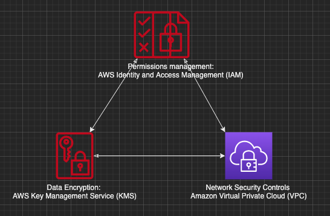
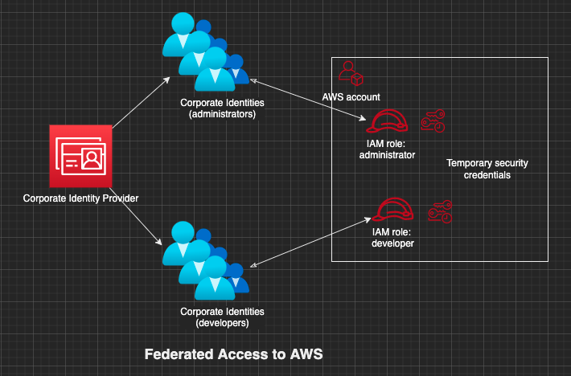

# AWS Security

Fundamentally there are a few patterns that can be used to secure everything in AWS

* Control your cloud infrastructure: AWS IAM
  * Every AWS service uses IAM to authenticate and authorize API calls
  * How to make authenticated API calls to AWS from IAM identities - humans  
* Control your data: AWS KMS
* Control your network: Amazon VPC



In order to secure your AWS resources, you can refer to the [AWS IAM security best practices](https://docs.aws.amazon.com/IAM/latest/UserGuide/best-practices.html).

## IAM

Identity and Access Management is used for

* 'I' stands for authentication and 'AM' stands for authorization - managing users and their access to AWS resources, allowing administrators to define **who can do what**
* issuing identities
  * IAM user - identity for humans using **long term access credentials** e.g. username and password or long term credentials for programmatic access
  * AWS services - identity for non-human resources e.g. EC2 instance, Lambda, SageMaker, Glue crawler, ECS task etc
  * IAM principal - is an identity in IAM, can be an IAM user, IAM role or an AWS service, something that can make API calls to other AWS services
  * IAM role - is an identity that you can create in your account that has specific permissions (similar to a Service Principal in Azure or Service Account in GCP). An IAM role is similar to an IAM user, in that it is an AWS identity with permission policies that determine what the identity can and cannot do in AWS. Instead of being uniquely associated with one person, a [role can be assumed](https://docs.aws.amazon.com/IAM/latest/UserGuide/id_credentials_temp_request.html) by anyone who needs it. Also, a role does not have standard long-term credentials such as a password or access keys associated with it. Instead, when you assume a role, it provides you with **temporary security credentials** for your role session.
* monitoring and auditing access to specific resources e.g. by enabling AWS Cloud Trail
* federate access into AWS by integrating with corporate identity providers like Microsoft Active Directory when the users have identities defined outside of AWS


|Users (Who)            |Groups (Who)       |Roles (Who)    | Policies (What) |
|:---------------------|:------------------|:--------------|:---------------|
|Specific individual, can receive logins |Collection of users by function such as administrator, developer etc |Collection of policies that you can use to access AWS resources e.g. a role with DB Read, DB Write permissions |Low level permissions to resources (Allow/Deny). There are mainly 2 ways to control access to resources  <ul><li>**Identity policy** - Issue an identity (role) and define who (the IAM principal) can assume that identity and what they can do with the resource in question. Such a policy is attached to a user, group or role specifying what the principal can do with the resource e.g. get items from an Amazon DynamoDB table</li><li>**Resource policy** - Define the access control directly at the AWS resource (e.g. S3 buckets, KMS Keys) itself as opposed to the IAM principal making the call and specify who can access the resource and do what. Unlike an identity-based policy, a resource-based policy specifies who (which principal - mandatory in a resource based policy) can access that resource. Not all resources allow you to define resource based policies e.g. dynamodb</li></ul>|

### IAM Roles

* IAM Roles can be used for delegated access on behalf of the signed in user e.g. an IAM Role can be assigned to an EC2 instance to allow the instance to work on the signed in user's behalf and access another AWS resource e.g. S3 bucket. This means you don't have to provide credentials to the EC2 instance for programmatic access to S3.

You generally have two [ways to use a role](https://docs.aws.amazon.com/IAM/latest/UserGuide/id_roles_common-scenarios.html): interactively in the IAM console, or programmatically with the AWS CLI, Tools for Windows PowerShell, or API.

* IAM users in your account using the IAM console can [switch to a role](https://docs.aws.amazon.com/IAM/latest/UserGuide/id_roles_use_switch-role-console.html) to temporarily use the permissions of the role in the console. The users give up their original permissions and take on the permissions assigned to the role. When the users exit the role, their original permissions are restored.

* An application or a service offered by AWS (like Amazon EC2) can assume a role by requesting temporary security credentials for a role with which to make programmatic requests to AWS. You use a role this way so that you don't have to share or maintain long-term security credentials (for example, by creating an IAM user) for each entity that requires access to a resource.

### IAM Policies

IAM Policies are generally applied to Groups as opposed to individual users. AWS pre-defines some IAM policies for common tasks. These are useful for setting up permissions for human roles that have common sets of coarse grained actions that they want to do. A [policy](https://docs.aws.amazon.com/AmazonS3/latest/userguide/example-bucket-policies.html) can be granted to a specific resource (with an `arn`) or all resources of a particular type (with a wildcard `"*"`)

* Not explicitly allowed == implicitly denied
* Explicit deny > everything else
* Only attached policies have effect
* AWS joins all applicable policies, e.g. EC2 admin access attached to devs and S3 admin access attached to devs, AWS will join these together but an explicit deny in one and an Allow in another will result in a Deny

Root Account: The account created when you first set up your AWS account and which has complete admin access. This should be secured with MFA and not meant to be used to log in day to day

New Users: No permissions when first created

#### Amazon Resource Names (ARNs)

* Uniquely identify AWS resources
* Required when you need to specify a resource unambiguously across all of AWS, such as in IAM policies, Amazon Relational Database Service (Amazon RDS) tags, and API calls
* Format: `arn:partition:service:region:account_id`
  * partition: aws|aws-cn (AWS China)
  * service: s3|ec2|rds
  * region: us-east-1|eu-central-1
  * account_id: 123456789012

```json
// full admin access, allow the action of everything on every resources
{
    "Version": "2012-10-17",
    "Statement": [
        {
            "Effect": "Allow",  // Allow or deny
            "Action": "*",      // What can (or can't) you do?        
            "Resource": "*"     // What can (or can't) you do it to?
        }
    ]
}

// allow dynamodb read and query access on 'mytable'
{
    "Version": "2012-10-17",
    "Statement": [
        {
            "Effect": "Allow",
            "Action": [
              "dynamodb:BatchGetItem",
              "dynamodb:GetItem",
              "dynamodb:Query"
            ]
            "Resource": [
              "arn:aws:dynamodb:eu-west-1:111122223333:table/mytable"
            ]
        }
    ]
}
```

#### Permission boundaries

* Controls maximum permissions an IAM policy can grant
* Prevents privilege escalation or unnecessarily broad permissions e.g. you do not want developers to get full admin access to the AWS console, you may only want them to create roles to be used with EC2 instances, lambda functions etc.

## Networking

VPC or Virtual Private Cloud is a logically isolated part of the AWS cloud, think of it as a virtual  data center in the cloud. You can leverage multiple layers of security, including security groups and network ACLs to help control access to Amazon EC2 instances in each subnet. The inbound and outbound connectivity to your VPC via the internet gateway or a VPN is established via three main lines of defense:

* Routing tables - whether there is a route in or out to the internet. A **router** is required to create subnets and routes traffic between different subnets.
  * `10.0.0.0/16 local` - Traffic bound to your VPC, stays within your VPC
  * A lot of the services within AWS do not run within a VPC e.g. S3, DynamoDb, API Gateway, CloudWatch. By default, communications to and from these services use the HTTPS protocol, which protects network traffic by using SSL/TLS encryption. Connectivity to these services from your VPC can be established by allowing a route out to the internet or if you have legitimate privacy and security concerns about sending and receiving data across the public internet a more secure option is a **VPC endpoint**. A VPC endpoint works while using AWS services, however if you are using external third-party services like Auth0, Splunk you will have to consider a NAT Gateway for accessing them.  
* Network ACLs - acts as a firewall for controlling traffic in and out of one or more subnets, so any instance in the subnet with an associated NACL will follow rules of NACL. Each subnet in your VPC must be associated with a NACL. If not done explicitly the subnet is automatically associated with the default NACL. You can associate a NACL with multiple subnets, however a subnet can be associated with **only 1 NACL** You may setup NACLs with rules similar to your security group to add another layer of security to your VPC
  * by default, a custom NACL denies all outbound and inbound traffic whereas the default NACL allows all outbound and inbound traffic
  * can be used to block specific IP addresses
  * are stateless, therefore explicit rules are enforced for inbound and outbound traffic
* Security Groups - virtual stateful firewalls for EC2 instances and the last line of defense.
  * by default everything is blocked
  * [security groups are tied to an instance whereas Network ACLs are tied to the subnet](https://medium.com/awesome-cloud/aws-difference-between-security-groups-and-network-acls-adc632ea29ae)
  * security groups are stateful - this means any changes applied to an incoming rule will be automatically applied to the outgoing rule. e.g. If you allow an incoming port 80, the outgoing port 80 will be automatically opened.


* Elastic Network Interface (ENI)s are virtual network cards you can attach to your EC2 instances. They are used to enable network connectivity for your instances, and having more than one of them connected to your instance allows it to communicate on two different subnets. You’re already using them if you’re running on EC2—the default interface, `eth0`, is attached to an ENI that was created when you launched the instance, and is used to handle all traffic sent and received from the instance. You’re not limited to just one network interface though—attaching a secondary network interface allows you to **connect your EC2 instance to two networks at once**. A common use case for ENIs is the creation of management networks. This allows you to have public-facing applications like web servers in a public subnet but lock down SSH access down to a private subnet on a secondary network interface.
* A public subnet requires a route out to the internet (via an internet gateway) and a mapping to a public IP. This allows any EC2 instances within this subnet to reach out to the internet and be publicly available. **1 subnet always spans 1 Availability Zone**
* An internet gateway - a virtual router that connects your VPC to the internet, allows routes out to the public internet from your VPC, therefore allowing resources within your public subnet to access the internet, and the internet to access said resources. **You can only have 1 internet gateway per VPC**
  * To allow access to the internet a route is defined in the route table with the destination as `0.0.0.0/0` and the target as the internet gateway.
  * To allow communication between subnets another route is defined with destination as CIDR block for VPC and target `local`
* A NAT Gateway allows resources in a private subnet to access the internet (think yum updates, external database connections, wget calls, OS patch, etc). It only works one way. The internet at large cannot get through your NAT to your private resources unless you explicitly allow it. The NAT Gateway is provisioned inside the public subnet to allow routing traffic from the private subnet.
  * To allow access to the internet from the private subnet, a route is defined with the destination as `0.0.0.0/0` and the target as the NAT gateway

You can create

* [VPC with public and private subnets](https://docs.aws.amazon.com/vpc/latest/userguide/VPC_Scenario2.html) to host your public facing web apps in the public subnet and the database servers in the private subnet. You can set up security and routing so that the web servers can communicate with the database servers.

* [VPC with public and private subnets and AWS Site-to-Site VPN access](https://docs.aws.amazon.com/vpc/latest/userguide/VPC_Scenario3.html) to run a multi-tiered application with a scalable web front end in a public subnet, and to house your data in a private subnet that is connected to your network by an IPsec AWS Site-to-Site VPN connection. A VPN or Virtual Private Network connection between your corporate data center and your VPC allows you to leverage the AWS Cloud as an extension of your corporate data center.

* [VPC with a private subnet only and AWS Site-to-Site VPN access](https://docs.aws.amazon.com/vpc/latest/userguide/VPC_Scenario4.html) to extend your network into the cloud using Amazon's infrastructure without exposing your network to the internet.

### Troubleshooting inbound network connectivity

While accessing your ec2 instance from the browser, if you are getting a timeout - it is probably because there is no inbound route defined in your route table or network ACL, however if you get an ERR connection refused: it means you are able to get through to the EC2 instance but it is not serving the requested page.

### AWS-manged VPN

AWS-managed VPN is a hardware IPsec VPN that enables you to create an encrypted connection over the public Internet between your Amazon VPC and your private IT infrastructure. The VPN connection lets you extend your existing security and management policies to your VPC as if they were running within your own infrastructure.

VPN is a great connectivity option for businesses that are just getting started with AWS. It is quick and easy to setup. Keep in mind, however, that VPN connectivity utilizes the public Internet, which can have unpredictable performance and despite being encrypted, can present security concerns.

### AWS Direct Connect

AWS Direct Connect bypasses the public Internet and establishes a secure, dedicated connection from your infrastructure into AWS. This dedicated connection occurs over a standard 1 GB or 10 GB Ethernet fiber-optic cable with one end of the cable connected to your router and the other to an AWS Direct Connect router. AWS has established these Direct Connect routers in large collocation facilities across the world, providing access to all AWS regions. With established connectivity via AWS Direct Connect, you can access your Amazon VPC and all AWS services.

AWS Direct Connect is a great option for businesses that are seeking secure, ultra-low latency connectivity into AWS. While provisioning AWS Direct Connect can sometimes be more involved, it is worth it once the connectivity is established the because of the ease of predictable network performance and 60% cost savings.

### VPC Endpoints

A VPC Endpoint enables you to privately connect your VPC to supported AWS services and VPC endpoint services powered by PrivateLink without requiring an internet gateway, NAT device, VPN connection or AWS Direct Connect.

Traffic between your VPC and other service does not leave the Amazon internal network.

Instances in your VPC do not require public IP addresses to communicate with resources in the service.

### AWS PrivateLink

Opening services in a VPC to another VPC, Sharing applications across VPCs. In a multi tenant system if you have a VPC per customer then connecting 1000s of VPCs to your service VPC may not scale well. AWS PrivateLink allows you to expose a service VPC to tens, hundreds or thousands of customer VPCs.

* Doesn't require VPC peering, no route tables, NAT gateways, internet gateways, etc.
* Requires a Network LB on the service VPC and an Elastic Network Interface on the customer VPC

## Key Management Service (KMS)

AWS-managed encryption and decryption service

* Create and control encryption keys used to encrypt your data. Provides centralized control over the lifecycle and permissions of your keys
* Integrates with S3, EBS, RDS and other services to encrypt your data with the encryption keys you manage

### AWS KMS Keys

AWS KMS keys (KMS keys) are the primary resource in AWS KMS. You can use a KMS key to encrypt, decrypt, and re-encrypt data. It can also generate data keys that you can use outside of AWS KMS. Typically, you'll use symmetric KMS keys, but you can create and use asymmetric KMS keys for encryption or signing. AWS KMS key is a logical representation of an encryption key. It contains the key material used to encrypt and decrypt data. The key material for a KMS key can be

* generated by default, within AWS KMS. The key material cannot be extracted, exported or viewed. Also, you cannot delete this key material; you must delete the KMS key. The key material for the KMS key is generated within shared HSMs (Hardware Security Module) managed by AWS KMS.
* imported from your own key management infrastructure into a KMS key
* created in the **AWS CloudHSM** cluster associated with an [AWS KMS custom key store](https://docs.aws.amazon.com/kms/latest/developerguide/custom-key-store-overview.html). When you create an AWS KMS key in a custom key store, AWS KMS generates and stores non-extractable key material for the KMS key in an AWS CloudHSM cluster that you own and manage. When you use a KMS key in a custom key store, the cryptographic operations are performed in the HSMs in the cluster.

A **Hardware Security Module (HSM)** is a physical computing device containing one or more secure cryptoprocessor chips that safeguards and manages digital keys and performs encryption and decryption functions. The default AWS KMS key store is a shared service and protected by FIPS 140-2 validated cryptographic module but if your security requirement mandates a dedicated HSM, certified at FIPS 140-2 Level 3 with full control of underlying hardware you can opt for a custom key store.

* AWS KMS keys can be rotated automatically every year, provided that those keys were generated within AWS KMS HSMs.
* Automatic key rotation is not supported for imported keys, asymmetric keys or keys generated in an AWS CloudHSM cluster using the AWS KMS custom key store
* There are 3 ways to control permissions to KMS keys
  * Using the key policy (resource based policy attached to the KMS key) - the full scope of access to the KMS key is defined in a single document (the key policy)
  * Using IAM policies (policies attached to IAM identity) in combination with the key policy - manage all the permissions for your IAM identities in IAM
  * Using grants in combinations with the key policy - enables you to allow access to the KMS key in the key policy as well as allow users to delegate their access to others

## Other AWS security services

### AWS Shield

Prevention of DDOS attack

* SYN flood attack - A TCP connection requires 3 way handshake between the client and the server
  * Client -> SYN packet -> Server
  * Server -> SYN-ACK -> Client
  * Client -> ACK -> Server
  * The client overwhelms ther server by sending SYN packets without sending ACK, crossing the number of TCP connections the server can support
* [NTP amplification attack](https://www.cloudflare.com/en-gb/learning/ddos/ntp-amplification-ddos-attack) - The Network Time Protocol is designed to allow internet connected devices to synchronize their internal clocks, and serves an important function in internet architecture. By exploiting the `monlist` command enabled on some NTP servers, an attacker is able to multiply their initial request traffic, resulting in a large response. This command is enabled by default on older devices, and responds with the last 600 source IP addresses of requests which have been made to the NTP server. NTP server functionality is exploited in order to overwhelm a targeted network or server with an amplified amount of UDP traffic, rendering the target and its surrounding infrastructure inaccessible to regular traffic. An amplification attack exploits disparity in bandwidth cost between an attacker and the targeted web resource. By sending small queries that result in large responses, the malicious user is able to get more from less. NTP amplification, much like DNS amplification, can be thought of in the context of a malicious teenager calling a restaurant and saying “I’ll have one of everything, please call me back and tell me my whole order.” When the restaurant asks for a callback number, the number given is the targeted victim’s phone number. The target then receives a call from the restaurant with a lot of information that they didn’t request.
* Layer 7 attacks -  Web server receives a flood of GET/POST requests

There are 2 tiers of AWS Shield

* Standard
  * All AWS customers benefit from the automatic protections of AWS Shield Standard, at no additional charge
  * Provides DDOS protection against SYN/UDP floods, reflection attacks and other layer 3 and layer 4 attacks when used with CloudFront and Route53
* Advanced
  * Protection against larger & more sophisticated attacks targeting applications running on EC2, ELB, CloudFront AWS Global Accelerator and Route 53 resources
  * Always on, flow based monitoring to provide realtime notifications of DDOS attacks

### Cloud Trail

* CCTV monitoring for your AWS account. Keeps a record of actions taken - Who, what, when and where
* Logs API calls made to your AWS account and stores them in S3
* not for RDP/SSH connections

### AWS Config

* service that enables you to assess, audit, and evaluate the configurations of your AWS resources.
* continuously monitors and records your AWS resource configurations and allows you to automate the evaluation of recorded configurations against desired configurations
* this is achieved by enabling AWS Config rules in one or multiple of your AWS accounts (enabling across multiple accounts [can be costly](https://dzone.com/articles/we-turned-off-aws-config)) to check for your configuration settings against best practices or your desired/approved settings like:

  | AWS Config Rule | Alerted |
  | ----------------|:-------:|
  | acm-certificate-expiration-check         | Yes |
  | ec2-instances-in-vpc                     | Yes |
  | ec2-volume-inuse-check                   | Yes |
  | encrypted-volumes                        | Yes |
  | restricted-ssh                           | Yes |
  | iam-root-access-key-check                | Yes |
  | iam-password-policy                      | Yes |
  | iam-user-no-policies-check               | Yes |
  | lambda-function-settings-check           | Yes |
  | db-instance-backup-enabled               | Yes |
  | rds-snapshots-public-prohibited          | Yes |
  | rds-storage-encrypted                    | Yes |
  | dynamodb-throughput-limit-check          | No  |
  | s3-bucket-public-read-prohibited         | Yes |
  | s3-bucket-public-write-prohibited        | Yes |
  | s3-bucket-replication-enabled            | Yes |
  | s3-bucket-server-side-encryption-enabled | Yes |
  | s3-bucket-ssl-requests-only              | No  |
  | s3-bucket-logging-enabled                | Yes |
  | s3-bucket-versioning-enabled             | Yes |
  | cloudtrail-enabled                       | Yes |
  
### Guard Duty

* Centralized **threat detection** service that uses ML to continuously monitor for malicious behavior. It receives feeds from 3rd parties like Proofpoint and Crowdstrike about known malicious domains and IP addresses.
* Anomaly detection by learning what normal behavior looks like in your account and alerts of any abnormal malicious behavior
  * IAM users and AWS accounts credentials being used in a suspicious way, such as from IP addresses associated with known malicious actors
  * EC2 instances trying to mine cryptocurrency or communicate with IP addresses and domains associated with known malicious actors
  * container workloads in EKS
  * storage - S3 policy allowing public read access)
* Allows you to monitor CloudTrail logs, VPC flow logs and DNS query logs for potential threats. Since it only alerts about an activity, it is not an **Intrusion Prevention System** (IPS). You could build your actions on top of GuardDuty alerts with AWS Lambda, but it is not part of the service itself. It is different from **Inspector** as it is not application aware

### Macie

* Monitors S3 buckets, uses ML and pattern matching to discover sensitive data stored in S3
* Uses AI to recognize if your S3 objects contain sensitive data such as PII (Personally Identifiable Information), PHI and financial data
* Great for frameworks like HIPPA and GDPA compliance
* Alerts you about public and unencrypted buckets, buckets shared with AWS accounts outside of those defined in your AWS organization. Alerts can be
  * filtered and searched in your AWS console
  * sent to Amazon EventBridge and integrated with your SIEM system
  * integrated with AWS Security Hub for a broader analysis of your organization's security posture
  * integrated with other AWS services, such as Step functions to take remediatory action

### Inspector

* Automated security assessment by performing vulnerability scans to help improve the security and compliance of applications deployed on AWS
* Automatically assesses applications for vulnerabilities or deviations from best practices by inspecting the network and EC2 instances, e.g. whether port 22 has been left open on your security group. It can perform
  * network assessment - network configuration analysis to check for ports reachable from outside VPC, inspector agent not required
  * host assessment - Vulnerable software (CVE), host hardening using CIS Benchmarks, inspector agent is required
* Assessment findings are reported based on severity

### Trust Advisor

* Provides recommendations that help you follow AWS best practices. Trusted Advisor evaluates your account by using checks. These checks identify ways to optimize your AWS infrastructure, improve security and performance, reduce costs, and monitor service quotas. You can then follow the check recommendations to optimize your services and resources.

### Access Analyser

Access Analyzer lets you identify unintended access to your resources and data. It helps you identify the resources in your organization and accounts, such as Amazon S3 buckets or IAM roles, shared with an external entity.

IAM Access Analyzer identifies resources shared with external principals by using logic-based reasoning to analyze the resource-based policies in your AWS environment.

* validates IAM policies against policy grammar and best practices
* generates IAM policies based on access activity in your AWS CloudTrail logs

### Systems Manager

* Allows you to select a resource group and view its recent API activity, resource configuration changes, related notifications, operational alerts, software inventory, and patch compliance status. It lets you take action on each resource group depending on your operational needs
* Systems Manager provides a central place to view and manage your AWS resources, so you can have complete visibility and control over your operations

### Secrets Manager

Secrets manager is a service that securely stores, encrypts and rotates your database credentials, SSH keys, API keys and other secrets

* Encryption in transit and at rest using KMS
* Automatic credentials rotation. When enabled secrets manager will rotate credentials immediately, therefore before enabling credential rotation make sure all your application instances are configured to use SecretsManager
* Fine-grained access control using IAM policies
* Costs money

### Parameter Store

* a capability of AWS Systems Manager, provides secure, hierarchical storage for configuration data management and secrets management
* store data such as passwords, database strings, Amazon Machine Image (AMI) IDs, and license codes as parameter values. You can store values as plain text or encrypted data
* Free, but limited to 10000 parameters with no key rotation
* Uses KMS in the backend
