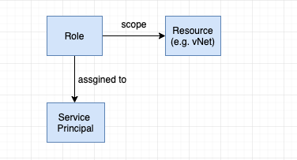

# Azure setup

[Azure isolation](https://docs.microsoft.com/en-us/azure/security/azure-isolation) allows distributing the cost of shared azure resources among multiple customers, preventing the risk of sharing physical servers and other infrastructure resources to run applications amongst multiple customers.

**Azure tenant** is a client or organization that owns and manages a specific instance of cloud service. A tenant is simply a dedicated instance of Azure AD that your organization receives and owns when it signs up for a Microsoft cloud service. Azure tenancy (Azure Subscription) refers to a “customer/billing” relationship and a unique tenant in Azure Active Directory.

Tenant level isolation in Microsoft Azure is achieved using Azure Active Directory and role-based controls offered by it.

Each **Azure subscription** is a logical permissions group and is associated with one Azure Active Directory (AD). You may want an additional subscription to avoid hitting subscription limits, to create separate environments for security, or to isolate data for compliance reasons. Azure subscription [trusts Azure AD](https://docs.microsoft.com/en-in/azure/active-directory/fundamentals/active-directory-how-subscriptions-associated-directory) to authenticate users, services, and devices.

Multiple subscriptions can trust the same Azure AD directory, but each subscription can only trust a single directory.

Subscription 1 ---|  
Subscription 2 ---|--------------> Active Directory  
Subscription 3 ---|

## IAM

Identity and Access Management can be configured at different levels. e.g. for a particular Resource Group, App Service, Storage Account etc or the Azure Subscription itself.

### IAM for the azure subscription

Select your account in the top-right corner -> My permissions -> Select Subscription -> Click here to view complete access details for this subscription -> Access control (IAM).

Your current URL contains the **subsctiption id** e.g. https://portal.azure.com/#@<tenant>.onmicrosoft.com/resource/subscriptions/<subscription-id>/users

#### Role assignments

List all the SPs:  -> Select Role Assignments -> Select Type {Apps}

Lists all the roles: -> Select Roles e.g. 'Owner' 'Contributor' 'Reader' and the Custom roles that you may have defined.



### IAM for Active Directory

Azure Active Directory -> App registrations -> Endpoints

Federated identity endpoints contain the **tenant id** e.g. Oauth Endpoint - https://login.microsoftonline.com/<tenant-id>/oauth2/token

## Securing azure services

Public internet access to your resources is not desirable. Locking down access to azure services is required for allowing traffic only from your virtual network or known IPs.

### Virtual Network service endpoints

Virtual Network (VNet) service endpoints allow you to [secure your critical Azure service](https://docs.microsoft.com/en-us/azure/virtual-network/virtual-network-service-endpoints-overview) resources by restricting access to the resources only via your virtual networks. Traffic from your VNet to the Azure service always remains on the Microsoft Azure backbone network.

Endpoints extend your virtual network private address space. The endpoints also extend the identity of your VNet to the Azure services over a direct connection. 


### IP firewall rules

[Microsoft recommends](https://docs.microsoft.com/en-us/azure/sql-database/sql-database-firewall-configure#recommendation) using server-level IP firewall rules for SQL administrators and when you have many databases that have the same access requirements and you don't want to spend time configuring each database individually.

One must explicitly **whitelist the IP addresses** that will be allowed access to a SQL Azure DB or add existing virtual networks to provide access to all databases in the dbserver.

* Allow access to Azure services ON: allows communications from all Azure IP addresses and all Azure subnets. These Azure IPs or subnets might not be owned by you. This ON setting is probably more open than you want your SQL Database to be.
* Allow access to Azure services OFF: most secure configuration

[Automatically configure](https://docs.microsoft.com/en-us/azure/sql-database/sql-database-firewall-configure#manage-server-level-ip-firewall-rules-using-azure-cli) firewall rules using the Azure   cli or REST api.

```sh
# Set server firewall -> add the following rule to

# provide access to any IP:
0.0.0.0 to 255.255.255.255
1.1.1.1 to 255.255.255.255

# give access to a single IP:
2.222.224.12 to 2.222.224.12
```
