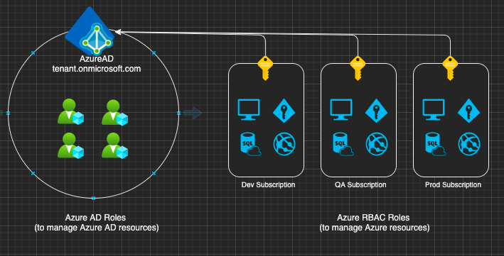
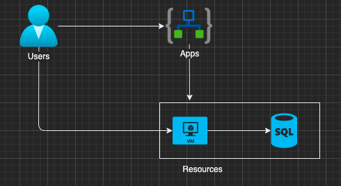

# Azure

[Azure isolation](https://docs.microsoft.com/en-us/azure/security/azure-isolation) allows distributing the cost of shared azure resources among multiple customers, preventing the risk of sharing physical servers and other infrastructure resources to run applications amongst multiple customers.

**Azure tenant** is a client or organization that owns and manages a specific instance of cloud service. A tenant is simply a **dedicated instance of Azure AD** that your organization receives and owns when it signs up for a Microsoft cloud service. Azure tenancy refers to a “customer/billing” relationship and a unique tenant in Azure Active Directory. Tenant level isolation in Microsoft Azure is achieved using Azure Active Directory and role-based controls offered by it.

* Each Azure AD directory is distinct and separate from other Azure AD directories. Just like a corporate office building is a secure asset specific to an organization, an Azure AD directory is also designed to be a secure asset for use by only a single organization.
* Azure AD runs on “bare metal” servers isolated on a segregated network segment, where host-level packet filtering and Windows Firewall block unwanted connections and traffic.
* An Azure AD tenant is logically isolated using security boundaries so that no customer can access or compromise co-tenants, either maliciously or accidentally.

**Azure subscription** is a logical permissions group associated with one Azure Active Directory (AD). A subscription [trusts Azure AD](https://docs.microsoft.com/en-in/azure/active-directory/fundamentals/active-directory-how-subscriptions-associated-directory) to authenticate users, services, and devices. You may create additional subscriptions to
* create separate environments for security e.g dev and prod subscriptions, or to isolate data for compliance reasons. 
* manage cost separately for cloud resources
* avoid hitting subscription limits

Multiple subscriptions can trust the same Azure AD directory, but each subscription can only be associated with a single directory.

#### Transferring subscription to a different tenant (changing directories)

When a subscription is created there are 2 roles that get automatically assigned to the user who created the subscription

* Account Admin - Billing and account ownership. This can be transferred to another tenant without changing the subscription and tenant association
* Service Admin - Admin for resources in the subscription

Transferring the subscription to another target (target tenant) means the account admin and service admin change to the target tenant. Several Azure resources have a dependency on a subscription or a directory. Transferring a subscription means role assignments, managed identities and a [range of other things](https://docs.microsoft.com/en-us/azure/role-based-access-control/transfer-subscription#understand-the-impact-of-transferring-a-subscription) are also deleted from the source subscription.

## IAM

Traditionally, organizations have secured their assets by establishing trust within the perimeter of the organisation's on premise network. Any communication going out or coming inside the network permiter was considered untrusted. With cloud computing where SAAS based resources are accessed over the public internet, ensureing the right people have access to the right resources and only when they need it is governed by issuing identity to resources, people and apps.

### Azure AD

Identity is at the heart of cloud security, it is something that remains constant whether you are an office based user or a cloud based one. By housing user objects, application objects and managed identities, Azure AD facilitates Identity and Access Management (IAM). It can be used to verify an identity (authentication) and control which identity has access to what resources (authorization). It can be configured at different levels. e.g. for a particular resource group, app service, storage account or the Azure subscription itself.

Users need access to apps and resources. Apps need access to resources and resources may need access to other resources. Access control is managed by Azure AD using **identities**

Azure AD can have different types of Identities

* User account
  * represents a staff member within the organization, can be cloud user, synchronized from on-prem AD or external guest user
  * user credentials such as username and password
* App
  * represents an application in use within the tenant
  * identity configuration for your application running in Azure or elsewhere that allows it to integrate with Azure AD
  * uses client secret or certificate for authentication
* Managed Identities
  * provides an identity for apps to use when connecting to resourecs supporting AD authentication
  * system assigned identity for accessing other Azure resources e.g. a VM accessing a SQl DB

For managing permissions and access control for your apps within Azure AD it is important to understand [what are application and service principal objects in Azure AD?](https://docs.microsoft.com/en-us/azure/active-directory/develop/app-objects-and-service-principals) To access resources that are secured by Azure AD, the entity that requires access must be represented by a **Service Principal**, the entity could be a

* user - user principal for delegated access (on behalf of the signed-in user) to resources
* an application or resource - service principal
  * Application
  * Managed Identity
  * Legacy (no associated app registration)

### IAM for the azure subscription

An Azure subscription uses RBAC (Role Based Access Control) for manging Azure resources.

For accessing IAM section of an azure subscription on the azure portal, select your account in the top-right corner -> My permissions -> Select Subscription -> Click here to view complete access details for this subscription -> Access control (IAM).

Your current URL contains the **subsctiption id** e.g. https://portal.azure.com/#@{tenant}.onmicrosoft.com/resource/subscriptions/{subscription-id}/users

#### Role assignments

Role assignments associate Service Principals to resources

List all the SPs:  -> Select Role Assignments -> Select Type {Apps}

Lists all the roles: -> Select Roles e.g. 'Owner' 'Contributor' 'Reader' and the Custom roles that you may have defined.

### IAM for Active Directory

Azure Active Directory -> App registrations -> Endpoints

Federated identity endpoints contain the **tenant id** e.g. Oauth Endpoint - https://login.microsoftonline.com/{tenant-id}/oauth2/token