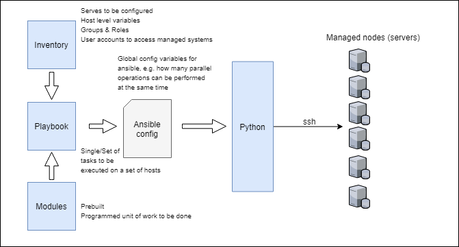

# Ansible

Ansible can be used for provisioning infrastructure, orchestrating and automating deployements. Unlike Puppet and Chef that use a **pull model** where agents deployed on the remote nodes (also called managed nodes) request relevant info (using HTTP APIs) from the masters that control configuration information, ansible uses a **push model** where the ansible control server pushes configuration to managed nodes over SSH.

In contrast to other configuration management frameworks, Ansible does not require the installation of any agents within managed environments. Instead commands are pushed over SSH and interpreted by a Python runtime. The Ansible **control server**, packages up the configuration in a python package and delivers it to the remote nodes over SSH, which upon execution return the execution result as json. The python package that was delivered is stored in a temp dir on the remote node and deleted after execution, therefore leaving no residual software on the remote node.

