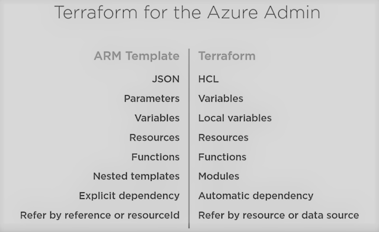

# Terraform

Tool to automate the deployment of your infrastructure across multiple clouds, both public and private. This enables Infrastructure as code to provision and manage any cloud, infrastructure or service.

* Friendly custom syntax (supports comments), uses HCL - Hashicorp configuration language but also has support for JSON
* Visibility into changes before they actually happen.
* Built-in graphing feature to visualize the infrastructure.
* Understands resource relationships. One example is failures are isolated to dependent resources while non-dependent resources still get created, updated, or destroyed. Resource referencing is intuitive.
* Open source project with a community of thousands of contributors who add features and updates.
* The ability to break down the configuration into smaller chunks for better organization, re-use, and maintainability. The last part of this article goes into this feature in detail.

Will Brock's [terraform playlist](https://www.youtube.com/playlist?list=PL8HowI-L-3_9bkocmR3JahQ4Y-Pbqs2Nt) is a good resource for learning terraform.

## Arm and Terraform

On Azure, you can run terraform directly in the azure cloud shell, which has the `azcli` and `terraform` both installed.



## Providers

A provider is responsible for understanding API interactions and exposing resources. [Providers](https://registry.terraform.io/browse/providers) generally are an IaaS (e.g. Alibaba Cloud, AWS, GCP, Microsoft Azure, OpenStack), PaaS (e.g. Heroku), or SaaS services (e.g. Terraform Cloud, DNSimple, Cloudflare). There are 3 Azure providers in Terraform

* Azure - Used to interact with Azure public cloud, Azure gov cloud or one of the sovereign clouds. It uses the Azure Resource Manager (Azure RM) API.
* Azure Stack - On premise extension of Microsoft Azure. It uses the same ARM API, but some of the versions and resources are different.
* Azure Active Directory - Explicitly deals with Azure AD

Providers have:

* Version: Terraform providers are versioned, allows you to specify the version of the provider to use
* Data sources: Information that you can pull from the provider about your target environments. e.g. get a list of marketplace images or get an existing virtual network that's already been provisioned or subscription details of the target subscription
* Resources: e.g. create an Azure VM in a Vnet that you got from the data sources.
* Modules: help deploy common configurations for that provider. These modules can be found on public terraform registry: `registry.terraform.io`
* Authentication:
  * azcli
  * managed service identity - a VM running in azure under managed identity
  * service principal with client secret
  * service principal with client certificate

```sh
    provider "azurerm" {
        version         = "~> 1.0" # stay in the 1 major version 1.x
        alias           = "networking" # allows you to create multiple instances of the same provider
        subscription_id = var.subscription_id
        cliend_id       = var.client_id
        client_secret   = var.client_secret
    }
```

## Modules

As teams and operations scale you want to organise your infrastructure resources into meaningful groups by keeping their configurations separate.

A module is a container for multiple resources that are used together. Modules can be used to create lightweight abstractions, so that you can describe your infrastructure in terms of its architecture, rather than directly in terms of physical objects.

Generally it is advisable to **avoid preemptively creating modules** and only doing it after seeing patterns emerging. Eventually you may end up with a structure like:

* application
  * modules
    * frontend
    * backend
    * database

Using a standard [module structure](https://www.terraform.io/docs/modules/index.html#module-structure) is recommended for reusable modules. Terraform tooling is built to understand the standard module structure and use that structure to generate documentation, index modules for the module registry, and more.

### Passing variables to modules

You cannot pass references into variables as variables are initialized before any parsing is done. Rather than passing arguments as `variables` if you need to dynamically obtain the value for a module variable, you can use `local` constructs as they are evaluated later in the plan/apply process. An example of this is provided [here](https://discuss.hashicorp.com/t/passing-values-in-existing-variables-to-modules/4803/3)

## Remote state

Terraform stores state about your managed infrastructure and configuration. This state is used by Terraform to map real world resources to your configuration, keep track of metadata, and to improve performance for large infrastructures.

This state is stored by default in a local file named `terraform.tfstate`, but it can also be stored remotely, which works better in a team environment.

A [backend](https://www.terraform.io/docs/backends/index.html) in Terraform determines how state is loaded and how an operation such as apply is executed. This abstraction enables non-local file state storage, remote execution, etc. e.g. when commands like plan, apply or destroy are running terraform puts a lock on the state file to ensure it can only be modified in isolation.

A backend like Azure blob storage supports locking

```sh
backend "azurerm" {
    storage_account_name = "storestate"
    container_name       = "terraform-state"
    key                  = "prod.terraform.tfstate"
    access_key           = "access_key"
}
```

## Workspaces

```sh
terraform workspace -h
```

Terraform CLI workspaces are associated with a specific working directory and isolate multiple state files in the same working directory, letting you manage multiple groups of resources with a single configuration.

One configuration -> multiple states (multiple workspaces)

```sh
* dev.tfstate
* qa.tfstate
* prod.tfstate
```

The persistent data stored in the backend belongs to a workspace. Initially the backend has only one workspace, called "default", and thus there is only one Terraform state associated with that configuration. Some backends support multiple named workspaces, allowing multiple states to be associated with a single configuration. Unfortunately, one workspace can only be associated with a single backend, therefore all your state for all your environments ends up in the same bucket. If you require separate backends for separate environments [workspaces are not ideal for system decomposition](https://developer.hashicorp.com/terraform/language/state/workspaces#using-workspaces).

## Provisioners

[Provisioners](https://www.terraform.io/docs/provisioners/index.html) can be used to model specific actions on the local machine or on a remote machine in order to prepare servers or other infrastructure objects for service.

Provisioners are a Last resource and be used with caution. An example of running a local provisioner on the machine that terraform is running on, rather than running the provisioner on a remote VM.

```sh
resource "null_resource" "post_config" {

    depends_on = [azurerm_role_assignment.vnet]

    provisioner "local-exec" {
        command = <<EOT
    echo "export TF_VAR_my_vnet_id=${module.vnet-my.vnet_id}" >> file.txt
    EOT
    }
}
```

## Terraform workflow

Terraform [Infrastructure as Code (IaC) workflow](https://learn.hashicorp.com/tutorials/terraform/infrastructure-as-code?in=terraform/aws-get-started) uses Terraform plugins called [providers](https://registry.terraform.io/browse/providers) that let Terraform interact with cloud platforms and other services via their application programming interfaces (APIs).

### terraform init

* pulls down and installs all the providers e.g. `azurerm` and modules(written in the Terraform language) being referenced in your configuration
* initializes the `.terraform` directory: a local cache where terraform retains some files it will need for subsequent operations against this configuration. Its contents are not intended to be included in version control
* creates or updates the dependency lock file `.terraform.lock.hcl`: determines compatibility between the current terraform configuration and dependencies (providers and modules). At present, the dependency lock file tracks only provider dependencies. Terraform does not remember version selections for remote modules, and so Terraform will always select the newest available module version that meets the specified version constraints.

### terraform plan

Identify the changes that terraform will apply based on your configuration

Pass inline variables

`terraform plan -var client_id=$AZURE_CLIENT_ID -var client_secret=$AZURE_CLIENT_SECRET -out my.tfplan # output the plan to a file 'my.tfplan'`

Pass variables as file

`terraform plan -var-file="terraform.example.tfvars" -out my.tfplan`

### terraform apply

`terraform apply "my.tfpan" # apply the plan`

### Logs

For debugging purposes, log levels can be set using the `TF_LOG` environment variable. e.g. `TF_LOG=DEBUG terraform destroy`

### Defining resources

```sh
resource "<type>" "<terraform_identifier>" { # <terraform_identifier> or variable name
  name     = "resourceGroup1"
  location = "West US"
}

# Usage
resource "azurerm_resource_group" "rg1" {
  name     = "resourceGroup1"
  location = "West US"
}
```

## Terragrunt

Terragrunt is a thin wrapper (executable) that can auto generate terraform configuration prior to invoking terraform. e.g. parameterising remote state config. This is controlled by `hcl` files, usually one per module that you put within your directories. This may help in

* Reducing repetition. Essentially it helps provide configuration to terraform which can also be provided at runtime via a text file or environment variables.
* Working with multiple terraform modules
* Managing terraform state by making it more granular e.g. one state file per module. Large configurations in a single state file used to be resource intensive to apply in terraform

Terraform has probably evolved to fill the gap in functionality that terragrunt once provided. Especially post 0.12 versions terraform state is less brittle and terraform plans are based on diffs as opposed to a complete state refresh.
