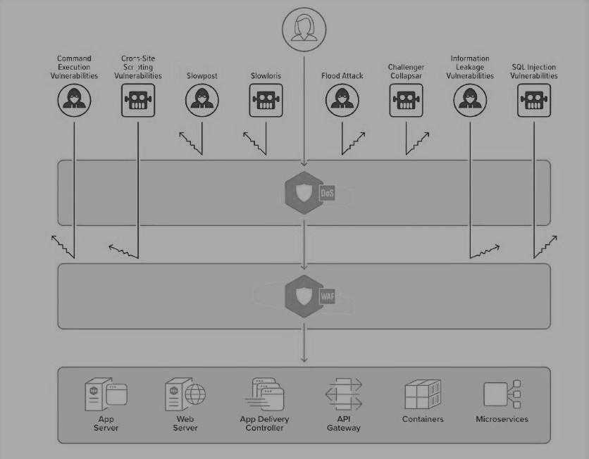

# Nginx

While Nginx is primarily a webserver it also provides layer 7 load balancing capabilities. Nginx started off as basic reverse proxy, created by *Igor Sysoev* while he was working as a sysadmin at Rambler (Russian equivalent of yahoo). He was looking at ways to improve Apache's performance. Due to the several inherent design choices Apache had the inability to handle more than 10k simultaneous users, commonly known as the **C10k problem**.

Nginx can address many use cases and provides all the tools for delivering your applications reliably with a low resource footprint. As a web server, it serves static content directly and reverse proxies to other application servers accepting TCP connections and making new TCP connections to upstream servers. As a caching engine it handles both static and dynamic content.

* Basic load balancer
* Reverse proxy and HTTP web server
* Serves static content very efficiently and reliably, using relatively little memory
* Set request limit (request rate) - Effective way to protect against DOS by blacklisting IP addresses. Possible to set the IPs in key value store. Also use Fail2ban.

In addition to the above **Nginx Plus** provides commercial load balancing, authentication, access control, application‑aware health checks and more configuration and monitoring options. It can be used alongside or as a replacement for hardware load balancers.

## Nginx and Apache

Apache is an HTTP server designed to serve static web pages. It can serve dynamic content using various technologies such as Java Servlets, JSPs, PHP, CGI, Python or whatever. It spins new threads as the server get busy, therefore ends up using more memory with each new connection. Performance asymptotically slows as you reach your server's limit.

Apache HTTP and Apache Tomcat can be used together through a connector module called `mod_jk`. This allows you to use the Apache HTTP server to serve regular static webpages, and the Tomcat Servlet engine to execute servlets.

Apache runs PHP or Python in  process and utilises *AppArmour* to elevate & downgrade privileges for 3rd party code. Nginx on the other hand runs 3rd party code in a contained environment - *jail* or *container* not in the Nginx process by default. Therefore you get a higher degree of isolation and a better security model with Nginx.

As well as performance, consider which web server you are more familiar with, while opting for one.

## Nginx as an API Gateway

For most microservices‑based applications, it makes sense to implement an [API Gateway](https://www.nginx.com/blog/building-microservices-using-an-api-gateway), which acts as a single entry point into a system. The API Gateway is responsible for request routing, composition, and protocol translation. It provides each of the application’s clients with a custom API. The API Gateway can also mask failures in the backend services by returning cached or default data.

An API gateway restricts access to your backend servers whereas [WAF](https://www.owasp.org/index.php/Web_Application_Firewall) - Web application firewall protects your application logic from layer 7 attacks including SQL injection, XSS, CSRF and more. It works as an intermediary between external users and web applications. While proxies generally protect a client machine’s identity by acting as an intermediary, WAFs protect servers.

Like hardware load balancers, WAFs have traditionally been in the realm of hardware appliances and suffered from the same shortcomings - cost and inflexibility to scale up and down. The Nginx WAF module is based on the widely used open source software **ModSecurity**. ModSecurity is a basic WAF module, if you need performance optimizations there are supported versions of ModSecurity available from F5. Nginx also provides a commercial WAF offering with [Nginx App Protect](https://www.nginx.com/products/nginx-app-protect/)

[IPS](https://www.lanner-america.com/blog/waf-vs-ips-whats-difference/) - Intrusion Prevention System is a layer 3/4 general purpose protection appliance or software. It provides protection from traffic from a wide variety of protocol types, such as DNS, SMTP, TELENT, RDP, SSH and FTP.

API gateways provide utility in dealing with some [specific concerns](https://www.nginx.com/blog/microservices-api-gateways-part-1-why-an-api-gateway) — such as authentication and rate limiting but business logic and process orchestration implemented in middleware, especially where it requires expert skills and tooling can lead to **overambitious API gateway** problems.

### Access management and security control

* IP Access Control List (ACL) - `Allow` & `Deny` directives can be used to whitelist or blacklist IP addresses or subnet(s). **Failtoban** - dynamically manage blacklists.

* SSL/TLS offload with integration to Let's Encrypt - fully automated, free certificates trusted by 99% of browsers.

* Rate, connection and bandwidth limiting can help mitigate some forms of DDoS.

* HTTP Basic and [Authentication based on Subrequest result](https://docs.nginx.com/nginx/admin-guide/security-controls/configuring-subrequest-authentication/) - proxy pass to external authentication service, such as LDAP or OAuth. If the auth server is HTTP based, the authentication setup is straight forward, but if your are going to authenticate against LDAP you'll have to write an HTTP to LDAP converter that generates an LDAP request from an HTTP request, authenticates with LDAP and returns the response as HTTP.

* JWT Token Based authentication - (exclusive to Nginx Plus) JWT Token once received by the client app from the JWT issuer (Identity provider) can be validated & parsed by Nginx. **Identity Propagation** - The relevant identity fields after being parsed, can be passed onto the upstream APIs as standard HTTP headers. Nginx can also perform authorization for certain endpoints that have restricted access e.g. admins, by inspecting the groups present in the token.

* NTLM proxying - (exclusive to Nginx Plus) Nginx interleaves requests across different connections to upstream servers in order to optimize traffic (HTTP2). NTLM requires each request to be sent over a different HTTP connection so that requests from different users are not interleaved on the same connection. By specifying `ntlm` directive Nginx does not interleave requests across connection(s).

## Nginx monitoring

* https://amplify.nginx.com is a SAAS based monitoring tool that provides real time monitoring, alerting and configuration checking - runs a bunch of tools to determine your configuration is safe e.g. SSL configuration. You can use NGINX Amplify for free on up to 5 servers. There is no trial period, so you can monitor those servers, for free, indefinitely.
* https://www.datadoghq.com/blog/how-to-monitor-nginx

## ModSecurity WAF

ModSecurity is an open source tool for securing applications, used by over a million sites around the world. It protects against a broad range of Layer 7 attacks, such as SQL injection (SQLi), local file inclusion (LFI), and cross‑site scripting (XSS), which together accounted for 95% of known Layer 7 attacks in Q1 2017, [according to Akamai](https://content.akamai.com/am-en-pg8854-q1-17-soti-security.html).

* Inspects incoming HTTP requests for anomalies
* Uses database of rules to define behaviours. It supports:
  * free open source OWASP ModSecurity Core Rule Set (CRS) with generic attack detection
  * commercial TrustWave rule set (rule package updated daily) that works alone or with OWASP CRS with specific attacks & accuracy,
* Traffic that violates rules are dropped and/or logged

The latest version, ModSecurity 3.0, has a modular architecture that runs natively in NGINX. Previous versions worked only with the Apache HTTP Server. Modsecurity can be [complied and installed for open source inginx](https://www.nginx.com/blog/compiling-and-installing-modsecurity-for-open-source-nginx/)

## Nginx DOS protection

