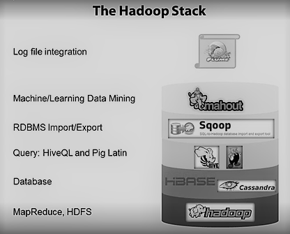

# Aspects of big data

* Data that is too big (100s of TB - x PB) or moves too fast to be processed by conventional means (too big of OLTP).
* Three Vs
  * Volume -  Data too big to fit on a single machine
  * Velocity - The rate at which the data comes into the system and the velocity of the output of the system matters. The tighter the feedback loop, the greater is the competitive advantage. The results might go directly into a product e.g. – Facebook recommendations. The need of speed has also driven the development of NoSQL databases where RDBMS' aren’t the right fit.
  * Variety - The data being generated can be unstructured with a format that is outside your control. A common use of big data processing is to take unstructured data and extract meaning out of it for either human consumption or as a structured input to another application.  Relational databases with their fixed schemas aren’t always a natural fit for storing such data. Semi-structured NoSQL databases provide the flexibility to store unstructured data that has less formal schema.

* Partition a big dataset into multiple smaller datasets and send each chunk of the data to a separate node in a cluster to be processed individually and in parallel.

## Big data architectures

Effective use of data follows a kind of Maslow's hierarchy of needs. The base of the pyramid involves capturing all the relevant data, being able to put it together in an applicable processing environment (be that a fancy real-time query system or just text files and python scripts). This data needs to be modeled in a uniform way to make it easy to read and process. Once these basic needs of capturing data in a uniform way are taken care of it is reasonable to work on infrastructure to process this data in various ways—MapReduce, real-time query systems, etc.

It's worth noting the obvious: without a reliable and complete data flow, a Hadoop cluster is little more than a very expensive and difficult to assemble space heater. Once data and processing are available, one can move concern on to more refined problems of good data models and consistent well understood semantics. Finally, concentration can shift to more sophisticated processing—better visualization, reporting, and algorithmic processing and prediction.

In my experience, most organizations have huge holes in the base of this pyramid—they lack reliable complete data flow—but want to jump directly to advanced data modeling techniques. This is completely backwards.

So the question is, how can we build reliable data flow throughout all the data systems in an organization?

Traditional [big data architectures](https://docs.microsoft.com/en-us/azure/architecture/data-guide/big-data/) are designed to handle the ingestion, processing, and analysis of data that is too large or complex for traditional database systems. In these architectures data is moved from the operational plane (producers of data) to the analytical plane (consumers of data) via a [data pipeline](./Data%20Processing%20Pipeline.md). This separation can create data silos where data engineering teams have little knowledge of the domain and the domain teams produce data without considering how it may be used externally, resulting in data quality, accuracy and freshness issues.

### Data mesh

A Data mesh brings the operational and analytical planes together and advocates for applying the well known principles and practices that we have come to know of in the operational plane (microservices, DevOps) to the analyical data plane.

* Data as a product
  * apply product thinking to data, thinking from the point of view of the customers of your data, where a domain's internal state is encapsulated, however the shared state or as [Pat Helland](https://www.cidrdb.org/cidr2005/papers/P12.pdf) puts it **data on the outside** is made easy to be shared with the consumers.
  * data as a product not a by-product, think data contracts for publishing schemas with appropriate backwards and forwards compatibility so that existing consumers can continue to work when you add a new field, however if you do introduce a breaking change, then you use a versioned message/event
* Domain driven decentralized data ownership
  * move from monolithic ownership of data to distributed ownership within domain teams
  * move away from technology driven architecture (data ingestion, ETLs, pipelines) to domain driven data
* Self serve infrastructure as a platform
  * apply infrastructure as code and platform thinking to data operations. Data infrastructure platform is agnostic to the domains and provide cross cutting functionality:
    * storage
    * unified pipeline with reliable data flow throughout all the data systems with a well defined API for adding data rather than many point to point pipelines
    * catalogue
    * schema registry - maintains a database of schemas to manage data definition and evolution of data in time e.g. change in data format - date to string or if a field in the data message gets renamed. The schema registry provides runtime validation of schema compatibility via an API and caching for schemas so that they don't need to be included in the message payload. A producer configured to use the schema registry, it calls at produce time an API at the Schema Registry REST endpoint and presents the schema of the new message. If it is the same as the last message produced then the produce may succeed, if it is different but matches the compatibility rules defined for the channel the produce may still succeed
    * access control - segregate public and private channels for handling data, service PII and GDPR requirements
    * governance and observability - data lineage for visibility of where data comes from (source), where it goes (destination) in a real time graph
* Federated computational governance
  * apply distributed data governance where domain teams or communities as opposed to central gatekeepers are responsible for defining data quality, security and data ownership
  * ensure governance requirements are computationally embedded using automation in the data platform tooling e.g. embed policies into every endpoint and access point and enforce them at the time they get built, deployed or accessed

#### Limitations of data mesh

Not that these limitations cannot be resolved but before adopting data mesh within your organization it is important to understand the tradeoffs

* For servicing the data product if different domains are required to keep different interpretations of data belonging to other domains, multiple copies of data can lead to data divergence and governance nightmare
* Data engineering specialists required in domain teams who are familiar with data tools and systems - data lakes, ETLs, stream processing, data warehouses and maybe Hadoop/Spark ecosystem

### Balancing request-response and event-driven paradigms

The [data dichotomy](https://www.confluent.io/blog/data-dichotomy-rethinking-the-way-we-treat-data-and-services) describes the tension between business services that manage operational data and data services that provide business intelligence. It provides Stateful Stream Processing as a possible compromise. Using messaging to make services Event Driven can provide better scalability and better decoupling than the Request-Response alternatives, as they move flow control from the sender to the receiver. This increases the autonomy of each service. In fairness it comes at a cost: you need a broker. But for significant systems, this is often a tradeoff worth making (less so for your average web app)

 Messaging without storage has no historical reference and can lead to data corruption over time. If the broker is a distributed log, rather than a traditional messaging system, a few additional properties can be leveraged

* The transport can be scaled out linearly in much the same way as a distributed file system
* Data can also be retained in the log, long term. Sometimes a domain needs a local, historic dataset in a database engine of their choice. The trick here is to ensure that the copy can be regenerated from source at will, by going back to the Distributed Log. Connectors in Kafka help with this. So it’s messaging, but it’s also storage. Storage that scales, and without the perils of shared, mutable state.

A Lambda architecture separates batch processing from stream processing whereas the Kappa architecture enables you to build your streaming and batch processing system on a single technology. With a sufficiently fast stream processing engine (like Hazelcast Jet), you may not need a separate technology that is optimized for batch processing. While the Lambda Architecture does not specify the technologies that must be used, the batch processing component is often done on a large-scale data platform like Apache Hadoop. The Hadoop Distributed File System (HDFS) can economically store the raw data that can then be transformed via Hadoop tools into an analyzable format. While Hadoop is used for the batch processing component of the system, a separate engine designed for stream processing is used for the real-time analytics component. One advantage of the Lambda Architecture, however, is that much larger data sets (in the petabyte range) can be stored and processed more efficiently in Hadoop for large-scale historical analysis.

### Data lake

Data Lake is a methodology of storing data within a system that facilitates the collation of data in variant schemas and structural forms, usually object blobs or files.

A **data warehouse** typically stores highly structured, frequently accessed data in a relational, PostGres like database with direct ODBC/JDBC connections.

Databases require you to structure data according to a particular model (e.g. relational or document) whereas files in a distributed filesystem are just byte sequences which can be written using any data model and encoding. They might be collections of database records but they can equally well be text, images, videos, sensor readings, genome sequences or any other kind of data.

Hadoop opened up the possibility of indiscriminately dumping data into HDFS, and only later figuring out how to process it further. By contrast, MPP (Massively Parallel Processing) databases typically require careful **up-front modelling** of the data and query patterns before importing the data into the database's proprietary storage format.

From a purist's point of view, it may seem that careful modelling and import is desirable, because it means the users of the database have better-quality data to work with. However, in practice, it appears that simply making data available quickly - even if it is in a quirky, difficult-to-use, raw format is often valuable than trying to decide on the ideal data model up front.

The idea is a data lake is similar to that of a data warehouse: simply bringing data from various parts of a large organization together in one place is valuable, because it enables joins across datasets that were previously disparate.

SQL is completely relational, while your **data lakes** are completely unstructured — they can be any kind of data.

#### Hadoop

The concept of a data lake is closely tied to Apache Hadoop and its ecosystem of open source projects.

Hadoop is a platform for distributing computing across a number of servers in a cluster. It is an open source implementation of MapReduce. It combines a **MapReduce** engine with a **Hadoop distributed file system (HDFS)**. HDFS allows the disks local to individual nodes in a Hadoop cluster to operate as a single pool of storage. Files are replicated across various nodes so that loss of one node will not cause loss of data. Facebook uses A MySQL database to store the core user data which is then derived on to Hadoop servers. After computations the data is then transferred to MySQL database for pages served to the users.

When working with very large data sets, it can take a long time to run the sort of queries that clients need. These queries can't be performed in real time, and often require algorithms such as **MapReduce** that operate in parallel across the entire data set. The results are then stored separately from the raw data and used for querying.

* Map: split the data and distribute the computation over multiple servers in parallel. For that computation to take place each server must have access to the data. HDFS makes this possible.
* Reduce: take the O/P from the map phase (in a key value format) and aggregate the results

Gartner estimates the failure rate of Big Data projects is as high as 85% and predicted that Hadoop implementations are [deemed to be obsolete](https://www.analytics.today/blog/snowflake-vs-hadoop) as a result of complexity and questionable usefulness.

#### Apache Spark

Whereas Hadoop was a child of the cheap storage era, Spark is a child of the memory and network era.

* Large scale data processing engine that can run on Hadoop, Mesos, standalone, or in the cloud.
* Spark can perform more efficient computations in less time using fewer machines than Hadoop.
* Its generalized abstractions result in less code.

**Cluster manager** manages resource distribution between different apps. **Yarn** and **Mesos** are two most widely used cluster managers in big data systems at the moment, Spark can run on either
