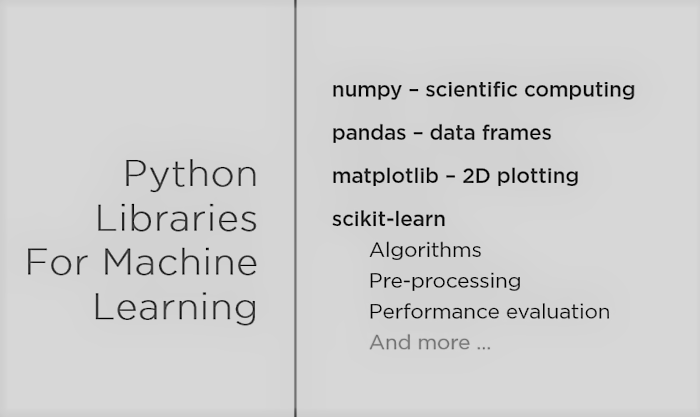

# Machine Learning

There are two ways of programming computer systems. The traditional way is by defining the steps to achieve an outcome e.g. providing a recipie to the computer to perform a task. The other way is by providing the computer lots and lots of data and the computer learns to classify this data by ingesting this data. This method didn't catch on until recently because there wasn't enough data. But with the advent of the smart phones, social media we now collect lots and lots of data. 

Given a dataset, machine learning is used to make sense of  data by finding patterns in the data. Patterns could be found by a human just looking at the data if the dataset is small or by using an **algorithm** e.g. linear regression `y = mx + b` to fit points to a line. The values of `m` and `b` are derived mathematically using an algorithm to best fit the line, thus giving you a **model** like `y = 10x + 4` that can recognize patterns. Applications can then supply new data to the model to see if the new data matches this known pattern based on the value of `m` and `b`.

Algorithms are designed to be efficient. Being fully efficient, always doing what you are told, always doing what you are programmed to do is not always the most human thing to do. Sometimes its disobeying, sometimes its saying "No I'm not gonna do this". If you automate everything and the algorithms do what they are supposed to do, sometimes it can lead to very inhumane things.  

## Machine learning and data science

Data science and machine learning [share a lot of common ground](https://www.analyticsvidhya.com/blog/2019/10/mathematics-behind-machine-learning/) but there are subtle differences in their focus on mathematics. In data science our primary goal is to explore and analyse the data, generate hypotheses and test them. On the other hand, machine learning focuses more on the concepts of [Linear algebra](https://www.analyticsvidhya.com/blog/2017/05/comprehensive-guide-to-linear-algebra/?utm_source=blog&utm_medium=mathematics-behind-machine-learning) as it serves as the main stage for all the complex processes to take place. Multivariate calculus, or partial differentiation to be more precise - the driving force behind most machine learning algorithms is used for the mathematical optimisation of a given function (mostly convex).

Mathematical optimization - maximizing or minimizing a real function by systematically choosing input values from within an allowed set and computing the value of the function.

[Derivatives in differential calculus](https://www.youtube.com/watch?v=rAof9Ld5sOg) - rate of change of a function e.g. f(x) = x 2 and finding the slope of a curve.

Broadly there are [3 types](https://www.analyticsvidhya.com/blog/2017/09/common-machine-learning-algorithms/) of machine learning algorithms:

## Supervised

A labelled dataset (with complete class information available) is given to the data model. Each dataset has a set of **feature values** and the value that we want to predict. The model gets feedback on what is correct and what is not. The mapping between the data and the label helps in **classification**.

e.g.

* Predicting the price of a house, houses could be classified into new 2 bedroom houses built after 2010. This classification can then provide a price.
  
```javascript
    {
      price: 98000,
      size: 2255,
      bedrooms: 3,
      yearbuilt: 2010
    }
```

* Detecting fraud in a set of financial transactions.

* Classifying the type of car in an image.

[**Regression**](https://en.wikipedia.org/wiki/Regression_analysis) is another supervised machine learning technique which is used to predict continuous values. It is often used for estimating the relationships amongst data variables. The ultimate goal of the regression algorithm is to plot a best-fit line or a curve between the data.

## Unsupervised

Most data is unstructured, complex and unlabelled (with no available class information), so we do not always have the privilege of classification based on labelled data. In unsupervised learning, groups of data that share the same traits are identified. The data model gets no feedback, it has to figure out the structure of the data by itself to perform a given task. This is harder to do but more convenient.

In supervised learning you can get feedback at every move because expected input/output pairs are present, but in the unsupervised approach you do not get feedback at all.

**Clustering** is an unsupervised machine learning technique. Data is grouped into a cluster: a group where all group members are similar in nature in some way and members of one cluster are dissimilar to the members of another cluster. e.g. *gene cluster*. Clustering can be very helpful with unlabelled data. It is used in applications like

* Document classification: Google news uses various clustering techniques to group news, posts and articles on the web.
* [Bloomberg](https://www.bloomberg.com/professional/tech-decoded/) reviews vast quantities of previously published news stories and social posts to assign a positive, negative or neutral score to each, giving investors a directional sentiment score, which they can use to understand the impact of the current news story or social post on the price of the security. They use Natural Language Processing (NLP) in making sense of the human language to read and decipher the data contained in words to reveal meaning in the data of the financial world.

* City planning, grouping houses by type, value, location.

`Input data + Number of clusters => Learning process => Clustered data`

## Reinforcement

Reinforcement learning is used to train machines to make specific decisions. The machine is exposed to an environment where it trains itself continually using trial and error. It involves finding a balance between exploration (of uncharted territory) and exploitation (of current knowledge).

The model gets feedback only when it has finished its goal. e.g. a machine playing chess would only get feedback if it wins or loses the game. For most part, the machine is trying to make moves that it thinks will win without knowing if they will. It gets zero reward until it finally wins the game. Thus, reinforcement learning is particularly well-suited to problems which include a long-term versus short-term reward trade-off. It has been applied successfully to various problems, including robot control, elevator scheduling, telecommunications and games.

## Deep learning

Neural networks one of the machine learning models/techniques used widely. When we use a neural network that is not just one or two layers but many layers deep to make a prediction we call that deep learning. It is a subset of machine learning that has outperformed almost every other type of model, almost every time on a huge range of tasks, but it needs a relatively large data set as compared to regression and classification.

### Recurrent Neural Network

Google translate used a bit
https://github.com/martin-gorner/tensorflow-rnn-shakespeare

Modify input weights and biases in order to minimise the deviation from the expected output.

### Activation function

* Sigmoid -  (0 to 1)
* Hyperbolic tangent - tanh (-1 to 1)

### LSTM - Long Short term memory

Mitigates the vanishing gradient problem

## ML Cloud APIs

* Speech API - convert speech to a transcript (text)
* Natural Language API - analyse the text
    * Extract entities (nouns) from the text
    * Sentiment analysis, analyse syntax
* Translate API - Google Translate is used by Air B&B to translate postings and reviews submitted in languages other than English.
* Neural Machine Translation - NY times

## Python ML Libraries

