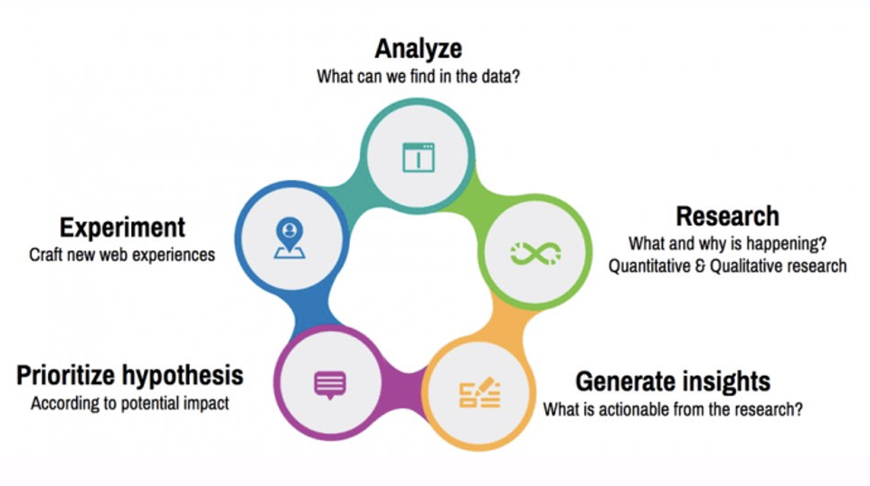

# Big data in the cloud

Data services broadly fall into the following categories

## Data integrations - moving data

targeted at Data Engineers

* AWS Glue
  * serverless data integration service that provides both visual and code-based interfaces to discover, prepare, and combine data for analytics, machine learning and application development
  * allows you to visually create, run and monitor ETL workflows in AWS Glue Studio
  * with AWS Glue DataBrew, data analysts and data scientists can visually enrich, clean, and normalize data without writing code
  * with AWS Glue Elastic Views, application developers can use SQL to combine and replicate data across different data stores

* Azure Data Factory
  * serverless data integration and transformation service
  * code free and code based ETL and ELT processes
  * orchestrate and monitor data pipelines

* Google Cloud Dataprep
  * serverless service for visually exploring, cleaning, and preparing structured and unstructured data for analysis, reporting, and machine learning.

* Tools used
  * dbt for data transformations in your cloud data warehouse like Snowflake for creating data models
  * SQL & python - data analysis and exploration
  * Snowflake - cloud data warehousing

### Stream processing

Stream processing is the infrastructure for continuous data processing. The computational model can be as general as MapReduce or other distributed processing frameworks, but with the ability to produce low-latency results. The real driver for the processing model is the method of data collection. Data which is collected in batch is naturally processed in batch. When data is collected continuously, it is naturally processed continuously.

* Kafka - messaging system with durability guarantees and strong ordering semantics
* Kinesis Data Stream - collection and storage mechanism
  * ingest and store data from multiple data sources - log & event data collection, IOT, mobile and game devices
  * after data stream is saved, a data receiver e.g. firehose, lambda is required for further data processing or delivery
* Kinesis Data Firehose - delivery mechanism
  * easiest way to load streaming data into data lakes - S3, RedShift, Open Search or Splunk
  * writes data in micro batches, buffer of 60 seconds for **near real-time processing**
  * for real-time processing you can remove firehose and replace it with a lambda
* Kinesis Data Analytics
  * analyze streaming data for **real-time insights** e.g. used to uncover real-time monitoring metrics such as response time and error-rate spikes in a centralized logging system
  * provides real-time streaming ETL and analytics using Apache Flink - open-source framework and distributed processing engine for stateful computations like filtering, grouping, aggregating, joining and more.
  * build streaming application using Apache Flink in Java, Scala, and Python
  
## Analytics and modelling

Targeted at Data Analysts, Data Scientists

Questions data analysts help answer

* Descriptive analysis, *What happened (past)?*
* Diagnostic analysis, *Why did something happen?*
* Predictive analysis, *What is likely to happen (future)?*
* Prescriptive analysis, *What actions should be taken?*

The tools you use for data analysis and processing defer depending upon the type of analysis you are performing and whether you are going to employ [machine learning in real time](https://dzone.com/articles/build-and-deploy-scalable-machine-learning-in-prod)

* you want to deploy a new model in production in real time (as soon as it is built) ? Overtraining the models can lead to information loss. Generic ML models that are based on a wider data set e.g. a model per geographical region will provide better results than a model per gas site.
* is latency of the model build process an issue ?
* is the ordering of messages important ?
* analytics of fuel prices and sales volume streams ? - adopt stream analytics (aggregations and statistical metrics over a large number of events) Many open source distributed stream processing frameworks are designed with analytics in mind - Apache Storm, Spark Streaming, Samza and Kafka streams
* monitoring in place for analysing the outcomes of the applied model ?
* single model per tenant or a single model for the entire system ?

### Digital Analytics

* **Conversion Rate Optimization** -  Better understanding of customers and their behaviors so as to positively impact conversion rates at all stages throughout the customer journey
* Tech enablement
  * One of, if not the, most important responsibility of a Digital Analyst is making sure that the **web analytics platform** of choice is setup in the right way. That can either be in the analytics platform itself to ensure variables are set up and channels are classified, or making sure that tracking has been briefed into Developers to be tracked through a tag management system
* Analysis of product improvements and feature releases
  * Once the data has been collected and processed properly, the next step is to analyse the data. Whether that be in a dashboard, excel or python, the data is poured through to find insights. These tend to be pieces of work as a result of  a question that someone has asked or some exploratory analysis off the back of an A/B test, but ultimately this is where actionable insight can be found to make change in the product
* Post experiment analysis to feed further experimentation
  * While the Optimisation analysts handle the prioritisation, running and in-flight analysis of A/B tests, the digital analyst’s will support optimisation analysts by performing proactive analysis to uncover areas of opportunities that feed hypothesis backlog for running A/B tests.
  
* Tools used
  * Analytics: Excel, SQL
  * Attribution and marketing analytics platform where primary focus is user acquisition and marketing ROI:  AppsFlyer for mobile apps
    * **Attribution**: AppsFlyer tracks and attributes user installs and actions to specific marketing channels or campaigns. It helps you understand which advertising campaigns or channels are driving app installs and user engagement.
    * **Marketing Analytics**: AppsFlyer provides detailed data on user acquisition, retention, and the lifetime value (LTV) of users acquired through different marketing efforts. It enables you to optimize your marketing spend and strategies.
    * **In-App Events**: You can track and measure specific in-app events and user interactions, such as purchases, sign-ups, or any custom events you define
    * **Deep Linking**: AppsFlyer supports deep linking, allowing you to route users to specific content or features within your app based on the marketing source that brought them to your app.
    * **Fraud Prevention**: It includes features for fraud detection and prevention, helping you ensure that your marketing budget is not wasted on fraudulent activities.
  * Web analytics tools like Adobe Analytics, Google Analytics for in-depth user behavior analysis. Its features include:
    * **User Analytics**: Google Analytics provides detailed insights into user behavior, including user sessions, pageviews, and user demographics. It also offers data on user flow and user journeys within your app.
    * **Conversion Tracking**: You can set up goals and track conversions in Google Analytics. This is particularly useful for e-commerce apps or apps with specific conversion funnels.
    * **Audience Segmentation**: Google Analytics allows you to segment your user data based on various criteria, such as user type, location, or device, to gain insights into different user groups.
    * **E-commerce Tracking**: If your app involves e-commerce, Google Analytics can provide detailed data on product performance, shopping behavior, and revenue tracking.
    * **Custom Events**: You can set up custom events to track specific user interactions within your app like purchases, sign ups, or any custom events you define.
  * Customer Experience - Salesforce experience, Google Tag Manager, Adobe Launch
  * Running experiments - Adobe Target, Optimizely

### Services

* Amazon Athena
  * serverless interactive fast query service that makes it easy to perform **ad-hoc analysis** data in Amazon S3 using standard SQL
  * point to your data in Amazon S3, define the schema, and start querying using standard SQL, pay per query and the data scanned
  * integrated with AWS Glue Data Catalog

* Google Cloud ML Engine
  * allows you to [train machine learning models](https://towardsdatascience.com/how-to-train-machine-learning-models-in-the-cloud-using-cloud-ml-engine-3f0d935294b3) in TensorFlow and other Python ML libraries (such as scikit-learn) without having to manage any infrastructure

* Kaggle
  * the *Github of Data Science*
  * allows users to find and publish data sets, explore and build models in a web-based data-science environment, work with other data scientists and machine learning engineers, and enter competitions to solve data science challenges  
  * offers a no-setup, customizable, Jupyter Notebooks environment for data analysis

#### Amazon SageMaker AI

Unlike CPUs which consists of a few cores optimized for sequential serial processing, GPUs have a massively parallel architecture consisting of thousands of smaller, more efficient cores optimized for taking huge batches of data and performing the same operation over and over very quickly.

* GPUs have thousands of compute cores and when coupled with lightning fast memory access they accelerate machine learning, gaming, database queries, video rendering and transcoding, computational finance, molecular dynamics and many other applications
* With GPUs in the cloud, your calculation-heavy applications can be scaled on elastic GPU clusters without building this into your own data centre

Sagemaker HyperPod can maximize compute resource utilisation for model training, fine tuning and inference. It can dynamically allocate inference GPUs to training models when they are not being utilised e.g. during the night. 

#### Bedrock

* Choose the best model
  * AI21Labs, amazonm Anthropic, Cohere, Meta, Minstral AI, stability.ai, Luma AI, poolside.ai - specifically for software engineering
  * AI/
* Apply safety and responsible AI checks
* Build and orchestrate agents

### Data warehousing

A data warehouse typically stores highly structured, frequently accessed data in a relational, PostGres like database with direct ODBC/JDBC connections to data sources. A data warehouse is a piece of batch query infrastructure which is well suited to many kinds of reporting and ad hoc analysis, particularly when the queries involve simple counting, aggregation, and filtering. They provide seamless integration with visualization tools like PowerBI, Tableau

* Amazon Redshift

* Dataform (part of Google Cloud)
  * Cloud warehouses store and process data cost effectively, meaning more and more companies are [moving away from an ETL to an ELT approach](https://dataform.co/etl-vs-elt) for managing analytical data
  * [Dataform](https://dataform.co) helps in converting captured data to curated data in BigQuery data warehouse
* Google BigQuery
  * fully managed, serverless data warehouse that scales with your storage and computing power needs

## Big data workloads

* Amazon EMR
  * cloud big data platform for running large-scale distributed data processing jobs, SQL queries, and ML applications using open-source analytics frameworks such as Apache Spark, Apache Hive, and Presto.
* Azure Databricks
  * Apache Spark-based big data analytics platform with the ability to run ML workloads (R, Python, Scala, Java) in Apache Spark workers
  * fully managed Apache Spark clusters with global scale and availability

* Azure HDInsight
  * on demand Hadoop type big data clusters
  * requires cluster management

## Data visualization

* Amazon QuickSight
* PowerBI
* Tableau
