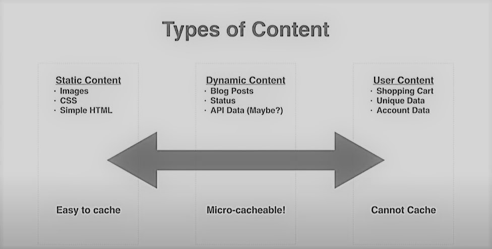

# HTTP Caching

[HTTP Caching](https://developer.mozilla.org/en-US/docs/Web/HTTP/Caching) can be done in the browser/client, at the reverse proxy/CDN or at the origin/server. It supports a bunch of headers:

* [Cache-Control](https://developer.mozilla.org/en-US/docs/Web/HTTP/Headers/Cache-Control)
  * `public` means a resource can be cached at the server. A proxy will not cache a resource if it is marked as `private`, the resource could be specific to a user and is only meant to be cached at the client.
  * `no-cache` option doesn't mean the cache wouldn't store the resource, it can. It just implies that the proxy should verify with the server each time the resource is requested whether the resource is still valid. The server can use an **ETag** which uniquely identifies the resource (e.g. by performing a hash) or **Last-Modified** to check if the resource has changed.
  * `no-store` option will prevent resources from being stored by the cache at all.
  * `must-revalidate` doesn't necessarily mean "must revalidate", it means the local resource can be younger than the provided `max-age`, so only revalidate if the content has expired.
  * `proxy-revalidate` Like `must-revalidate`, but only for shared caches (e.g., proxies). Ignored by private caches.
  * `max-age` the resource can be cached for the specified duration in seconds. This works well for independent resources but for mutable content with dependencies [max-age is the wrong choice](https://jakearchibald.com/2016/caching-best-practices/) as it can lead to the inter dependent resources getting out of sync.
* Responses to requests with `Authorization` header are automatically private, and aren't generally cached by shared/public caches e.g. reverse proxies
* `Vary` - Specifies a header value that can be different for different requests. When a cache receives a request that has a `Vary` header field, it must not use a cached response by default unless all header fields specified in the Vary header match in both the original (cached) request and the new request. For example
  * `Vary: Accept-Encoding` specifies `Accept-Encoding` value can be different for different requests e.g. `Accept-Encoding: gzip,deflate,sdch` A server can set `Vary: Accept-Encoding` to ensure that a separate version of a resource is cached for all requests that specify support for a particular set of encodings. You may want to allow a resource to be cached in uncompressed and (various) compressed forms, and served appropriately to user agents based on the encodings that they support.
  * `Vary: User-Agent` specifies `User-Agent` value can be different for mobile and desktop clients. This is useful for serving different content to desktop and mobile users

## Types of Cacheable content

Reverse proxies are great at caching static content like video, images, CSS, HTML, JS - all the big files that do not change often and only between releases.

Caching API data that is continuosuly being updated in the backend especially if it is a big payload for even a short amount of time for high amounts of load can have a significant change in performance. It’s perfectly fine to serve a slightly stale response for content that doesn’t change extremely often, such as daily news feeds, product descriptions, reviews, and comment boards. Even caching this content for five or ten seconds could have a worthwhile impact, depending on the number of users viewing that same data. Caching for a very short period of time is known as **microcaching**.

Caching content at the reverse proxy that is unique to a user, such as API keys, user profile data etc is not advisable because it is meant for that user and only ever going to be requested for that specific user.



### Caching authenticated requests

The rules for caching authenticated responses can be [tricky](https://stackoverflow.com/questions/39060208/authorization-check-for-http-caches). Section 14.8 of [RFC 2616](https://datatracker.ietf.org/doc/html/rfc2616#section-14.8) talks about the conditions under which shared caches can store and reuse such responses. They can be cached only when one of the following Cache-Control headers is present: `s-maxage`, `must-revalidate` or `public`.

The default behavior for responses that require authentication is to not be cached by shared proxies.

```sh
Cache-Control: private, s-maxage=0
```

But if you want to override this behavior you can ignore certain Cache-Control headers from the origin server and set your own Cache-Control header before sending the response. This will depend upon the sensitivity of the data, e.g. if you simply use expiration caching with `public` modifier, you run the risk of storing the data specific to a user in a public cache. This may still be okay as long as the request is being validated and authorized by the origin server.

```sh
Cache-Control: public ,no-cache 
# or 
Cache-Control: public, proxy-revalidate
```
