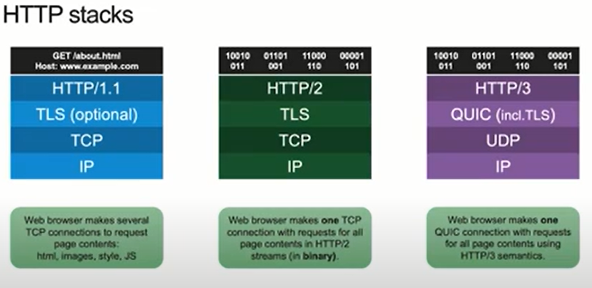

# HTTP based communication

HTTP is a layer 7 protocol that is transmitted over a TCP connection.  It works in a client-server model and follows the [request-response](https://twitter.com/kosamari/status/859958929484337152?lang=en) paradigm. The client sends a request to a server, the server waits till the complete request is received and then replies with a response.

* **Bidirectional**- means you can send data in both directions over a channel.

* **Full duplex** - implies that client and server can send data in both directions *at the same time* without waiting for a response. Phone lines are example of full duplex while a walkie-talkie is half-duplex.

* **Multiplexing** - allows several request and responses to be sent over a single TCP connection by combining multiple requests into one without order dependency i.e. the responses can arrive in a different order as the requests were sent.

## HTTP 1.x

Multiple TCP connections can be opened in parallel by the browser to speed up page loading. Browsers have different limits on maximum concurrent connections they can open on a domain but they generally support around 6 different connections. You can improve the latency and save resources if you open fewer TCP connections and reuse them for any subsequent HTTP requests.

HTTP 1.x may **pipeline** (send multiple requests without waiting for each response on a single TCP connection) its requests but it still means the requests are queued one after the other. As the entire connection is ordered and blocking (FIFO), a slow request can hold up the connection, slowing down all subsequent requests. Therefore to increase performance *CSS image sprites (image collection) & JS concatenation is perferred because it reduces the number of requests which reduces waiting on queue.*

## HTTP/2

* Built on Google's SPDY protocol, currently supported by nearly [two-thirds](https://caniuse.com/http2) of all web browsers in use.

* With HTTP/1.1 when multiple requests are issued on a single TCP connection (aka pipelining) they must be processed in series, which results in a known limitation in networking known as head-of-line blocking (HOL Blocking). As the entire connection is ordered and blocking (FIFO), a slow request can hold up the connection, slowing down all subsequent requests. HTTP/2 solves this problem by multiplexing (concurrent processing vs linear) multiple requests over a single TCP connection (the `Connection` header is now forbidden and all clients and servers *must* persist connections.) significantly reducing the number of connections and latency between clients and servers. This means [HTTP/1.x optmizations like Domain sharding, CSS image sprites and JS concatenation actually hurt](https://www.nginx.com/blog/7-tips-for-faster-http2-performance/).

* HTTP/2 is a binary protocol where HTTP 1.x is textual. It increases bandwidth efficiency by using a binary compressed format for headers. The considerable bandwidth savings offset the minor increase in CPU load (to compress and uncompress the headers) and the inconvenience to human users who can’t read the headers (for debugging purposes, for instance).

* HTTP/2 also introduces resource prioritization to improve the user experience of page loading. Web browsers and other clients can now indicate the order in which they want to receive resources. Browsers with good HTTP/2 support can render pages significantly faster by prioritizing the key resources the user needs to see first. This means traditional Web pages that mix HTML, CSS, JavaScript code, images, and limited multimedia work well with HTTP/2.

* While HTTP/2 did not explicitly change the security requirements for HTTP, almost all browsers that use HTTP/2 require SSL/TLS to be enabled at the website, which makes it mandatory for all intents and purposes.

## HTTP/3

QUIC moves multiplexing to the transport protocol i.e. the reliability of receiving HTTP/3 frames for the right resources in the right order is moved down into the transport and leaves UDP just for the packetisation, therefore simplifying HTTP.

## Persistent connections

HTTP is a session-less protocol. Each request and response sequence is independent from each other, which means that, on its own, HTTP requires each request to have its own connection. To make it more efficient, we need [HTTP Keep-Alive](https://www.haproxy.com/blog/http-keep-alive-pipelining-multiplexing-and-connection-pooling/#history-of-keep-alive-in-http). HTTP Keep-alive is the mechanism that instructs the client and server to maintain a persistent TCP connection, decoupling the one-to-one relationship between TCP and HTTP, effectively increasing the scalability of the server.

The HTTP 1.0 protocol does not support persistent connections by default. In order to do so, the client has to send a `Connection` header with its value set to `keep-alive` to indicate to the server that the connection should remain open for any subsequent requests. That said, this is not a hard and fast rule and the server can close said connection after the first response—or any response actually. In short, the keep-alive mode in HTTP 1.0 is explicit. Both the client and server have to announce it.

HTTP 1.0 is very old (almost 25 years old) and is almost no longer used on the Internet.

HTTP 1.1 supports persistent connections by default. There is no need to send the Connection header field to announce support for keep-alive. Each party expects that the peer supports it, although it is possible for any peer of the transaction to change this behavior by sending a `Connection: close` header. A persistent connection can be closed after any full response is sent or after some time when the connection has become idle, the purpose of which is to save resources on the server side.

Because HTTP 1.1 relies on persistent connections, you can use it to send multiple queries in a row and expect responses in the same order. This is called **HTTP pipelining**, it allows a single TCP connection to be used much more [efficiently](https://www.w3.org/Protocols/rfc2616/rfc2616-sec8.html).

There are several protocols where long-lived TCP connections are utilized:

* Websockets
* SSE
* HTTP/2
* gRPC
* RSockets
* AMQP

### Long polling

Polling is

* Not responsive - you cannot be sure that the requested data has changed
* Not efficient - results in wastage of CPU and bandwidth resources to transfer stale data

As in regular polling, rather than making repeated requests to a server by establishing a connection every time for every client until new data for a given client becomes available, Long polling is where the server elects to hold a client connection open for as long as possible, delivering a response only after data becomes available or timeout threshold has been reached. After receiving response client may immediately send a new long-polling request to the server to emulate real-time transaction of data.

### Websockets

Websocket protocol standardized in RFC6455 provides full-duplex bidirectional communication between a client and server over a long running TCP connection.

Client sends HTTP GET request with the following headers

* Connection: Upgrade
* Upgrade: websocket
* Sec-WebSocket-Key: key (to ensure anti-tampering of the connection)

Server responds with HTTP status code "101" - indicates to the client that in order to communicate it will be Switching protocols from HTTP to websockets or WS. The server then responds with the following headers:
  - Upgrade: websocket
  - Connection: Upgrade
  - Sec-WebSocket-Accept: key (modifies the key sent by the client to allow the client to verify the communication)

Both the client and the server will then start to communicate using an open Websocket connection where either side is able to send data to the other. This is particularly useful for real-time applications like Chat apps, Stock tickers or system dashboards for real-time monitoring.

* WebSocket can often be a source of pain when considering compatibility with existing web infrastructure as it upgrades an HTTP connection to a completely different protocol that has nothing to do with HTTP.

* Scale and security: Web components (Firewalls, Intrusion Detection, Load Balancers) are built, maintained and configured with HTTP in mind, an environment that large/critical applications will prefer in terms of resiliency, security and scalability.

### Server-Sent Events

Unidirectional push notification from server to client. The client side code works almost identically to websockets in part of handling incoming events. This is one-way connection, so you can't send events from a client to a server, however HTTP/2 provides efficient HTTP based bidirectional communication.

In practice since everything that can be done with SSE can also be done with Websockets, Websockets gets a lot more attention and love, and many more browsers support Websockets than SSE. SSEs are sent over traditional HTTP. That means they do not require a special protocol or server implementation to get working. WebSockets on the other hand, require full-duplex connections and new Web Socket servers to handle the protocol. In addition, Server-Sent Events have a variety of features that WebSockets lack by design such as automatic reconnection, event IDs, and the ability to send arbitrary events.

HTTP/2 introduces Server Push which enables the server to proactively send resources to the client cache. It does not, however, allow for pushing data down to the client application itself. Server pushes are only processed by the browser and do not pop up to the application code, meaning there is no API for the application to get notifications for those events. Therefore [HTTP/2 is not a replacement for push technologies such as Websocket or SSE](https://www.infoq.com/articles/websocket-and-http2-coexist/) but it has implications on [unsolicited communication from server to client](https://stackoverflow.com/questions/54940099/confusion-regarding-bidirectional-and-full-duplex-in-articles-about-http-2)

### Scaling persistent connections

The number of concurrent TCP connections that a web server can support is limited. Standard HTTP clients use ephemeral connections. These connections can be closed when the client goes idle and reopened later. On the other hand, long-lived TCP connections like Websockets stay open even when the client goes idle. In a high-traffic app that serves many clients, these persistent connections can cause servers to hit their maximum number of connections. A server can handle 65,536 sockets per single IP address, however the quantity can be extended by [adding additional network interfaces to a server](https://dzone.com/articles/load-balancing-of-websocket-connections). The [number of connections is not the primary problem](https://stackoverflow.com/questions/17448061/how-many-system-resources-will-be-held-for-keeping-1-000-000-websocket-open) (that's mostly just a question of kernel tuning and enough memory - used to track each connection), it is the processing and sending/receiving data to/from each of those connections. If the incoming connections are spread out over a long period, and they are mostly idle or infrequently sending small chunks of static data then you could probably get much higher than even 1m simultaneous connections. However, even under those conditions (slow connections that are mostly idle) you will still run into problems with networks, server systems and server libraries that aren't configured and designed to handle large numbers of connections.

[Load balancing persistent connections](https://docs.microsoft.com/en-us/aspnet/core/grpc/performance?view=aspnetcore-5.0#load-balancing) with L4 load balancers can be ineffective, however L7 load balancers or proxies understand HTTP/2 and are able to distribute calls multiplexed to the proxy on one HTTP/2 connection across multiple endpooints.

Websockets work on top of TCP and do not use the HTTP protocol, therefore your load balancer needs to work in TCP mode. This enables load balancing of any type of TCP connections including WebSockets. The heavy use of connection-related resources by Websocket can affect other web apps that are hosted on the same server. When Websockets opens and holds the last available TCP connections, other web apps on the same server also have no more connections available to them. Therefore it may make sense to run your real-time applications based on websockets on their own dedicated server.

Cloud service like [Azure SignalR](https://docs.microsoft.com/en-us/aspnet/core/signalr/scale?view=aspnetcore-5.0#azure-signalr-service) can be used as a proxy for real-time traffic, where it manages all of the client connections, while each server needs only a small constant number of connections to the service.

### SignalR

[SignalR](https://docs.microsoft.com/en-gb/aspnet/signalr/overview/getting-started/introduction-to-signalr) is an ASP.NET library that provides a simple API for creating server-to-client remote procedure calls (RPC) that call JavaScript functions in client browsers (and other client platforms) from server-side. It abstracts the transports that are required to do real-time work between client and server. Supported transports are:

* WebSockets
* Server Sent Events
* Forever frame (for Internet Explorer only)
* Long polling

SignalR selects the transport based on a number of factors like client browser, transport support on the client and server etc. It uses the new WebSocket transport where available, and falls back to older transports where necessary.

This allows your application to take advantage of WebSocket without having to worry about creating a separate code path for older clients. SignalR also shields you from having to worry about updates to WebSocket, since SignalR will continue to be updated to support changes in the underlying transport, providing your application a consistent interface across versions of WebSocket.

SignalR currently is based on the ASP.NET framework. This makes it unsuitable for Non Windows platforms.

### Streamdata.io

[Streamdata.io](https://streamdata.io) is a **Proxy as a Service** that can be used to reduce load on your API by caching responses and for sending push notifications to client applications, servers and devices without requiring any server-side code. Therefore turning your API into a real-time stream of updates. It is basically a reverse proxy plus push notification mechanism as a service.

* Streamdata.io uses [Server-Sent Event over WebSockets]((https://streamdata.io/blog/push-sse-vs-websockets/)) as the Push protocol.
* In SSE v Polling [benchmarking](http://streamdata.io/blog/benchmark-server-sent-events-versus-polling/), their architecture suggests streamdata.io reverse proxy sits between your load balancer and the API.
* Along with acting as stream based API cache proxy it provides further optimization by [compressing](http://streamdata.io/blog/add-compression-server-sent-events-undertow) the API data.
