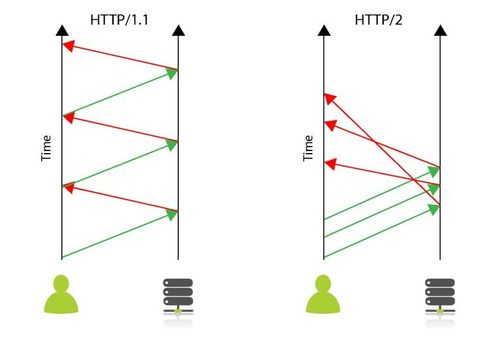
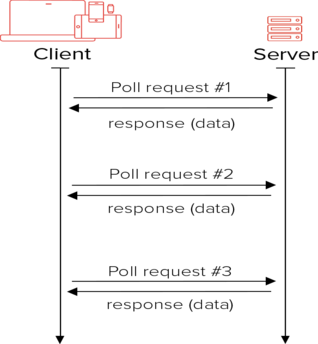

# Push and Pull models

## HTTP Based Communication

HTTP is a [request-response protocol](https://twitter.com/kosamari/status/859958929484337152?lang=en). The client sends request. The server waits till the complete request is received. Then sends a response.

A **Full duplex** channel implies that client and server can send data simultaneously without waiting for a response. Phone lines are example of Full duplex while a walkie-talkie is half-duplex.

### HTTP 1.x

Multiple TCP connections can be opened in parallel by the browser to speed up processing.

According to [RFC-2616](http://www.ietf.org/rfc/rfc2616.txt) **Persistent connections** allow HTTP requests and responses to be pipelined on a connection. Pipelining allows a client to make multiple requests without waiting for each response, allowing a single TCP connection to be used much more efficiently, with much lower elapsed time.

Since the client can send requests without waiting for a response HTTP 1.1 supports full-duplex.

HTTP 1.x may **pipeline** its requests (i.e., send multiple requests without waiting for each response on a single TCP connection) but this means the requests are queued one after the other. As the entire connection is ordered and blocking (FIFO), a slow request can hold up the connection, slowing down all subsequent requests.

*CSS image sprites (image collection) & JS concatenation is performant because it reduces the number of requests which reduces waiting on queue.*

**Multiplexing** (combining multiple requests into one) allows several request and response to fly on the wire over a single TCP connection without order dependency i.e. the responses can arrive in a different order as the requests were sent.

### HTTP/2

One TCP connection per origin (domain). Takes advantage of streams to transfer data in chunks (binary rather than text format) and uses header compression.

*CSS image sprites and JS concatenation doesn't matter. Its better if files are smaller and distinct*

* Browser supports HTTP/2 only when communication is encrypted. Setup HTTPS if you want HTTP/2.
* OS's with OpenSSL 1.0.2 or later support HTTP/2
* List of [HTTP/2 Implementations](https://github.com/HTTP/2/HTTP/2-spec/wiki/Implementations)
* REST APIs on HTTP/2 benefit from the more efficient wire format in particular due to multiplexing and compression.
* HTTP/2 impacts the choice of [ Websockets](https://www.infoq.com/articles/websocket-and-HTTP/2-coexist) for multiplexing requests over a single TCP connection and bidirectional streaming.

### HTTP/3

QUIC moves multiplexing to the transport protocol i.e. the reliability of receiving HTTP/3 frames for the right resources in the right order is moved down into the transport and leaves UDP just for the packetisation, therefore simplifying HTTP.

## Polling

* Inefficient because you cannot be sure that the requested data has changed.
* Results in wastage of CPU and bandwidth resources to transfer stale data.

## Websockets

Websocket protocol standardized in RFC6455 provides full-duplex bidirectional communication between a client and server over a long running TCP connection. It works on top of TCP and does not use the HTTP protocol, therefore it may not be compliant with your existing IT infrastructure (load balancers, firewalls) and may need additional security and monitoring capabilities.

## Server-Sent Events

Unidirectional push notification from server to client. With HTTP/2 it provides efficient HTTP based bidirectional communication.

Polling, Web sockets and Server-Sent Events [comparison](https://stackoverflow.com/questions/11077857/what-are-long-polling-websockets-server-sent-events-sse-and-comet)

## SignalR

[SignalR](https://docs.microsoft.com/en-gb/aspnet/signalr/overview/getting-started/introduction-to-signalr) is an ASP.NET library that provides a simple API for creating server-to-client remote procedure calls (RPC) that call JavaScript functions in client browsers (and other client platforms) from server-side. It abstracts the transports that are required to do real-time work between client and server. Supported transports are:

* WebSockets
* Server Sent Events
* Forever frame (for Internet Explorer only)
* Long polling

SignalR selects the transport based on a number of factors like client browser, transport support on the client and server etc. It uses the new WebSocket transport where available, and falls back to older transports where necessary.

This allows your application to take advantage of WebSocket without having to worry about creating a separate code path for older clients. SignalR also shields you from having to worry about updates to WebSocket, since SignalR will continue to be updated to support changes in the underlying transport, providing your application a consistent interface across versions of WebSocket.

SignalR currently is based on the ASP.NET framework. This makes it unsuitable for Non Windows platforms.

## Streamdata.io

[Streamdata.io](https://streamdata.io) is a **Proxy as a Service** that can be used to reduce load on your API by caching responses and for sending push notifications to client applications, servers and devices without requiring any server-side code. Therefore turning your API into a real-time stream of updates. It is basically a reverse proxy plus push notification mechanism as a service.

* Streamdata.io uses [Server-Sent Event over WebSockets]((https://streamdata.io/blog/push-sse-vs-websockets/)) as the Push protocol.
* In SSE v Polling [benchmarking](http://streamdata.io/blog/benchmark-server-sent-events-versus-polling/), their architecture suggests streamdata.io reverse proxy sits between your load balancer and the API.
* Along with acting as stream based API cache proxy it provides further optimization by [compressing](http://streamdata.io/blog/add-compression-server-sent-events-undertow) the API data.