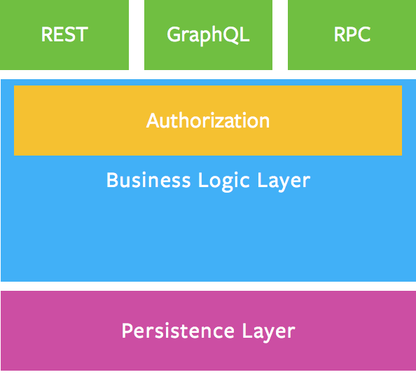

# Synchronous request/response‑based integration

Gregor Hohpe and Bobby Woolf provide 65 [integration patterns](http://www.enterpriseintegrationpatterns.com/patterns/messaging/) for integration and coordination between disparate services. These include shared database, file transfer and [messaging](http://www.enterpriseintegrationpatterns.com/patterns/messaging/toc.html) but here we look at synchronous request/response based integration where services are often built as APIs - https://blog.apisyouwonthate.com/

## REST

REST is about a client-server relationship, where server-side data are made available through representations of data in simple formats, often JSON and XML. These representations for resources, or collections of resources, which are then potentially modifiable, with actions and relationships being made discoverable via a method known as hypermedia. Hypermedia is the concept of providing links to other resources and is fundamental to REST.

HTTP based REST is a familiar standard. HTTP helps to enforce REST constraints such as modelling resources, providing a uniform interface, stateless requests and discoverability and self describing relationships through hypermedia. [Maturity model for REST](https://martinfowler.com/articles/richardsonMaturityModel.html) can be used as a technique for incrementally enforcing REST constraints in your APIs.

With HTTP REST you end up with API endpoints with the same path but different behaviour depending upon the verb (GET, POST) or the Content-Type.

Getting a resource

```
GET /avatars HTTP/1.1
Host: localhost:3000
Content-Type: application/json
Content-Length: 284

{
  "name" : "hemantksingh",
  "image" : "http://example.org/pic.png"
}
```

Uploading an image in the HTTP body

```
POST /avatars HTTP/1.1
Host: localhost:3000
Content-Type: image/jpeg
Content-Length: 284

raw image content
```

Support `application/json` requests on the same endpoint to handle the upload slightly differently

```
POST /avatars HTTP/1.1
Host: localhost:3000
Content-Type: application/json

{
  "image_url" : "https://example.org/pic.png"
}
```

### Standardising REST APIs

[JSON API](http://jsonapi.org/) is a spec for standardising REST APIS with a designated media type ` application/vnd.api+json` for content negotiation. It has a predefined format for fetching data, related resources, sorting, pagination and filtering.

At first glance, it appears very verbose obfuscating your resource data under JSON API exchange semantics. Is it worth adopting for every API you are going to build ? Is there a universal standard that covers every use case? This [thread](https://news.ycombinator.com/item?id=9280058) captures the essence of the argument about standardising APIs.

We should not confuse and API with a transport protocol (which is what JSON API seems to do). Making transports human readable appears to be a waste of resources. Those API's are meant to be consumed by machines and debugging can and should be done with tools, not by enforcing a standard. Lets work on improving the semantics and documentation around what constitutes an API e.g. Swagger.

If you have large and/or public API which needs to be stable, extensible, will be developed for years, JSON API maybe a good choice. It is a lot of overhead for a private API between one client and one server which might be completely reworked in a year.

## RPC

Remote Procedure Call (RPC) is a protocol that one program can use to request a service from a program located in another computer on a network without having to understand the network's details. RPC spans the transport layer (TCP) and the application layer in the OSI model of network communication. It is dependent on having a **common interface definition** for describing message data types and service definition (available service methods) which happens to be either

In earlier RPC implementations like *.Net Remoting* and *Java RMI* the interface definition was platform dependent. This meant a Java based service could not be invoked by a .Net client and vice versa. However a bunch of RPC frameworks made interoperability possible

### SOAP

Xml being platform independent, XML-RPC or SOAP based APIs attempted to resolve the interoperability problem. SOAP uses **UDDI** - XML based registry for service description and discovery and **WSDL** for interface definition.

Ensuring data types of XML payloads in XML-RPC is tough. In XML you layer meta data on top in order to describe things such as which fields correspond to which data types. This means a SOAP envelope (message) can be incredibly verbose as compared to a JSON message in a JSON based API such as [Slack API](https://api.slack.com/web)

SOAP is a network protocol which is routed over HTTP but ignores the existing well understood HTTP specification (HTTP verbs and the error codes are ignored). Moreover there are inconsistencies in different implementations of SOAP by different vendors therefore it still suffered from some degree of **platform coupling**.

### Thrift

* [Thrift](https://thrift.apache.org/) originally developed by Facebook to expedite development of efficient and scalable backend services is based on their scalable cross-language services [paper](https://thrift.apache.org/static/files/thrift-20070401.pdf)
* Thrift allows developers to define datatypes and service interfaces in a single language-neutral file and generate all the necessary code to build RPC clients and servers.

### gRPC

* Modern, high-performance, lightweight RPC framework mainly suitable for machine to machine synchronous communication that requires quick message parsing with less overhead. It diverges from typical REST conventions as it uses static paths during call dispatch for performance reasons. Parsing call parameters from paths, query parameters and payload body adds latency and complexity.
* Contract-first API development, using [protocol buffers](https://developers.google.com/protocol-buffers/docs/overview) by default - a stricter type system than Xml or Json, allowing for language agnostic implementations. ProtoBuf's goal was to be really faster in both encoding, but especially decoding. Because it knows the structure so well and it's binary, the size of the messages are smaller and inferring the types and the serialization becomes incredibly fast.
* Tooling available for many languages to generate strongly-typed servers and clients.
* Supports client, server bi-directional streaming calls. Largely follows HTTP semantics over HTTP/2 but explicitly allows for full-duplex streaming.
* Reduced network usage with Protobuf binary serialization.

A limitation with gRPC is that not every platform can use it. Browsers don't fully support HTTP/2, making REST and JSON the primary way to get data into browser apps. Because of gRPC's binary format it is harder for Javascript to parse it and contracts aren't suitable for web apps. Even with the benefits that gRPC brings, REST and JSON have an important place in web apps.

gRPC comes with an overhead as [compared to Thrift](https://groups.google.com/forum/#!msg/grpc-io/JeGybvbz8nc/wpqQdAfuBwAJ) since it uses HTTP2 at the transport layer which is a multiplexing wire protocol, but provides a variety of benefits like metadata exchange - allowing non-business data such as authentication tokens, standardized status codes for error handling, to be handled separately from actual business data.

## REST or RPC

https://www.smashingmagazine.com/2016/09/understanding-rest-and-rpc-for-http-apis/

REST helps you model your domain as resource or entities whereas RPC based APIs are great for actions i.e. commands. RPC may be a better fit if you are writing your API in a functional language.

The fact that a remote procedure appears to be executing locally can lead to

* over use and over reliance on the network. Assumption that the network is reliable is a **fallacy of distributed computing**.
* chatty APIs that break encapsulation and expose the API's internal behavior and state leading to **behavioral coupling**.

Rather than coupling to procedures in RPC a badly implemented REST API could easily suffer from coupling to URLs that expose functions. Therefore adopting a design based upon **coarse-grained message exchange** e.g. having a single URL per resource can help alleviate over reliance on the network and behavioral coupling.

## GraphQL

GraphQL is a [query language for your API](https://graphql.org/learn/), and a server-side runtime for executing queries using a type system you define for your data. With GraphQL, you model your business domain as a graph  by defining a schema; within your schema, you define different types of nodes and how they connect/relate to one another. This allows you to do open querying, craft the kinds of data queries especially against large datasets e.g. Facebook graph or even the LinkedIn graph that Microsoft has. GraphQL is a natural extension of being able to look at these very complex models from a simple web call. Not that trivial to set up, but it certainly is much more useful than trying to invent your own query language and strap it on top of REST.

GraphQL is [typically served over HTTP](https://graphql.org/learn/serving-over-http/) via a single endpoint which expresses the full set of capabilities of the service. This is in contrast to REST APIs which expose a suite of URLs each of which expose a single resource. HTTP is commonly associated with REST, which used "resources" as its core concept. In contrast, GraphQL's conceptual model is an entity graph. As a result, entities in GraphQL are not identified by URLs. Instead, a GraphQL server operates on a single URL/endpoint, usually `/graphql`, and all GraphQL requests for a given service should be directed at this endpoint. Your GraphQL HTTP server should handle the HTTP GET and POST methods.

GraphQL allows clients to specify the fields they would like to be returned (**sparse fieldsets**) in the GraphQl query, allowing you to skip all data that is not relevant to the response. GraphQL's query language moves the responsibility out of the hands of the API devs and into the clients. For example, the query:

```sh
{
  me {
    name
  }
}
```

Could produce the following JSON result:

```sh
{
  "me": {
    "name": "Luke Skywalker"
  }
}
```

Die to less data going over the wire, this can have performance benefits. It also allows tracking of field usage by clients that prevents introduction of breaking changes in your APIs, thus makes deprecations easy.

GraphQL devloves power to clients by allowing them to write their own queries - Having diverse client apps like iOS, Andrioid and web app accessing the same API can be a limiting choice as the data required by each could be very different. In the REST world this might mean:

* Creating custom endpoints: `/iphone`
* Create custom representations using `Content-Type: application/vnd.turtlefans.com+v1+iphone+json`
* Custom APIs - APIS for each client (Back ends for Front ends)

Your API I/O mechanism can be REST, GraphQL or RPC but you can fulfill requests coming through each I/O channel with the same business logic layer

