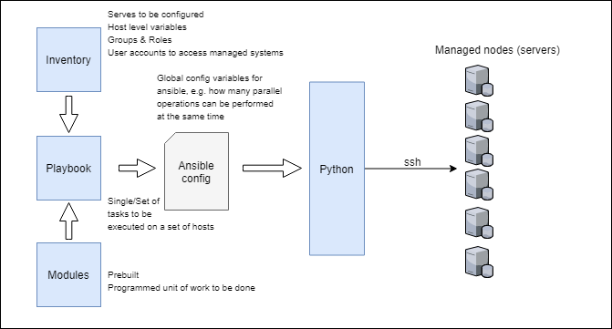

# Ansible

Ansible can be used for provisioning infrastructure, orchestrating and automating deployements. Unlike Puppet and Chef that use a **pull-based model** by deploying agents on managed remote nodes and requesting relevant info (using HTTPs APIs) from masters that control configuration information, ansible uses a **push model** where the ansible control server pushes configuration to nodes being managed using SSH. Ansible — in contrast to other configuration management frameworks — does not require the installation of any agents within managed environments. Instead, commands are pushed over SSH and interpreted by a Python runtime.  

Ansible control server packages up the configuration in a python package and delivers the python pacakge to the remote nodes over ssh, which upon execution return the execution result as json. The python package that was delivered is stored in a temp dir on the remote node and deleted after execution, therefore leaving no residual software on the remote node.

