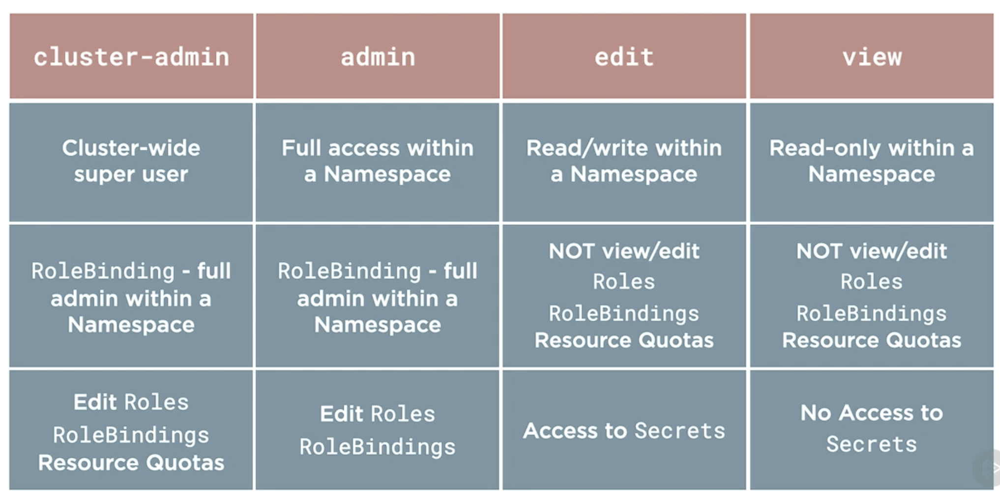

# Securing the API Server

Authentication in Kubernetes is configurable, and you could define one or more authentication methods for your API server. An authentication plugin is defined by the cluster administrator with configuration parameters on the API server itself. There are no usernames stored in the API server for authentication purposes, it's up to the selected authentication plugin to define and implement how a user is defined and authenticated. Some of the common authentication plugins available are:

* Client Certificates - most commonly used way to authenticate to the API server e.g. in managed cloud service like AKS. A request is authenticated when a valid, trusted certificate is presented as part of the HTTP request. Certificate contains the username (used for authorization - i.e. what the user can do) in the Common Name (CN) field of the certificate.
* Authentication Tokens - HTTP Authorization header in the client request
* Basic Http - uses static password files read during API server startup, simple to setup and use (Dev)

Open ID Connect enables external identity providers for authentication and remote authentication services. This requires additional set up integration with that external provider, but enables you to have a centralized user database which can facilitate for single sign on this, convey useful in scenarios where you have multiple clusters or multiple applications that require centralized authentication services for your organization.

The main idea here is that authentication is plugable and you have the ability to use one or more than one method for authentication.

## Certificate based authentication

Kubernetes uses certificates to provide TLS encryption. The API server is exposed on an https endpoint using a certificate. In addition to providing encryption, certificates are also used for authenticating both users and system components.

Every Kubernetes cluster has a cluster root Certificate Authority (CA). The CA is generally used by cluster components to validate the API server’s certificate, by the API server to validate `kubelet` or `kubectl` client certificates, etc. There can be [more than one CAs in a kubernetes cluster](https://jvns.ca/blog/2017/08/05/how-kubernetes-certificates-work/) e.g API server CA and kubelete CA.

The API server provides a certificate API enabling you to submit a Certificate Signing Request (CSR) to be used to [request X.509 certificates](https://kubernetes.io/docs/tasks/tls/managing-tls-in-a-cluster/#requesting-a-certificate). Once generated and signed you can download a certificate for use in your cluster by users and system components. This could be done at the command line using certificate tools like `OpenSSL` or `CFSSSL`, but the API provides a programmatic interface for Certificate management for the internal cluster self signed CA on the control plane node.

```sh
# Get the client certificate from kubeconfig
kubectl config view --raw -o jsonpath='{ .users[*].user.client-certificate-data }' | base64 --decode > admin.crt

# Inspect the client certificate
openssl x509 -in admin.crt -text -noout | more

```

## Authorization with service accounts

Running a pod in kunernetes without a specified service account runs it with the default service account.

```sh
# List all service accounts
kubectl get serviceaccounts

# Check if a service account <serviceaccountname> is authorized to list pods by impersonating as the <serviceaccountname>
kubectl auth can-i list pods --as=system:serviceaccount:default:<serviceaccountname>
```

## Roles based access

Role/ClusterRole - only define what can be done. It maps nouns to verbs `get pods`. Role is confined to a namespace whereas a ClusterRole is applicable to the entire cluster.

RoleBinding - defines who can do what. It defines the Subjects and refers to a Role/ClusterRole. The Subject can be User/Group or ServiceAccount. *Users and Groups are not namespaced objects and are considered cluster-wide resources*. The Role and RoleBinding must be defined in the same namespace.

When a ClusterRole is used with their RoleBinding, your specifying who can do which actions potentially across multiple name spaces, or even the whole cluster. These objects do not have to be in the same namespace, because the scope of their security is potentially across multiple namespaces or even the whole cluster. This allows you to have the same cluster role in several namespaces and potentially all namespaces. If you find yourself configuring this for all namespaces use a ClusterRoleBinding instead.

ClusterRoleBinding -  ClusterRoleBinding is used to grant access to all namespaces across a cluster. When you combine a ClusterRole with a ClusterRoleBinding, this will scope security for the subjects defined in the ClusterRoleBinding to all namespaces or all non-namespace cluster scoped resources. Use a ClusterRole with a ClusterRoleBinding if you need to give access to

* all namespaces or
* cluster scoped resource like nodes and persistent volumes

### What to use when

* Use a Role and RoleBinding to scope security to a single namespace. e.g. giving one development group access to a whole name space for their applications or projects.

* Use a ClusterRole and RoleBinding to scope security to several or potentially all of the namespaces in a cluster. Perhaps this is a development architect or manager overseeing several projects deployed across several namespaces, but usually not the whole cluster.
  
* Use a ClusterRole and a ClusterRoleBinding to scope security to all namespaces OR cluster-scoped resources. The resource is this most often will be someone that's in charge of managing a cluster or those cluster-scoped resources like nodes and persistent volumes

### Default cluster roles



### Multi tenancy

RBAC can be employed to run multi-tenant application in kubernetes. The namespace logical isolation along with RBAC provides the fundamentals of [multi-tenancy in kubernetes](https://www.infoq.com/presentations/multi-tenancy-kubernetes/). All tenants share the master control plane where secrets and ConfigMaps are stored, therefore the API server can be overloaded by a user from a particular tenant. This can result in tenants crowding each other accidentally or on purpose, however [API priority and fairness](https://kubernetes.io/docs/concepts/cluster-administration/flow-control/) by using the `--max-requests-inflight` flag can help limit the amount of outstanding work that will be accepted.  

## Compliance

How do you embed security and validate compliance against standards like PCI, NIST, and SOC2 across the lifecycle of containers and Kubernetes? 
* https://sysdig.com/products/kubernetes-security/

Check cluster against CIS kubernetes benchmarks
* https://github.com/aquasecurity/kube-bench
