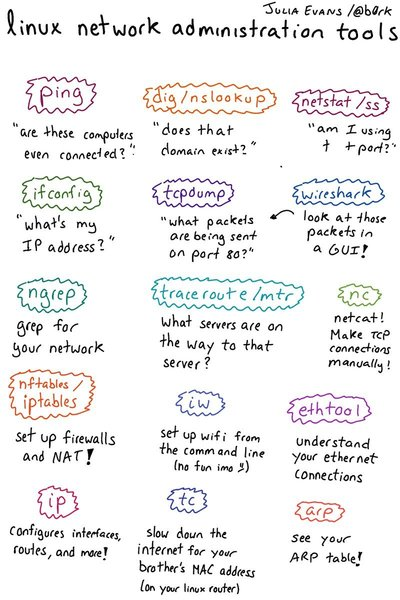

# OSI Model

* Application - Email, web browser, twitter, facebook
* Presentation - Encryption, compression, translation of encodings (ASCII & EBCDIC) between different OS
* Session - Authenticate and establish a session.
* Transport - Guarantee end to end delivery of data. Ensure all packets of data arrive at the destination.
* Network - Finds the destination network, the shortest route not physical distance but shortest time
* Data Link - Finds the physical device on the network.
* Physical - Cables, voltages, frequencies, bits transfer rates

## TCP/IP

PDU - Protocol data unit

* Application layer - Http, SMTP, Telnet (does not have encryption), SSH (has encryption, therefore uses part of the Presentation layer) are all application level protocols.

* Transport layer - TCP, UDP. Application and transport layer addressing use ports to identify services. A web server listens for http traffic on port 80 and https traffic on 443. A client (browser) also gets a port assigned dynamically between 8000 to 65535. Firewalls make decisions based on the port number.`

* Internet layer - Internet protocol, Internet Control Message Protocol (used in ping), Address Resolution Protocol. Internet layer PDU is a **packet**. Internet layer uses IP addresses.

* Network access layer - Ethernet, Fiber optics, copper cables, RJ45, RJ48. PDU is **frames** (for the Data Link) and **bits** (for the Physical layer). Uses physical address (48 bit hexadecimal layer) also called the MAC address that is physically permanently burnt into a network interface card. There is a sub layer in the Data Link called Median Access Control.

### TCP

The receiver sends an acknowledgement, therefore it is useful in cases where data loss is unacceptable for example loading an http page. PDU for TCP is a **segment**.

### UDP

The receiver does not send any acknowledgement and the data is sent without the overhead of establishing a connection. UDP is useful in video streaming. PDU for UDP is a **datagram**.

## Making Http requests

### Curl

Tool to transfer data from or to a server, using one of the supported protocols (DICT, FILE, FTP, FTPS, GOPHER, HTTP, HTTPS, IMAP, IMAPS, LDAP, LDAPS, POP3, POP3S, RTMP, RTSP, SCP, SFTP, SMTP, SMTPS, TELNET and TFTP). Practically speaking its a multipurpose tool built off libcurl to communicate with these protocols. In short, you can use curl to script something that sends data to a system or receive data.

### Telnet

*Unencrypted* terminal protocol, whose client just happens to be useful in testing other applications since it speaks '*raw*' tcp. Sensitive data sent over telnet is susceptible to *packet sniffing*. Connect to your web server through tcp protocol on the port 80

`telnet hemantkumar.net 80` establishes a connection with the host on port 80 and the web server on hemantkumar.net waits for the client to say what it wants - `GET /index.html`

`telnet telnet gmail-smtp-in.l.google.com 25` connect to the gmail server at port 25 (SMTP or mail traffic is on port 25)

If the host uses ssl you can use **Openssl**

`openssl s_client -connect www.thoughtworks.com:443`

### SSH

Secure shell is the same as telnet but with encryption to allow network services to operate securely over an unsecured network. Both telnet and ssh are application layer protocols in the OSI model. As it allows login and encryption SSH uses part of the Presentation layer too.

* RSA fingerprint - is based on the hosts public key for easy identification of the host you are connecting to. You can generate fingerprint for a public key using `ssh-keygen -lf /path/to/key.pub`
* `~/.ssh/known_hosts` - public keys of the ssh hosts that you connect to

## Network Admin Tools

Port scanning on a MAC is available under Network Utilities. `netstat` can be used to determine which processes are listening on which ports on the system.

