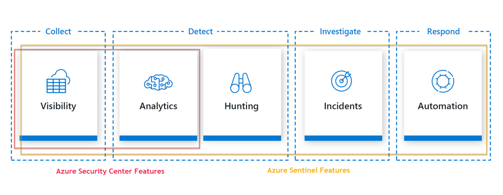

# Security checklist

| Requirement                                  | Description                               |
| ---------------------------------------------|:------------------------------------------|
| Malware Detection and Response               | The cloud solution should have an active system to detect malware, automatically remove an infection, and alert on operational status	|
| Vulnerability Management                     | The cloud solution should be assessed for vulnerabilities, missing patches, and improperly configured resources in accordance with established procedures |
| Intrusion Detection and Intrusion Prevent    | The cloud based SaaS offering should detect malicious activity including unauthorized connectivity and when appropriate, prevent inappropriate activity	 |
| Security Information Event Monitoring (SIEM) | All security logs should be consolidated to identify indicators or evidence of compromise |
| Standard Operating Procedures                | All standard operating procedures should be updated to govern daily operations and exception management	|
| Penetration Test                             | A third party organization should perform penetration test on the SaaS offering to isolated and determine any weaknesses before general availability |
| Access Control                               | Access control is required for access to Cloud production resources with assigned authorized actions to support the least privilege model |
| Cryptography                                 | Cryptographic controls should be in place to support data in transit and data at rest for the both the product and the supporting infrastructure |
| Network Security                             | The cloud offering should have the ability to develop and maintain network security groups to perform network access control and network segmentation |
| Patch Management                             | The cloud offering should incorporate patch management to remediate vulnerabilities appropriately |

## General data protection regulation

Cloud provider is the processor and you are the controller.

Assess Technical, Legal and Political & cultural risk

There are exceptional cases like paedophilia, organised crime and imminent death where the cloud provider is bound to provide information

## SIEM and SOAR

Although security information and event management (SIEM) and security orchestration, automation and response (SOAR) have capabilities that complement each other, they are not the same thing. SIEM system helps in identifying and analysing security incidents and SOAR allows you to respond to these incidents in an automated way.

Firewalls, network appliances and intrusion detection systems generate an immense amount of event-related data—more data than security teams can reasonably expect to interpret. A SIEM makes sense of all of this data by collecting and aggregating and then identifying, categorizing and analyzing incidents and events. This is often done using machine learning, specialized analytics software and dedicated sensors. 

SIEM tools usually need regular tuning to continually understand and differentiate between anomalous and normal activity. The need for regular tuning leads to security analysts and engineers wasting precious time on making the tool work for them instead of triaging the constant influx of data. Manual incident response processes, insufficient workflows and difficulty hiring security personnel leave security operations teams struggling to keep up with the growing volume of alerts. 

SOAR combines automated data gathering, security automation, case management and analytics to provide organizations the ability to easily implement sophisticated **defense-in-depth** capabilities based on internal and external data sources.

## Azure Security center

Azure security center provides endpoint threat detection and provides security alerts based on signals detected on resources being monitored. Azure security center requires agents to be running on the VMs that you're going to be monitoring. You use configuration (workspace ids and keys) for deploying and setting up the agents to talk back to Azure using `azcli`. Once your agents are deployed and configured, over a few hours you'll see data appear in your azure workspaces.

* Azure security centre allows you to run threat detection on Azure storage, SQL and app service. 
* Integrates with windows defender ATP (Advanced Threat Protection) that expands the volume of signals available for better protection of windows environments

## Azure Sentinel

Azure sentinel is a cloud native SIEM and SOAR solution, similar to Splunk or Rapid7. It allows ingestion of data from various sources

## Cloud Security Alliance (CSA)

The Cloud Security Alliance (CSA) is a nonprofit organization that promotes research into best practices for securing cloud computing and the use of cloud technologies to secure other forms of computing. [CSA](https://searchcloudsecurity.techtarget.com/definition/Cloud-Security-Alliance-CSA) leverages the expertise of industry practitioners, associations and governments, as well as its corporate and individual members, to offer research, education, certification, events and products specific to cloud security. The industry group also provides security education and guidance to companies in different stages of cloud adoption and helps cloud service providers address security in their software delivery models.

Cloud Service Providers can register for the [Security Trust Assurance and Risk (STAR)](https://cloudsecurityalliance.org/star) program that documents the security and privacy controls provided by popular cloud computing offerings. This publicly accessible registry allows cloud customers to assess their security providers in order to make the best procurement decisions.

The [Consensus Assessments Initiative Questionnaire (CAIQ)](https://searchcloudsecurity.techtarget.com/definition/CAIQ-Consensus-Assessments-Initiative-Questionnaire) is a survey provided by the Cloud Security Alliance (CSA) for cloud consumers and auditors to assess the security capabilities of a cloud service provider. The CAIQ was developed to create commonly accepted industry standards to document the security controls in infrastructure-as-a-service, platform-as-a-service and software-as-a service applications. This document can be uploaded to the [STAR regsitry](https://cloudsecurityalliance.org/star/registry) for making your security controls publicly accessible. 

## CIS Hardened Images

CIS (Centre for Internet Security) hardened VM images are configured to meet [CIS Benchmarks](https://www.cisecurity.org/cis-benchmarks/), consensus-based configuration guidelines developed (and relied upon) by cyber security experts around the world. Some of the common threats that can be mitigated by using a CIS Hardened Image include:

* Denial of service
* Insufficient authorization
* Overlapping trust boundaries threats
CIS Hardened Images have been hardened to either the Level 1 or Level 2 CIS Benchmark profile. A Level 1 CIS Benchmark profile meets minimum and essential security requirements, while a Level 2 profile provides more advanced settings for situations where security is paramount.

Microsoft Azure marketplace [provides CIS hardened images](https://www.cisecurity.org/blog/cis-hardened-images-now-in-microsoft-azure-marketplace/) that are certified to run on Microsoft Azure.

## Acronyms

* SIEM - Security information and event management 
* SOAR - Security orchestration, automation and response
* SOR - Security automation and orchestration
* SOC - Security Operations center
* PRA - Probabilistic risk assessment

