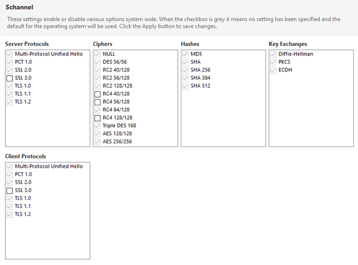

# Compliance

Compliance to security standards requires a combination of strong communication protocols, cryptography, hashing and key exchange. Schannel or [secure channel](https://docs.microsoft.com/en-us/windows/win32/secauthn/secure-channel) is a Secure Support Provider Interface (Win32 API) used by Windows systems to perform security operations for internet applications that require secure HTTP communications. It contains a set of security protocols that provide identity authentication and secure, private communication through encryption.

The Public-Key Cryptography Standards (PKCS) are a set of inter-vendor standard protocols for making possible secure information exchange on the Internet using a [Public Key 
Infrastructure (PKI)](https://www.thesslstore.com/blog/wide-world-pki/) devised and published by the computer and network security company RSA Security LLC. The standards include RSA encryption, password-based encryption, extended certificate syntax, and cryptographic message syntax for S/MIME, RSA's proposed standard for secure e-mail.

## Compliance Standards

[Compliance standards](https://docs.microsoft.com/en-gb/microsoft-365/compliance/offering-home?view=o365-worldwide) govern the collection and use of data for
* global (ISO, SOC) 
* national (FIPS)
* industry (PCI, DSS, HIPAA/HITECH)
* region (GDPR) specific requirements.

### ISO 27001, 27017, 27018 

Security Management Controls, Cloud Specific Controls, Personal Data Protection

### SOC 1, 2, 3

Security, Availability & Confidentiality Reports

### PCI DSS

In the Payment Card Industry Data Security Standard, SSL has been removed as an example of strong cryptography and can no longer be used as a security control after June 30, 2016 - [PCI Security Standards Council](https://www.pcisecuritystandards.org/) (PCI SSC)

TLS 1.2 currently meets the PCI SSC definition of "strong cryptography". If you are processing credit cards you must be using this version not TLS 1.1 or 1.0

### FIPS

The Federal Information Processing Standard (FIPS) 140 is a security implementation designed for certifying cryptographic software. FIPS 140 validated software is required by the U.S. Government and requested by other prominent institutions. Enabling FIPS forces you to use [FIPS 140 standard compliant encryption, hashing and signing schemes](https://csrc.nist.gov/csrc/media/publications/fips/140/2/final/documents/fips1402annexa.pdf):

Symmetric ciphers (algorithms) for encryption

* AES (Advanced Encryption Standard) - is a specification and a successor of DES. [Rijndael](http://web.archive.org/web/20070711123800/http://csrc.nist.gov/CryptoToolkit/aes/rijndael/Rijndael-ammended.pdf) - a symmetric key encryption algorithm (cypher) has been selected as the AES. .Net framework provides [3 implementations supporting AES](https://stackoverflow.com/questions/939040/when-will-c-sharp-aes-algorithm-be-fips-compliant#:~:text=RijndaelManaged%20implements%20the%20full%20Rijnadael,size%20other%20than%20128%20bits):  `RijndaelManaged`, `AesManaged` and `AesCryptoServiceProvider` of which `AesCryptoServiceProvider` is FIPS compliant.
* Triple-DES (Data Encryption Standard)
* EES (Escrowed Encryption Standard)

Asymmetric Key (Public key cryptography) for TLS key exchange and authentication

* RSA (Rivest–Shamir–Adleman)
* DSA
* ECDSA (Elliptic Curve Digital Signature Algorithm)

Hash Standards for TLS integrity requirements

* SHA-1, SHA-224, SHA-256, SHA-384, SHA-512, SHA-512/224, SHA-512/256

Random number generators
* See annex c

Message authentication

* AES
* Triple DES
* HMAC

#### FIPS security implications

The security setting forces the OS to use only FIPS-validated cryptography e.g. it disables the weaker Secure Sockets Layer (SSL) protocols and only supports TLS 1.0 and above, however the algorithms enforced by FIPS don't necessarily make your system more secure because [security standards and certifications move at a slower pace](https://security.stackexchange.com/questions/4122/question-of-importance-of-fips-in-security-implementations) than security vulnerabilities. This means, if there are new cryptography schemes available that haven't yet been FIPS-validated, your system maybe running slower and less secure encryption schemes. e.g. on a FIPS enabled system Microsoft’s .NET framework will block access to algorithms that aren’t FIPS-validated. So enabling FIPS mode will either break .NET applications that may use a more efficient algorithm or force them to use the less efficient algorithm and be slower.

#### FIPS compliance and certification

[FIPS compliance is different from certification](https://www.infoworld.com/article/2642540/is-your-web-site-fips-compliant-.html). FIPS certification is a laborious, long, and expensive process, where a crypto vendor submits its product to a FIPS certification lab to obtain a FIPS certification certificate. Most noncrypto vendors are expected to be FIPS compliant, which means they use and rely on other FIPS-certified products for their solution. But there is a big, costly difference between the two options.
