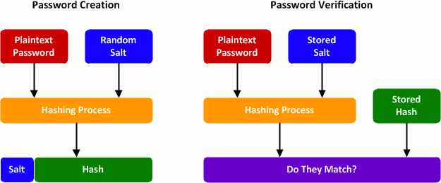

# Data Security

## Personally identifiable information (PII)

Any data that could potentially identify a specific individual. e.g. Name, email address, Social Security Number, National Insurance Number.

There are always grey areas when classifying a piece of data as PII or not. Everything can be considered PII in the right frame of reference
* Personal email address is always PII but there is an exemption in GDPR for staff email addresses. Companies are able to process employee data without explicit GDPR consent from employees.
* A lot of individual data points e.g. (DOB) by themselves are not PII but when linked to other data points e.g. individual's Name become PII. If data is accessible along with other piece of data it can be classified as PII 
  * Company registration number by itself is not PII - it is public data but if it is accessed along with list of names and the company they work for it can be PII.
  * Address linked to a user is PII, not by itself
  * IP address along with device/browser fingerprinting can potentially leak PII. Fingerprints can be used to fully or partially identify individual users or devices even when cookies are turned off. Fingerprinting is used to collect information about your browser type and version, as well as your operating system, active plugins, time zone, language, screen resolution and various other active settings. The large majority of sites use this data to personalize the advertisements and information that they serve up to you. Fingerprints can be used in a constructive way to combat fraud or credential hijacking, by checking that a user who logs into a specific site is likely the legitimate user.
   
## General Data Protection Regulation (GDPR)

A game changer in how companies have to process PII. It replaced the Data Protection Act in the UK

* Lawfulness, fairness and transparency
* Purpose limitation
* Data minimization
* Accuracy
* Storage limitation
* Integrity and confidentiality - obligation to avoid data breaches
* Accountability - companies are now accountable to [ICO](https://ico.org.uk) and can be punished with a maximum fine of 20m or 4% of their revenue

The data subject (individual) also gets rights under the law:

* The right to be informed
* The right of access
* The right of rectification
* The right to erasure
* The right to restrict processing
* The right to data portability
* The right to object
* Rights to in relation to automated decision making and profiling

## Payment Card Industry Data Security Standard (PCI DSS)

Regualtionput inplace by payment processors, e.g. Visa, Mastercard, Worldpay, PayPal, Stripe

* Payment Card Industry - Data Security Standard
* Strict industry regulations for handling card numbers
* Includes segregated networks, vulnerability management, access control, monitoring and testing and policy

## Techniques

Data security involves [three key properties](https://auth0.com/blog/how-secure-are-encryption-hashing-encoding-and-obfuscation/): confidentiality, integrity and authenticity. 

| Security Goal         | Hash | MAC       | Digital Signature|
|:----------------------|:-----|:----------|:-----------------|
|Integrity              |  Yes |    Yes    |   Yes            |
|Authentication         |  No  |    Yes    |   Yes            |
|Confidentiality        |  No  |    Yes    |   Yes            |
|Non-repudiation        |  No  |    No     |   Yes            |
|**Kind of keys**       | none | symmetric | asymmetric       |

### Data masking

Hiding sensitive information to prevent unintentional leakage

### Data backups

Redundant storage for maintaining copies of data 

### Encryption

Encryption is a two-way function where information is scrambled in such a way that it can be unscrambled later. You encrypt information with the intention of decrypting it later.

Encryption dates back to at least 1900 BC after the discovery of a tomb wall with non-standard hieroglyphs chiseled into it. 
* The ancient Egyptians used a simple form of encryption. 
* Caesar used a primitive shift cipher that changed letters around by counting forward a set number of places in the alphabet. It was extraordinarily useful though, making any information intercepted by Caesar’s opponents practically useless.

Modern encryption algorithms:

* AES Advanced Encryption Standard
* RSA Rivest-Shamir-Adlemen
* ECC Elliptic Curve Cryptography
* PGP Pretty Good Privacy

Usage

* Store sensitive data that must be retrieved (unlike passwords); e.g., credit card information.
* Protect network traffic; e.g., Wi-Fi Protected Access, Transport Layer Security, Virtual Private Networking.
* Protect data within storage media in the event of physical theft; e.g., full disk encryption.

### Hashing

Hashing is a one-way function where data is mapped to a fixed-length value. Hashing is primarily used for performing integrity checks on data. A **hash** is a unique code, generally hexadecimal that represents a dataset e.g a file. It is designed to be:

* unique - the hash changes if the contents of the input data change. No 2 inputs can generate the same hash thus a one-way function. This property is also known as **preimage resistance**.
* random, to avoid generating the same hash code for different inputs, thus minimising collisions when used in hash tables, thus providing **collision resistance**.
* reasonably quick to compute, but also not too quick. If it is too quick it is easy to break.

Usage 

* A **checksum** is necessarily a hash, however not all hashes are checksums (one's used in hash tables) but if you can afford the computational cost, a cryptographically strong hash code is a good checksum. A cryptographic hash is designed to be computationally infeasible to reverse, thus provide confidentiality via encryption whereas a checksum is designed to detect data integrity errors and often to be fast to compute.

* **Password hashing** uses a "Salt" - a unique value that can be added to the end of the password to create a different hash value. This adds a layer of security to the hashing process, specifically against brute force attacks.  

  

* **Hash-based Message authentication codes (HMACs)** use hashes to verify the sender of the message and the integrity of a message. Hashing the same message multiple times results in the same hash. **Nonce** is a one time value used to generate a unique hash per request, to prevent replay attacks.

### Encoding

Encoding is the process of converting data from one form to another and has nothing to do with cryptography. It guarantees none of the 3 cryptographic properties of confidentiality, integrity, and authenticity because it involves no secret and is completely reversible. Encoding methods are considered public and are used for data handling when data is sent over the wire. Base64 is a way to encode binary data into an ASCII character set known to pretty much every computer system, in order to transmit the data without loss or modification of the contents.

