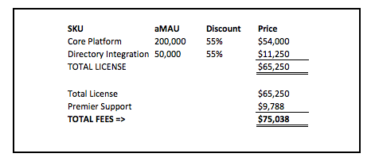

# Okta

The Okta core platform consists of

* Universal cloud directory
* Single sign on

Other skews include

* AD LDAP Integration - To bring in customer users into Okta from various sources
* Inbound Federation - Integration with other identity providers (Integrated Windows Authentication)
* Standardised SSO Integration
* API access management
* Social media
* Multifactor auth

## Billing

Combination of Okta capabilities and
Number of unique logins per month.

* How many different users login per month? KMobile higher number of users?
* How many total clients?
* Average number of users per client?
* Number of users who need Directory Integration?

## Users

Total number of users for

* PriceNet  - 29k
* Kalibrate - 25k

Total number of pricing users ~ 35k

## Pricing

* Core platform - 16666 unique logins per month
* Directory Integration - 4166 unique logins per month
* Test users can be controlled via groups based on the same instance

## Setup

Okta as Identity provider with an API gateway?

Okta as a service provider and identity provider.

## Single instance

All customers reside in a single Okta instance. Multiple organizations are managed through Groups/Admins

A group per organization and all users for that organization in a single group.

* Less admin overhead
* Less flexibility

## Hub and Spoke

Central hub and a spoke per customer.

* More flexibility and control, with administrative access to each customer independently
* Higher overhead in terms of managing spokes.

Comparison - https://support.okta.com/help/answers?id=906F0000000DFA7IAO