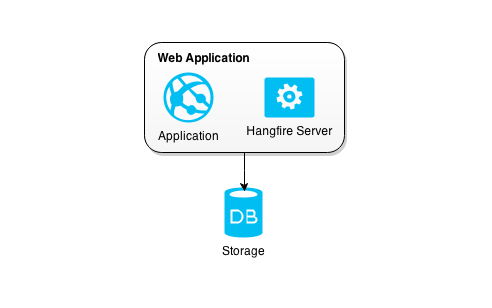
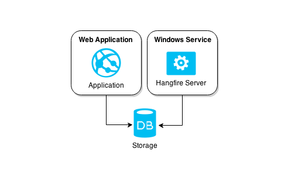

## Service or application

* A Windows service is like a Unix daemon. It isn't associated with any particular user, and is always running in the background.

* Many services can exist within a single process, therefore allowing less startup time for multiple services as compared to multiple processes.

### Hangfire

Hangfire allows you to kick off method calls outside of the request processing pipeline in a easy, but reliable way. These method invocations are performed in a *background thread* called background jobs.

Ability to process background jobs directly in web applications is a primary goal of Hangfire. No external application like Windows Service or console application is required for running background jobs

This does not mean that the hangfire server cannot be [run separately](https://www.hangfire.io/overview.html) in its own process or inside a Windows service.

Currently Hangfire has .NET framework 4.5 [requirement](http://docs.hangfire.io/en/latest/index.html#requirements).

### Topshelf

Topshelf is a [Windows service framework](http://docs.topshelf-project.com/en/latest/overview/faq.html) for the .NET platorm. It attempts to decouple a windows service behaviour from the .NET framework specific built-in service support, making it easy to create, test, debug and install a Windows Service.