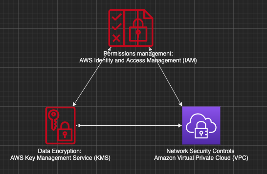

# AWS

Notes on AWS, organised around one idea: every action in AWS is an API call that IAM authenticates and authorises, and the same three controls apply to every service. The rest of AWS security is detecting when those controls fail and responding.

## Pages in this folder

* [Identity](Identity.md): how IAM evaluates a request, users and roles, identity and resource policies, ARNs, permission boundaries.
* [Key Management](Key%20Management.md): KMS key material, custom key stores, rotation, the three permission models, why deletion is scheduled and not instant.
* [VPC Networking](VPC%20Networking.md): subnets and route tables, why security groups are stateful and NACLs are not, endpoints, PrivateLink, Direct Connect and VPN.
* [Messaging](Messaging.md): SNS, SQS and EventBridge, what each guarantees, fan out, dead letter queues.
* [Disaster Recovery](Disaster%20Recovery.md): high availability versus DR, RTO and RPO, the four DR strategies, multi Region serverless.
* [EKS](EKS.md): what AWS runs and what you own, IAM as the cluster authenticator, pod networking with the VPC CNI, version lifecycle.

## Three controls for every service

Fundamentally there are a few patterns that can be used to secure all your AWS services.

* Control your cloud infrastructure: [AWS IAM](Identity.md). Every AWS service uses IAM to authenticate and authorise API calls, from human and non human identities.
* Control your data: [AWS KMS](Key%20Management.md). When you control the key a service encrypts with, that key lives in KMS, and every use of it is an IAM decision.
* Control your network: [Amazon VPC](VPC%20Networking.md). Which addresses and ports can reach a resource, and whether traffic to AWS services leaves your network at all.

An AWS account is the isolation boundary. Resources in one account cannot access resources in another unless explicitly allowed through a trust relationship. Accounts are also cost boundaries for billing, and service quotas are enforced per account (most are adjustable). Hence the usual advice: many small accounts under one organisation.

## Shared responsibility

AWS secures the cloud: the buildings, the hardware, the hypervisor and the software inside managed services. You secure what you put in the cloud: identities and their permissions, network rules, what is encrypted and with which key, and the data itself. The line moves with the service type. On EC2 you patch the operating system. On Lambda or S3, AWS does. Managed services shift work to AWS but never the decisions about who may access what, so the three controls above are always yours.

## Five kinds of control

The five areas below are those of the AWS Well-Architected security pillar. Services are named as examples only; the [AWS security docs](https://docs.aws.amazon.com/security/) list best practices per service.

### Identity

Who is calling and what they may do. IAM roles with temporary credentials for people (through IAM Identity Center) and for workloads (instance profiles, execution roles). Service control policies set guardrails across an organisation. IAM Access Analyzer finds resources shared outside your organisation, validates policies and generates least privilege policies from CloudTrail activity.

### Detection

Knowing what happened and what is wrong. CloudTrail is the CCTV for the account: who did what, when and from where, for every API call, but not for SSH or RDP sessions. AWS Config records resource configuration and evaluates it against rules you choose, such as "no public S3 buckets". GuardDuty is threat detection: it reads CloudTrail, VPC flow logs and DNS logs, learns normal behaviour and flags the unusual, such as credentials used from a suspicious address or an instance mining cryptocurrency. It alerts only; it is not an intrusion prevention system. Inspector is the opposite kind of scanner: known vulnerabilities (CVEs) in EC2 instances, ECR container images and Lambda functions, using the SSM agent or agentless EBS snapshot scanning. Inspector Classic, which needed its own agent, ended support in May 2026.

Security Hub CSPM (the original Security Hub, renamed in 2025) checks accounts against standards such as AWS Foundational Security Best Practices, CIS Benchmarks and PCI DSS. The new unified Security Hub, generally available since December 2025, correlates findings from CSPM, GuardDuty and Inspector into one view. If none of these are enabled, the [AWS Security Assessment Tool](https://github.com/awslabs/aws-security-assessment-solution) runs Prowler and ScoutSuite for a point in time assessment; the tools themselves are described in [Cloud Security](../../security/Cloud%20Security.md#tool-categories).

### Infrastructure protection

Keeping unwanted traffic away from workloads. Inside the VPC that is security groups, NACLs and route tables. At the edge, Shield Standard protects every AWS customer against common layer 3 and 4 DDoS attacks at no charge; Shield Advanced is the paid tier with wider coverage and response support. AWS WAF filters layer 7 traffic (SQL injection, cross site scripting, bots) in front of CloudFront, ALB and API Gateway. Network Firewall inspects traffic at the VPC boundary. Background: [DDoS protection](../../security/Web%20Application%20Risks.md#ddos-protection).

### Data protection

Encryption, classification and secrets. KMS holds the keys; every use of a key is an IAM decision and a CloudTrail record. Macie scans S3 for sensitive data such as PII, PHI and financial records and flags public or unencrypted buckets, which matters for HIPAA and GDPR. Secrets Manager stores and rotates credentials; rotation starts immediately when enabled, so make sure every consumer already reads from Secrets Manager first. Parameter Store is the free alternative for configuration and secrets, with a per Region limit on the standard tier and a paid Advanced tier; the trade offs are in [Secrets Management](../../security/Secrets%20Management.md).

### Incident response

Turning a finding into an action. Detective builds a graph from CloudTrail, flow logs and GuardDuty findings so you can trace an incident back to its cause. Findings from the detection services land in EventBridge, where a rule can invoke Lambda or Step Functions to isolate an instance, revoke a key or open a ticket. The response is your work; the services only alert.

## How to rederive this

* Start from "everything is an API call": then authentication and authorisation (IAM) is the first control, and a log of every call (CloudTrail) is the basis of detection.
* Ask what a call needs besides permission: a network path (VPC) and, if it touches stored data, a key (KMS). That gives the three controls.
* Ask what AWS cannot decide for you: who may access what. That is your half of shared responsibility, whatever the service.
* Detection splits into known (Inspector, Config rules, CSPM standards) and unusual (GuardDuty). Response is glue you write on EventBridge.

## Sources

* AWS Well-Architected Framework, Security Pillar: <https://docs.aws.amazon.com/wellarchitected/latest/security-pillar/welcome.html>
* AWS Shared Responsibility Model: <https://aws.amazon.com/compliance/shared-responsibility-model/>
* AWS security documentation, per service best practices: <https://docs.aws.amazon.com/security/>
* Security Hub unified service GA (December 2025): <https://aws.amazon.com/about-aws/whats-new/2025/12/security-hub-near-real-time-risk-analytics/>
* Amazon Inspector Classic end of support: <https://docs.aws.amazon.com/inspector/v1/userguide/inspector_introduction.html>
* Diagram source: `AWS.drawio` in this folder, page "IAM" (icon triad).
