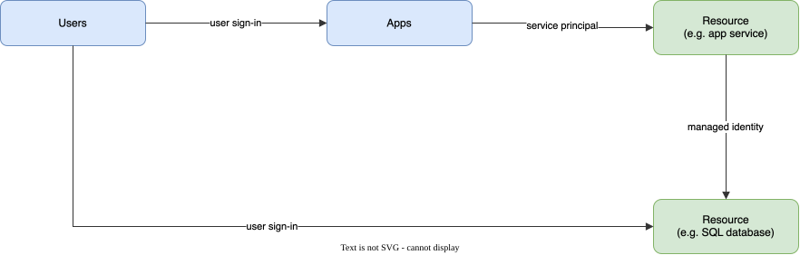

# Tenants, Subscriptions and RBAC

Azure is multi-tenant: the cost of shared physical servers and other infrastructure is spread across many customers. [Azure isolation](https://docs.microsoft.com/en-us/azure/security/azure-isolation) is what stops that sharing from becoming a risk, so that one customer cannot see or affect another customer's applications and data.

**Azure tenant** is a client or organization that owns and manages a specific instance of cloud service. A tenant is simply a **dedicated instance of Microsoft Entra ID (formerly Azure AD)** that your organization receives and owns when it signs up for a Microsoft cloud service. The product was renamed in 2023; the Azure CLI command group is still `az ad` and did not change. Azure tenancy refers to a “customer/billing” relationship and a unique tenant in Entra ID. Tenant level isolation in Microsoft Azure is achieved using Entra ID and role-based controls offered by it.

* Each Entra ID directory is distinct and separate from other Entra ID directories. Just like a corporate office building is a secure asset specific to an organization, an Entra ID directory is also designed to be a secure asset for use by only a single organization.
* An Entra ID tenant is logically isolated using security boundaries so that no customer can access or compromise co-tenants, either maliciously or accidentally.

**Azure subscription** is a logical permissions group associated with one Entra ID tenant. A subscription [trusts Entra ID](https://docs.microsoft.com/en-in/azure/active-directory/fundamentals/active-directory-how-subscriptions-associated-directory) to authenticate users, services, and devices. You may create additional subscriptions to
* create separate environments for security e.g dev and prod subscriptions, or to isolate data for compliance reasons. 
* manage cost separately for cloud resources
* avoid hitting subscription limits

Multiple subscriptions can trust the same Entra ID directory, but each subscription can only be associated with a single directory.


## Transferring subscription to a different tenant (changing directories)

When a subscription is created, the user who created it gets two things

* **Account Administrator** - billing and account ownership. This is a billing role, not an RBAC role, and can be transferred to another user without changing the subscription and tenant association
* **Owner** (Azure RBAC) at subscription scope - admin for the resources in the subscription. The classic Service Administrator and Co-Administrator roles that used to sit here were retired on 31 August 2024

Transferring the subscription to another directory (target tenant) does not by itself change the billing Account Administrator. Several Azure resources have a dependency on a subscription or a directory. Transferring a subscription means RBAC role assignments, managed identities and a [range of other things](https://docs.microsoft.com/en-us/azure/role-based-access-control/transfer-subscription#understand-the-impact-of-transferring-a-subscription) are deleted from the source subscription and have to be recreated in the target directory.


## IAM

Traditionally, organizations have secured their assets by establishing trust within the perimeter of the organisation's on premise network. Any communication going out or coming inside the network perimeter was considered untrusted. With cloud computing where SAAS based resources are accessed over the public internet, ensuring the right people have access to the right resources and only when they need it is governed by issuing identity to resources, people and apps.

### Entra ID

Identity is at the heart of cloud security, it is something that remains constant whether you are an office based user or a cloud based one. By housing user objects, application objects and managed identities, Entra ID facilitates Identity and Access Management (IAM). It can be used to verify an identity (authentication) and control which identity has access to what resources (authorization). The directory itself is tenant-wide. What gets scoped is the Azure RBAC role assignment, which can target a management group, a subscription, a resource group or a single resource such as an app service or storage account.

Users need access to apps and resources. Apps need access to resources and resources may need access to other resources. Access control is managed by Entra ID using **identities**



Entra ID can have different types of Identities

* User account
  * represents a staff member within the organization, can be cloud user, synchronized from on-prem AD or external guest user
  * user credentials such as username and password
* App
  * represents an application in use within the tenant
  * identity configuration for your application running in Azure or elsewhere that allows it to integrate with Entra ID
  * uses client secret or certificate for authentication
* Managed Identities
  * provides an identity for apps to use when connecting to resources supporting Entra authentication, with no secret for you to store or rotate
  * **system-assigned** identity is created with one resource and deleted with it e.g. a VM accessing a SQL DB
  * **user-assigned** identity is a standalone resource that several resources can share and that outlives any of them

For managing permissions and access control for your apps within Entra ID it is important to understand [what are application and service principal objects in Entra ID?](https://docs.microsoft.com/en-us/azure/active-directory/develop/app-objects-and-service-principals) To access resources that are secured by Entra ID, the entity that requires access must be represented by a **Service Principal**, the entity could be a

* user - user principal for delegated access (on behalf of the signed-in user) to resources
* an application or resource - service principal
  * Application
  * Managed Identity
  * Legacy (no associated app registration)

### IAM for the azure subscription

An Azure subscription uses RBAC (Role Based Access Control) for managing Azure resources.

To see who has what on a subscription, list its role assignments. In the portal the same view is Subscriptions -> Access control (IAM).

```bash
az role assignment list --subscription <subscription-id> --all --output table
```

Your current URL contains the **subscription id** e.g. https://portal.azure.com/#@{tenant}.onmicrosoft.com/resource/subscriptions/{subscription-id}/users

#### Role assignments

Role assignments associate Service Principals to resources

List all the SPs:  -> Select Role Assignments -> Select Type {Apps}

Lists all the roles: -> Select Roles e.g. 'Owner' 'Contributor' 'Reader' and the Custom roles that you may have defined.

### IAM for Entra ID

Microsoft Entra ID -> App registrations -> Endpoints

Federated identity endpoints contain the **tenant id**. There are two versions of the OAuth token endpoint

* v1.0: https://login.microsoftonline.com/{tenant-id}/oauth2/token
* v2.0: https://login.microsoftonline.com/{tenant-id}/oauth2/v2.0/token

Use v2.0 (the Microsoft identity platform) for new apps. It uses scopes instead of a resource identifier and can also sign in personal Microsoft accounts.

## Locking down network access to Azure services

Most Azure PaaS services have a public endpoint by default. Two ways to stop treating the internet as your network:

* **Virtual network service endpoints** restrict a service (Storage, SQL, Key Vault) to traffic from your VNet subnets. Traffic stays on the Azure backbone and the service sees your VNet's identity. The service still has a public IP; the firewall just refuses everyone else.
* **Private endpoints** (Private Link) give the service a private IP inside your VNet, so there is no public endpoint to lock down at all. This is now the recommended approach for most services.

Azure SQL adds server-level IP firewall rules. Use them when many databases share the same access needs. The "Allow Azure services" switch permits traffic from every Azure IP, including other tenants', so leave it off unless you know why you need it. Rules can be set with `az sql server firewall-rule create`.

## Security services

Microsoft Defender for Cloud (formerly Azure Security Center) is the cloud security posture management (CSPM) and workload protection service. It scores the subscription against benchmarks and raises alerts for storage, SQL, app service and VMs. Agentless scanning has replaced the old Log Analytics agent workflow, so VMs no longer need workspace ids and keys pushed to them. Microsoft Sentinel (formerly Azure Sentinel) is the cloud native SIEM and SOAR, the analogue of Splunk or Rapid7: Defender finds and alerts, Sentinel ingests, correlates and runs the response playbooks. The framework view (CSF, CIS, CSPM, SIEM versus SOAR) is in [Cloud Security](../../security/Cloud%20Security.md).
