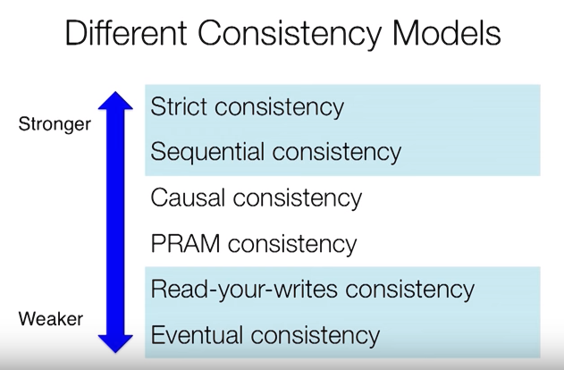

# Consistency Models

A distributed database keeps several copies of the data. The consistency model says which writes a read is guaranteed to see. The strongest, linearizability, behaves like one copy on one machine: a read sees every write that finished before it. The weakest, eventual consistency, only promises that replicas converge once writes stop. Each stronger model costs coordination: latency on every request, unavailability when nodes cannot talk.

## Why databases are hard to scale

Stateless applications scale by adding servers. Databases are stateful, so they do not. A bigger machine only goes so far. The other way is to partition the data, functionally or by sharding, over multiple databases. Compared to a monolithic database you then lose secondary indexes, foreign key constraints, joins and much of the query optimiser. That work does not vanish; the application does it. [Choosing a Database](Choosing%20a%20Database.md) covers replication and sharding.

## Two meanings of consistency

The C in ACID is application correctness: business rules hold after every transaction. A bank account balance cannot be negative. If the quantity on an order line changes, the order total must change too. These rules keep the aggregate (a group of properties that change together) consistent. The database cannot know them; only the application can (Kleppmann). If one transaction must span several aggregates, relook at the use case and ask whether eventual consistency between them would do (Vernon).

Consistency models are the other meaning: which writes each read sees, and in what order. Serializability is formally the I in ACID, not the C.

## Serializability, linearizability, strict serializability

*Serializability is not about doing one thing at a time but the effect of what you did is like you did one thing at a time.*

Running a set of transactions gives the same result as running them one after another in some serial order. Serializability is not serial execution. It costs concurrency control: locking and coordination. It does not say which serial order.

Linearizability is about single objects. Each read or write appears to take effect at one instant between request and reply, and those instants agree with real time. It is like running your code on a single thread on a single processor: once a write returns, every later read sees it, so events are **totally ordered**.

A **total ordering** fixes the exact order of every element. A **partial ordering** only fixes the order between elements that depend on each other. With three events `{A, B, C}`, they are totally ordered if they must happen as `A > B > C`. If A must happen before C but you do not care when B happens, then `A > B > C`, `A > C > B` and `B > A > C` all satisfy the partial ordering.

The two are independent. Commit a transfer, wait for the reply, then read the balance in a second transaction. A serializable database may pick the order "read, then transfer" and return the old balance; only real time was broken. **Strict serializability** adds the rule that an operation which finished before another started comes first (Bailis). Spanner's **external consistency** is strict serializability: if T1 commits before T2 starts, T2 sees T1's writes.

The slide's top rung, "strict consistency", means every read returns the latest write by absolute global time. That needs a perfect shared clock, which nothing has. Read that rung as linearizability.

## Weaker models

* **Sequential.** Everyone sees all writes in the same order, and each client's own operations in the order it issued them. That order need not match real time.
* **Causal.** Writes that depend on each other are seen in order: a reply after the comment it answers. Unrelated writes may be seen in different orders. Loosely connected systems like Git use this, with conflict resolution.
* **Read-your-writes.** After you write, your own later reads see it. Users must see the data they have just changed; a reload served by a lagging replica breaks this.
* **Monotonic reads.** Once you have seen a value you never see an older one. PRAM on the slide is read-your-writes, monotonic reads and monotonic writes together.
* **Eventual.** If writes stop, all replicas converge. No bound on when, no promise about what you see meanwhile. [Asynchronous messaging](../messaging/Messaging%20Fundamentals.md) between services gives you this.

## CAP

CAP uses three narrow terms (Gilbert and Lynch). Consistency means linearizability: the client perceives that a set of operations occurred all at once. Availability means every request to a non-failed node gets a response. Partition tolerance means the system keeps working when messages between nodes are lost or delayed indefinitely.

Partitions are a given. Servers stop hearing from each other (a garbage collection pause is enough), for an unknown time, and a delayed server looks like a dead one. During a partition you choose: refuse some operations until it heals (CP), or keep answering on both sides and reconcile later (AP). Brewer wrote in 2012 that "2 of 3" is misleading; Kleppmann's phrasing is "either consistent or available when partitioned". PACELC (Abadi) adds the no-partition case: there you trade latency against consistency.

## What linearizability costs

To guarantee a read returns the latest write, the answering node must be the single leader every write passes through, or must check with a majority of replicas. Either way a round trip sits on every request: latency. If the leader or majority cannot be reached, the node must refuse: unavailability. Single-leader replication and consensus (Raft, Paxos) give linearizability this way with no synchronised clocks.

Overuse of transactions creates bottlenecks across a network (two-phase commit) and across CPU cores on one machine (serialisation, cache line transfers). The Spanner authors still preferred transactions and fixing bottlenecks as they arise (Corbett et al., 2012). Identify the transactions that always need to be consistent and let the rest be eventually consistent.

TrueTime is Spanner's answer, not a general requirement. Spanner gets serializability from locks and external consistency from TrueTime timestamps. TrueTime (GPS and atomic clocks) returns an interval guaranteed to contain the true time. Non-overlapping intervals are ordered; overlapping ones are not, so a transaction waits out the uncertainty before committing. That orders transactions across independent Paxos groups.

## How to rederive this

* One copy on one machine: every read sees the last write. Copies over a network break that.
* Serializability allows any serial order. Add "respect real time" and you have strict serializability; for single operations, linearizability.
* Each weaker rung drops one promise: same order for all, order only for dependent writes, only your own writes, never backwards, converge someday.
* In a partition a cut-off node can answer (maybe wrong) or refuse (unavailable). P is never what you give up.

## Sources

* Kleppmann, *Designing Data-Intensive Applications* (2017), ch. 7 and 9.
* Brewer, "CAP Twelve Years Later" (2012); Gilbert and Lynch, "Brewer's Conjecture" (2002).
* Bailis, "Linearizability versus Serializability" (2014); Kingsbury, Jepsen consistency models.
* Corbett et al., "Spanner" (OSDI 2012); Brewer, "Spanner, TrueTime and the CAP Theorem" (2017).
* Abadi, "Consistency Tradeoffs in Modern Distributed Database System Design" (2012).
* Vernon, "Effective Aggregate Design" (2011).
