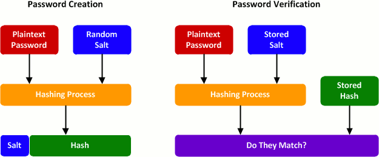

# Cryptography Basics

## Techniques

Data security involves [three key properties](https://auth0.com/blog/how-secure-are-encryption-hashing-encoding-and-obfuscation/): confidentiality, integrity and authenticity.

| Security Goal         | Hash | MAC       | Digital Signature|
|:----------------------|:-----|:----------|:-----------------|
|Integrity              |  Yes |    Yes    |   Yes            |
|Authentication         |  No  |    Yes    |   Yes            |
|Confidentiality        |  No  |    Yes    |   Yes            |
|Non-repudiation        |  No  |    No     |   Yes            |
|**Kind of keys**       | none | symmetric | asymmetric       |

### Data masking

Hiding sensitive information to prevent unintentional leakage

### Data backups

Redundant storage for maintaining copies of data

### Encryption

Encryption is a two-way function where information is scrambled in such a way that it can be unscrambled later. You encrypt information with the intention of decrypting it later.

Encryption dates back to at least 1900 BC after the discovery of a tomb wall with non-standard hieroglyphs chiseled into it.

* The ancient Egyptians used a simple form of encryption.
* Caesar used a primitive shift cipher that changed letters around by counting forward a set number of places in the alphabet. It was extraordinarily useful though, making any information intercepted by Caesar’s opponents practically useless.

Modern encryption algorithms:

* AES Advanced Encryption Standard
* RSA Rivest-Shamir-Adlemen
* ECC Elliptic Curve Cryptography
* PGP Pretty Good Privacy

Usage

* Store sensitive data that must be retrieved (unlike passwords); e.g., credit card information.
* Protect network traffic; e.g., Wi-Fi Protected Access, Transport Layer Security, Virtual Private Networking.
* Protect data within storage media in the event of physical theft; e.g., full disk encryption.

### Hashing

Hashing is a one-way function where data is mapped to a fixed-length value. Hashing is primarily used for performing integrity checks on data. A **hash** is a unique code, generally hexadecimal that represents a dataset e.g a file. It is designed to be:

* unique - the hash changes if the contents of the input data change. No 2 inputs can generate the same hash thus a one-way function. This property is also known as **preimage resistance**.
* random, to avoid generating the same hash code for different inputs, thus minimising collisions when used in hash tables, thus providing **collision resistance**.
* reasonably quick to compute, but also not too quick. If it is too quick it is easy to break.

Usage

* A **checksum** is necessarily a hash, however not all hashes are checksums (one's used in hash tables) but if you can afford the computational cost, a cryptographically strong hash code is a good checksum. A cryptographic hash is designed to be computationally infeasible to reverse, thus provide confidentiality via encryption whereas a checksum is designed to detect data integrity errors and often to be fast to compute.

* **Password hashing** uses a "Salt" - a unique value that can be added to the end of the password to create a different hash value. This adds a layer of security to the hashing process, specifically against brute force attacks.  

  

* **Hash-based Message authentication codes (HMACs)** use hashes to verify the sender of the message and the integrity of a message. Hashing the same message multiple times results in the same hash. **Nonce** is a one time value used to generate a unique hash per request, to prevent replay attacks.

### Encoding

Encoding is the process of converting data from one form to another and has nothing to do with cryptography. It guarantees none of the 3 cryptographic properties of confidentiality, integrity, and authenticity because it involves no secret and is completely reversible. Encoding methods are considered public and are used for data handling when data is sent over the wire. Base64 is a way to encode binary data into an ASCII character set known to pretty much every computer system, in order to transmit the data without loss or modification of the contents.
