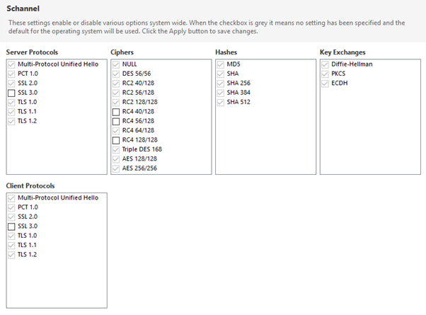

# Compliance

Compliance to security standards requires a combination of strong communication protocols, cryptography, hashing and key exchange. Schannel or [secure channel](https://docs.microsoft.com/en-us/windows/win32/secauthn/secure-channel) is a Security Support Provider Interface (SSPI, Win32 API) used by Windows systems to perform security operations for internet applications that require secure HTTP communications. It contains a set of security protocols that provide identity authentication and secure, private communication through encryption.

The Public-Key Cryptography Standards (PKCS) are a set of inter-vendor standard protocols for making possible secure information exchange on the Internet using a [Public Key
Infrastructure (PKI)](https://www.thesslstore.com/blog/wide-world-pki/) devised and published by the computer and network security company RSA Security LLC. The standards include RSA encryption, password-based encryption, extended certificate syntax, and cryptographic message syntax for S/MIME, RSA's proposed standard for secure e-mail.

## Compliance Standards

[Compliance standards](https://docs.microsoft.com/en-gb/microsoft-365/compliance/offering-home?view=o365-worldwide) govern the collection and use of data for

* global (ISO, SOC)
* national (FIPS)
* industry (PCI DSS, HIPAA/HITECH)
* region (GDPR) specific requirements.

### ISO

* ISO/IEC 27001:2022 - Information Security management systems. Replaced the 2013 edition; certificates against 27001:2013 expired on 31 Oct 2025. ISO/IEC 27002:2022 is the companion control catalogue (93 controls in 4 themes).
* ISO 27701 - outlines a framework for Personally Identifiable Information (PII) Controllers and PII Processors to manage data privacy
* ISO 27017 - Information Security controls for cloud services
* ISO 27018 - Protection of personal data in the cloud

### SOC 1, 2, 3

AICPA System and Organization Controls reports, produced by an independent auditor.

* SOC 1 - controls relevant to the customer's internal control over financial reporting (ICFR). Not a security report.
* SOC 2 - controls against the five Trust Services Criteria: Security, Availability, Processing Integrity, Confidentiality and Privacy. Security is mandatory, the others are optional. Type I reports on the design of controls at a point in time; Type II reports on their operating effectiveness over a period (usually 6 to 12 months). Restricted distribution.
* SOC 3 - a public summary of a SOC 2 Type II report with the detail removed, for general distribution.

### PCI DSS

The Payment Card Industry Data Security Standard is published by the [PCI Security Standards Council](https://www.pcisecuritystandards.org/) (PCI SSC). Current version: PCI DSS v4.0.1 (v3.2.1 retired 31 Mar 2024; the v4.0 future-dated requirements became mandatory 31 Mar 2025).

SSL and early TLS (1.0 and 1.1) were removed as examples of strong cryptography and could no longer be used as a security control after 30 June 2018 (the PCI DSS 3.1/3.2 migration deadline).

TLS 1.2 or 1.3 meets the PCI SSC definition of "strong cryptography". If you are processing credit cards you must be using one of these versions, not TLS 1.1 or 1.0.

### FIPS

The Federal Information Processing Standard (FIPS) 140 is a security standard for validating cryptographic modules. FIPS 140 validated software is required by the U.S. Government and requested by other prominent institutions. FIPS 140-3 is the active version; the approved security functions are listed in NIST SP 800-140C rather than in the old FIPS 140-2 Annex A. All remaining FIPS 140-2 certificates move to the CMVP Historical list on 21 Sep 2026. Enabling FIPS forces you to use [FIPS 140-3 approved encryption, hashing and signing schemes](https://csrc.nist.gov/projects/cryptographic-module-validation-program/fips-140-3-standards):

Symmetric ciphers (algorithms) for encryption

* AES (Advanced Encryption Standard) - is a specification and a successor of DES. [Rijndael](http://web.archive.org/web/20070711123800/http://csrc.nist.gov/CryptoToolkit/aes/rijndael/Rijndael-ammended.pdf) - a symmetric key encryption algorithm (cypher) has been selected as the AES. .NET Framework 4.x provides [3 implementations supporting AES](https://stackoverflow.com/questions/939040/when-will-c-sharp-aes-algorithm-be-fips-compliant#:~:text=RijndaelManaged%20implements%20the%20full%20Rijnadael,size%20other%20than%20128%20bits):  `RijndaelManaged`, `AesManaged` and `AesCryptoServiceProvider` of which `AesCryptoServiceProvider` is FIPS compliant. In .NET 6 and later these classes are obsolete (SYSLIB0021/SYSLIB0022); use `Aes.Create()`, which returns the platform's FIPS-validated implementation.
* Triple-DES (Data Encryption Standard) - legacy. Disallowed for encryption since 1 Jan 2024 (NIST SP 800-131A Rev 2); decrypt only.

Digital signatures (FIPS 186-5) for TLS authentication

* RSA (Rivest-Shamir-Adleman)
* ECDSA (Elliptic Curve Digital Signature Algorithm)
* EdDSA (Ed25519, Ed448)
* DSA - legacy. FIPS 186-5 (Feb 2023) removed DSA for generating new signatures; verify only.

Key agreement (SP 800-56A) for TLS key exchange. Signature algorithms do not perform key exchange.

* ECDH / ECDHE
* DH / DHE
* ML-KEM (FIPS 203, 2024) for post-quantum key encapsulation

Hash Standards for TLS integrity requirements

* SHA-2 family (FIPS 180-4): SHA-224, SHA-256, SHA-384, SHA-512, SHA-512/224, SHA-512/256
* SHA-3 family (FIPS 202): SHA3-224, SHA3-256, SHA3-384, SHA3-512
* SHA-1 - legacy. Disallowed for digital signatures since 2013; NIST plans full retirement by 31 Dec 2030 (SP 800-131A). TLS 1.3 does not use SHA-1 anywhere.

Random number generators

* DRBGs per SP 800-90A: Hash_DRBG, HMAC_DRBG, CTR_DRBG

Message authentication

* AES
* Triple DES (legacy, see above)
* HMAC

#### FIPS security implications

The security setting forces the OS to use only FIPS-validated cryptography e.g. it disables the weaker Secure Sockets Layer (SSL) protocols and only supports TLS 1.2 and above (TLS 1.0 and 1.1 were deprecated by RFC 8996 in 2021; NIST SP 800-52 Rev 2 requires 1.2 minimum and recommends 1.3), however the algorithms enforced by FIPS don't necessarily make your system more secure because [security standards and certifications move at a slower pace](https://security.stackexchange.com/questions/4122/question-of-importance-of-fips-in-security-implementations) than security vulnerabilities. This means, if there are new cryptography schemes available that haven't yet been FIPS-validated, your system maybe running slower and less secure encryption schemes. e.g. on a FIPS enabled system Microsoft’s .NET framework will block access to algorithms that aren’t FIPS-validated. So enabling FIPS mode will either break .NET applications that may use a more efficient algorithm or force them to use the less efficient algorithm and be slower.

#### FIPS compliance and certification

[FIPS compliance is different from certification](https://www.infoworld.com/article/2642540/is-your-web-site-fips-compliant-.html). FIPS certification is a laborious, long, and expensive process, where a crypto vendor submits its product to a FIPS certification lab to obtain a FIPS certification certificate. Most noncrypto vendors are expected to be FIPS compliant, which means they use and rely on other FIPS-certified products for their solution. But there is a big, costly difference between the two options.

## Certifications

**Individual.** CISSP and SSCP (ISC2), CEH (EC-Council). CREST is an accreditation body rather than a certification; its individual exams are CPSA, CRT and CCT.

**Organisational.** Cyber Essentials (NCSC, UK) certifies that an organisation has a sensible baseline of controls. It is a baseline only: it implies no guarantee against commodity attacks that get past those controls, and organisations should assess their own risks and go further where needed. Cyber Essentials Plus adds an independent technical audit. The requirements are revised roughly yearly.
