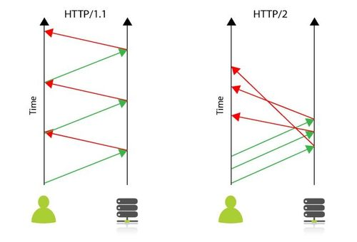
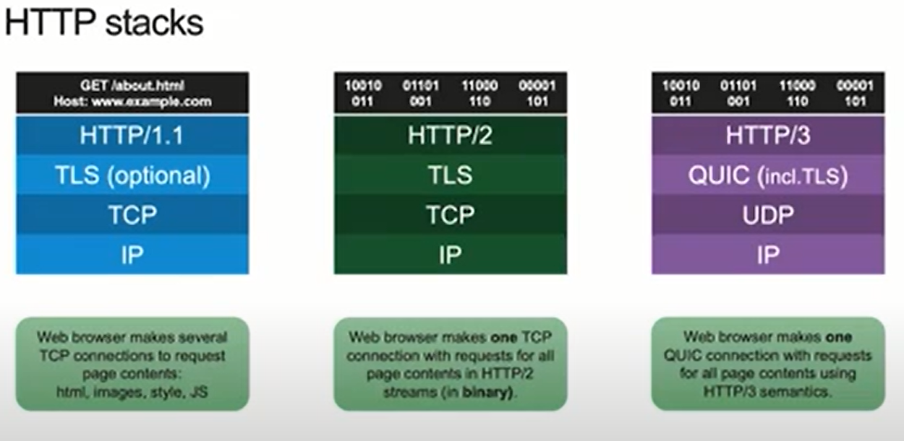

# HTTP based communication

HTTP is a layer 7 protocol. HTTP/1.x and HTTP/2 run over TCP; HTTP/3 runs over QUIC, which runs over UDP. It works in a client-server model and follows the [request-response](https://twitter.com/kosamari/status/859958929484337152?lang=en) paradigm. The client sends a request to a server, the server waits till the complete request is received and then replies with a response.

* **Bidirectional**- means you can send data in both directions over a channel.

* **Full duplex** - implies that client and server can send data in both directions *at the same time* without waiting for a response. Phone lines are example of full duplex while a walkie-talkie is half-duplex.

* **Multiplexing** - allows several request and responses to be sent over a single TCP connection by combining multiple requests into one without order dependency i.e. the responses can arrive in a different order as the requests were sent.

## HTTP 1.x

Multiple TCP connections can be opened in parallel by the browser to speed up page loading. Browsers have different limits on maximum concurrent connections they can open on a domain but they generally support around 6 different connections. You can improve the latency and save resources if you open fewer TCP connections and reuse them for any subsequent HTTP requests.

HTTP 1.x may **pipeline** (send multiple requests without waiting for each response on a single TCP connection) its requests but it still means the requests are queued one after the other. As the entire connection is ordered and blocking (FIFO), a slow request can hold up the connection, slowing down all subsequent requests. Therefore to increase performance *CSS image sprites (image collection) & JS concatenation is perferred because it reduces the number of requests which reduces waiting on queue.*

## HTTP/2

* Built on Google's SPDY protocol. First standardised as RFC 7540 (2015), revised as RFC 9113 (2022). [Supported](https://caniuse.com/http2) by all major browsers.

* With HTTP/1.1 when multiple requests are issued on a single TCP connection (aka pipelining) they must be processed in series, which results in a known limitation in networking known as head-of-line blocking (HOL Blocking). As the entire connection is ordered and blocking (FIFO), a slow request can hold up the connection, slowing down all subsequent requests. HTTP/2 solves this problem by multiplexing (concurrent processing vs linear) multiple requests over a single TCP connection (the `Connection` header is now forbidden and all clients and servers *must* persist connections.) significantly reducing the number of connections and latency between clients and servers. This means [HTTP/1.x optmizations like Domain sharding, CSS image sprites and JS concatenation actually hurt](https://www.nginx.com/blog/7-tips-for-faster-http2-performance/).

* HTTP/2 is a binary protocol where HTTP 1.x is textual. It increases bandwidth efficiency by using a binary compressed format for headers. The considerable bandwidth savings offset the minor increase in CPU load (to compress and uncompress the headers) and the inconvenience to human users who can’t read the headers (for debugging purposes, for instance).

* HTTP/2 also introduces resource prioritization to improve the user experience of page loading. Web browsers and other clients can now indicate the order in which they want to receive resources. Browsers with good HTTP/2 support can render pages significantly faster by prioritizing the key resources the user needs to see first. This means traditional Web pages that mix HTML, CSS, JavaScript code, images, and limited multimedia work well with HTTP/2. RFC 9113 (2022) deprecated the original HTTP/2 stream-dependency priority scheme; RFC 9218 (Extensible Priorities) replaces it for both HTTP/2 and HTTP/3.

* While HTTP/2 did not explicitly change the security requirements for HTTP, almost all browsers that use HTTP/2 require SSL/TLS to be enabled at the website, which makes it mandatory for all intents and purposes.

## HTTP/3

HTTP/3 (RFC 9114, 2022) runs over QUIC (RFC 9000, 2021) instead of TCP. QUIC moves multiplexing to the transport protocol i.e. the reliability of receiving HTTP/3 frames for the right resources in the right order is moved down into the transport and leaves UDP just for the packetisation, therefore simplifying HTTP. Because each QUIC stream is delivered independently, a lost packet only stalls the stream it belongs to. This removes the head-of-line blocking across streams that HTTP/2 still has on a single TCP connection. QUIC also builds in TLS 1.3, so HTTP/3 is always encrypted, and it supports 0-RTT connection resumption.

## Persistent connections

HTTP is a session-less protocol. Each request and response sequence is independent from each other, which means that, on its own, HTTP requires each request to have its own connection.  The client establishes a connection, requests an update, gets a response from the server, then closes the connection. Imagine this process being repeated endlessly, by thousands of concurrent users – it’s incredibly taxing on the server at scale. To make it more efficient, we need [HTTP Keep-Alive](https://www.haproxy.com/blog/http-keep-alive-pipelining-multiplexing-and-connection-pooling/#history-of-keep-alive-in-http). HTTP Keep-alive is the mechanism that instructs the client and server to maintain a persistent TCP connection, decoupling the one-to-one relationship between TCP and HTTP, effectively increasing the scalability of the server.

The HTTP 1.0 protocol does not support persistent connections by default. In order to do so, the client has to send a `Connection` header with its value set to `keep-alive` to indicate to the server that the connection should remain open for any subsequent requests. That said, this is not a hard and fast rule and the server can close said connection after the first response—or any response actually. In short, the keep-alive mode in HTTP 1.0 is explicit. Both the client and server have to announce it.

HTTP/1.0 is from 1996 (RFC 1945) and is almost no longer used on the Internet.

HTTP 1.1 supports persistent connections by default. There is no need to send the Connection header field to announce support for keep-alive. Each party expects that the peer supports it, although it is possible for any peer of the transaction to change this behavior by sending a `Connection: close` header. A persistent connection can be closed after any full response is sent or after some time when the connection has become idle, the purpose of which is to save resources on the server side.

Because HTTP 1.1 connections are persistent, a client can send its next request on the same connection as soon as the previous response has arrived. **HTTP pipelining** goes one step further: the client sends several requests without waiting for their responses, and the server must return the responses in the same [order](https://www.rfc-editor.org/rfc/rfc9112#section-9.3.2). Pipelining is unused in practice. No browser ships it, and HTTP/2 multiplexing replaced it.

There are several protocols where long-lived TCP connections are utilized:

* Websockets
* SSE
* HTTP/2
* gRPC
* RSocket
* AMQP

### Long polling

Polling is

* Not responsive - you cannot be sure that the requested data has changed
* Not efficient - results in wastage of CPU and bandwidth resources to transfer stale data

As in regular polling, rather than making repeated requests to a server by establishing a connection every time for every client until new data for a given client becomes available, Long polling is where the server elects to hold a client connection open for as long as possible, delivering a response only after data becomes available or timeout threshold has been reached. After receiving response client may immediately send a new long-polling request to the server to emulate real-time transaction of data.

Approaches like long polling require many hops between servers and devices, and these gateways/reverse proxies often have different ideas of how long a typical connection is allowed to stay open. If it stays open too long something may kill it, maybe even when it was doing something important.

### Websockets

Generally, WebSockets will be the better choice in the context of realtime, ongoing communication. Ably argues that HTTP-based techniques tend to be much more resource intensive on servers than WebSockets. That is a trade-off rather than a free win: each open WebSocket holds server resources for its whole lifetime, see [Scaling persistent connections](#scaling-persistent-connections) below.

Websocket protocol standardized in RFC6455 provides:

* Bi-directional protocol - either client/server can send a message to the other party (In HTTP, the request is always initiated by the client and the response is processed by the server – making HTTP a client-initiated, half-duplex protocol)
* Full-duplex communication - client and server can talk to each other independently at the same time over a long running TCP connection.
* Single TCP connection - After upgrading the HTTP connection in the beginning, client and server communicate over that same TCP connection (persistent connection) throughout the lifecycle of WebSocket connection.

WebSockets is essentially a thin transport layer built on top of a device’s TCP/IP stack. The intent was to provide what is essentially a TCP communication layer to web applications that's as close to raw as possible, bar a few abstractions to eliminate certain security-based complications and other concerns. [Websockets is different from HTTP](https://ably.com/topic/websockets-vs-http) but the WebSocket handshake is compatible with HTTP, using the HTTP Upgrade facility to upgrade the connection from HTTP to WebSocket. Client sends HTTP GET request with the following headers

* Connection: Upgrade
* Upgrade: websocket
* Sec-WebSocket-Key: key (proves the peer speaks WebSocket and defeats caching intermediaries; it is not a security feature)
* Origin: the page's origin. The server uses it to apply the browser's *origin based security model* and decide whether to accept the connection

Server responds with HTTP status code "101" - indicates to the client that in order to communicate it will be switching protocols from `http://` to websockets or `ws://` or preferably `wss://` (WebSockets over SSL/TLS). The server then responds with the following headers:
  - Upgrade: websocket
  - Connection: Upgrade
  - Sec-WebSocket-Accept: key (derived from the client's key so the client can confirm the server understood the WebSocket handshake)

Both the client and the server will then start to communicate using an open Websocket connection where either side is able to send data to the other. This is particularly useful for real-time applications like Chat apps, Stock tickers or system dashboards for real-time monitoring.

* HTTP compatibility allows WebSocket applications to more easily fit into existing infrastructures. For example, WebSocket applications can use the standard HTTP ports 80 and 443, thus allowing the use of existing firewall rules.
  
* Scale and security: There are some [challenges that a reverse proxy server faces in supporting WebSocket](https://www.nginx.com/blog/websocket-nginx/).
  - One is that WebSocket is a hop-by-hop protocol, so when a proxy server intercepts an Upgrade request from a client it needs to send its own Upgrade request to the backend server, including the appropriate headers
  - Since WebSocket connections are long lived, as opposed to the typical short-lived connections used by HTTP, the reverse proxy needs to allow these connections to remain open, rather than closing them because they seem to be idle.  

### Server-Sent Events

Unidirectional push notification from server to client. The client side code works almost identically to websockets in part of handling incoming events. This is one-way connection, so you can't send events from a client to a server.

In practice since everything that can be done with SSE can also be done with Websockets, Websockets gets a lot more attention and love. SSEs are sent over traditional HTTP. That means they do not require a special protocol or server implementation to get working. WebSockets on the other hand, require full-duplex connections and new Web Socket servers to handle the protocol. In addition, Server-Sent Events have a variety of features that WebSockets lack by design such as automatic reconnection, event IDs, and the ability to send arbitrary events.

HTTP/2 streams are bidirectional at the frame level, but browsers expose no API for server-initiated application messages, so [HTTP/2 is not a replacement for push technologies such as Websocket or SSE](https://www.infoq.com/articles/websocket-and-http2-coexist/). HTTP/2 also defined Server Push, which let the server send resources to the browser cache before they were requested. Pushed resources were only processed by the browser and never reached application code. Server Push is now historical: Chrome 106 disabled it in 2022 and Firefox 132 removed it in 2024. The `103 Early Hints` status (RFC 8297) is the replacement for preloading resources. See also this discussion of [unsolicited communication from server to client](https://stackoverflow.com/questions/54940099/confusion-regarding-bidirectional-and-full-duplex-in-articles-about-http-2) in HTTP/2.

Streaming proxies (Streamdata.io, acquired by Axway in 2019, was one) sit in front of a polling API, cache responses and push changes to clients as SSE without any server-side changes.

### Scaling persistent connections

The number of concurrent TCP connections that a web server can support is limited. Standard HTTP clients use ephemeral connections. These connections can be closed when the client goes idle and reopened later. On the other hand, long-lived TCP connections like Websockets stay open even when the client goes idle. In a high-traffic app that serves many clients, these persistent connections can cause servers to hit their maximum number of connections. However, the [number of concurrent connections is not the primary problem](https://stackoverflow.com/questions/17448061/how-many-system-resources-will-be-held-for-keeping-1-000-000-websocket-open) (that's mostly just a question of kernel tuning and enough memory - used to track each connection).

The real issue is the workload required to process and respond to messages once the WebSocket server process has handled receipt of the actual data. If the incoming connections are spread out over a long period, and they are mostly idle or infrequently sending small chunks of static data then you could probably get much higher than even 1m simultaneous connections. However, even under those conditions (slow connections that are mostly idle) you will still run into problems with networks, server systems and server libraries that aren't configured and designed to handle large numbers of connections.

As soon as one machine is unable to cope with the workload, you’ll need to start adding additional servers, which means now you’ll need to start thinking about load-balancing, synchronization of messages among clients connected to different servers, generalized access to client state irrespective of connection lifespan or the specific server that the client is connected to – the list goes on and on. [Load balancing persistent connections](https://learn.microsoft.com/en-us/aspnet/core/grpc/performance#load-balancing) with L4 load balancers can be ineffective, however L7 load balancers or proxies understand HTTP/2 and are able to distribute calls multiplexed to the proxy on one HTTP/2 connection across multiple endpoints.

After the Upgrade handshake, WebSocket frames flow over the same TCP connection without HTTP. A load balancer can handle them either as L4 (TCP) passthrough or as an L7 proxy that supports Upgrade; nginx, HAProxy, Envoy and the cloud L7 load balancers all do. L7 gives you routing and TLS termination. The heavy use of connection-related resources by Websocket can affect other web apps that are hosted on the same server. When Websockets opens and holds the last available TCP connections, other web apps on the same server also have no more connections available to them. Therefore it may make sense to run your real-time applications based on websockets on their own dedicated server.

Cloud service like [Azure SignalR](https://learn.microsoft.com/en-us/aspnet/core/signalr/scale#azure-signalr-service) can be used as a proxy for real-time traffic, where it manages all of the client connections, while each server needs only a small constant number of connections to the service.

### SignalR

[ASP.NET Core SignalR](https://learn.microsoft.com/en-us/aspnet/core/signalr/introduction) is a library that provides a simple API for creating server-to-client remote procedure calls (RPC) that call JavaScript functions in client browsers (and other client platforms) from server-side. It abstracts the transports that are required to do real-time work between client and server. Supported transports are:

* WebSockets
* Server Sent Events
* Long polling

SignalR selects the transport based on a number of factors like client browser, transport support on the client and server etc. It uses the WebSocket transport where available, and falls back to older transports where necessary.

This allows your application to take advantage of WebSocket without having to worry about creating a separate code path for older clients. SignalR also shields you from having to worry about updates to WebSocket, since SignalR will continue to be updated to support changes in the underlying transport, providing your application a consistent interface across versions of WebSocket.

ASP.NET Core SignalR has been cross-platform since its release in 2018. The original ASP.NET SignalR for .NET Framework (Windows only, with an extra Forever Frame transport for Internet Explorer) is legacy.
